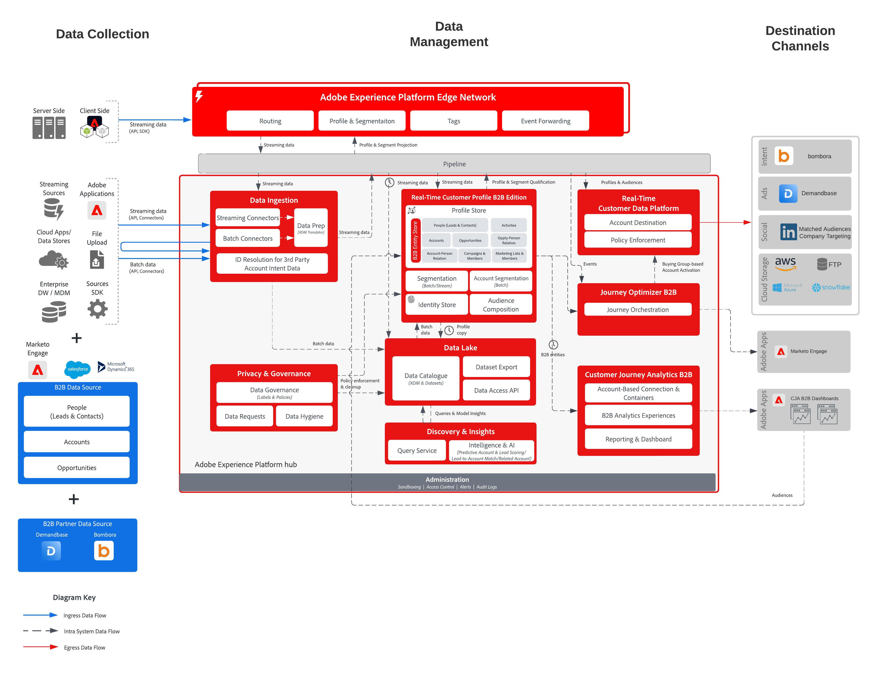

# B2B-Kontoaktivierung für Werbeziele und Dateiziele

Durch Account-basierte Interaktion können B2B-Marketing-Experten Zielgruppen von Konten (Unternehmenslisten) in **Real-Time Customer Data Platform B2B edition** erstellen und diese Konto-Zielgruppen für Werbeziele wie LinkedIn Matched Audiences, Bombora und Demandbase sowie für Cloud-Speicher-Ziele aktivieren. Diese Konto-Zielgruppen können für Zielgruppenbestimmung, Verkaufsförderung und nachgelagerte Analysen verwendet werden.

## Anwendungsfälle

Durch Account-basierte Interaktion können Marketing-Experten drei wichtige Anwendungsfälle erschließen:

- **Lücken in der Einkaufsgruppe schließen:** Ein Marketer kann auf Konten werben, auf denen er noch keine Kontakte für die CMO- oder CIO-Rollen hat. Sie können zunächst eine Audience von Konten ohne Kontakt mit dem Titel „CMO“ oder „CIO“ erstellen und dann die Audience auf LinkedIn Matched Audiences oder anderen unterstützten Werbezielen aktivieren. Innerhalb des Ziels können sie dann eine Kampagne starten, die auf diese Zielgruppe und bestimmte Personen mit „CMO“- oder „CIO“-Stellenbezeichnungen abzielt, um diese neuen Kontakte zu erreichen und die Vorteile ihrer Angebote hervorzuheben.
- **Upsell oder Crosssell an andere Abteilungen eines Unternehmens, das ein bestehender Kunde ist:** Ein Marketing-Experte kann eine Account-Zielgruppe erstellen, die Produkt X vor 3 bis 9 Monaten gekauft hat, aber noch kein Produkt Y besitzt. Anschließend können sie diese Konto-Zielgruppe aktivieren und die Vorteile von Produkt Y für diese Zielgruppe über LinkedIn Matched Audiences, andere Werbeplattformen oder Cloud-Speicherexporte für Verkaufs- und Marketing-Maßnahmen hervorheben.
- **Targeting von Unternehmen, die konkurrierende Produkte verwenden:** Ein Marketer kann Konten vermarkten, um die Produkte eines Mitbewerbers zu verdrängen, selbst wenn er bei diesen Konten keine Kontakte hat. Sie können eine Zielgruppe von Konten erstellen, die auf Partner- oder Intent-Daten basiert, die den Besitz oder die Nutzung des Produkts eines Mitbewerbers anzeigen, und dann über LinkedIn Matched Audiences oder andere unterstützte Werbeziele aktivieren, um Kontakte bei Zielkonten zu beschaffen und diese zu erweitern.

## Programme

- Real-Time Customer Data Platform B2B edition
- (Optional) Customer Journey Analytics B2B edition

## Integrationsmuster

Typische Integrationsmuster für diesen Blueprint sind:

- **B2B-Interaktion und CRM-Quellen → RTCDP B2B edition →-Konto-Zielgruppen → -Ziele**

  B2B-Interaktion und CRM-Systeme wie Marketo Engage, Salesforce und Microsoft Dynamics senden Leads/Kontakte, Konten und Opportunities mithilfe der standardmäßigen B2B-Schemata und -**in** Real-Time CDP B2B edition. Account-Zielgruppen basieren auf diesem einheitlichen B2B-Datenmodell und werden für Werbe- und Dateiziele aktiviert.

- **B2B-Absichten und Ereignisquellen → RTCDP B2B edition →-Kontozielgruppen → Ziele**

  B2B-Absicht und Ereignisquellen wie Bombora Intent und Demandbase Intent senden Intent- und Interaktionsereignisse an Experience Platform. Diese Datensätze werden den standardmäßigen B2B-Schemata zugeordnet, sodass Marketing-Experten Account-Zielgruppen erstellen (z. B. Accounts, die bei Themen von Mitbewerbern stark anwachsen) und für Werbe- und Cloud-Speicher-Ziele aktivieren können. Account-Zielgruppen können dann für Werbepartner wie Bombora und Demandbase aktiviert werden, sofern sie unterstützt werden.

## Architektur

{width="1000" zoomable="yes"}

## Konten-Audience-Ziele

- **LinkedIn übereinstimmende Zielgruppen**
- **Bombora**
- **Demandbase**
- **Cloud-Speicherziele**
  - Azure Data Lake Storage Gen2
  - Data Landing Zone
  - SFTP
  - Azure Blob
  - AWS S3

Die neueste Liste der Ziele, die Account-Zielgruppen unterstützen, finden Sie in der Zieldokumentation .

## Leitlinien

Beachten Sie die folgenden Leitplanken beim Entwerfen und Aktivieren von Konto-Zielgruppen:

- [Leitplanken für Real-Time Customer Data Platform B2B edition](https://experienceleague.adobe.com/de/docs/experience-platform/rtcdp/intro/rtcdpb2b-intro/b2b-guardrails?lang=en)
- [Konto-Zielgruppen](https://experienceleague.adobe.com/de/docs/experience-platform/segmentation/ui/account-audiences?lang=en)
- [Konto-Zielgruppen aktivieren](https://experienceleague.adobe.com/de/docs/experience-platform/destinations/ui/activate/activate-account-audiences?lang=en)
- [Leitplanken für Profile und Segmentierung](https://experienceleague.adobe.com/de/docs/experience-platform/profile/guardrails)
- [Aktualisierung der Eignungskriterien für Streaming-Segmentierung](https://experienceleague.adobe.com/de/docs/experience-platform/segmentation/eligibility-criteria-update)

## Implementierungsschritte für Real-Time Customer Data Platform B2B edition, Erstellung und Aktivierung von Konto-Zielgruppen

- Implementierungsschritte für Real-Time Customer Data Platform B2B edition finden Sie in der Dokumentation: [Erste Schritte mit Real-Time Customer Data Platform B2B edition](https://experienceleague.adobe.com/de/docs/experience-platform/rtcdp/intro/rtcdpb2b-intro/b2b-tutorial?lang=en).
- Schritte zur Erstellung von Konto-Zielgruppen finden Sie in der Dokumentation [Konto-Zielgruppen](https://experienceleague.adobe.com/de/docs/experience-platform/segmentation/ui/account-audiences?lang=en) .
- Die Schritte zur Aktivierung von Konto-Zielgruppen finden Sie in der Dokumentation [Aktivieren von Konto-Zielgruppen](https://experienceleague.adobe.com/de/docs/experience-platform/destinations/ui/activate/activate-account-audiences?lang=en):

  - Erforderliche Zuordnung für das Ziel [LinkedIn Matched Audiences](https://experienceleague.adobe.com/de/docs/experience-platform/destinations/ui/activate/activate-account-audiences?lang=en#required-mappings).

## Überlegungen bei der Implementierung

Für abgeglichene LinkedIn-Zielgruppen ist eine Mindestgröße für die Zielgruppe erforderlich (z. B. 300 übereinstimmende Mitglieder). Wenn die für abgeglichene LinkedIn-Zielgruppen aktivierte Konto-Zielgruppe diese Anforderung nicht erfüllt, müssen Sie die Zielgruppendefinition möglicherweise erweitern, um die abgleichbare Zielgruppengröße zu erhöhen, bevor Sie eine Kampagne starten.

## Verwandte Dokumentation

- [Blueprint zur B2B-Zielgruppe und Profilaktivierung](b2b-audience-profile-activation.md) — Übergeordneter Blueprint, der sowohl die B2B-Aktivierung auf Personenebene als auch auf Kontoebene umfasst.
- [B2B edition von Real-Time Customer Data Platform](https://experienceleague.adobe.com/de/docs/experience-platform/rtcdp/intro/rtcdpb2b-intro/b2b-overview?lang=en)
- [Kontozielgruppe erstellen und aktivieren - Anleitungsvideo](https://experienceleague.adobe.com/de/docs/platform-learn/tutorials/audiences/create-audiences-with-b2b-data?lang=en)
- [Konto-Zielgruppen erstellen](https://experienceleague.adobe.com/de/docs/experience-platform/segmentation/ui/account-audiences?lang=en)
- [Account-Zielgruppen aktivieren](https://experienceleague.adobe.com/de/docs/experience-platform/destinations/ui/activate/activate-account-audiences?lang=en)
- [Adobe Experience Platform - LinkedIn-Ziel-Connector](https://experienceleague.adobe.com/de/docs/experience-platform/destinations/catalog/social/linkedin?lang=en)
- [Schemata in Real-Time CDP B2B edition](https://experienceleague.adobe.com/de/docs/experience-platform/rtcdp/schemas/b2b)
- [Architekturupgrades auf Real-Time CDP B2B edition](https://experienceleague.adobe.com/de/docs/experience-platform/rtcdp/intro/rtcdpb2b-intro/b2b-architecture-upgrade)
- [Ziel-Leitlinien](https://experienceleague.adobe.com/de/docs/experience-platform/destinations/guardrails)
