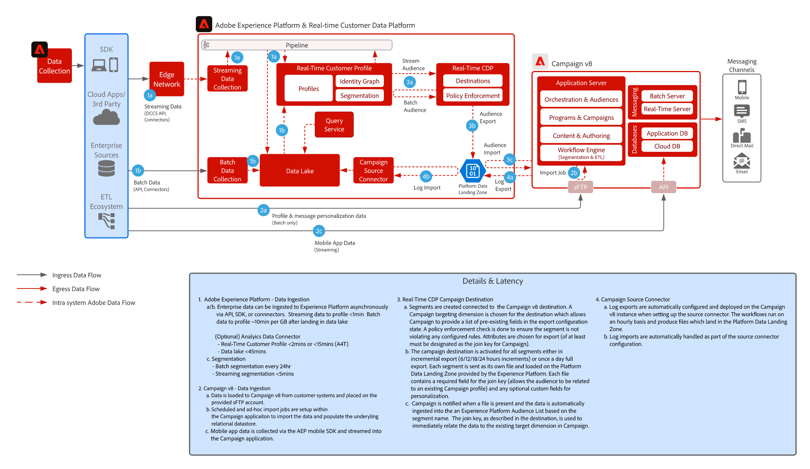

# [!DNL Real-Time CDP] mit dem Integrationsmuster für Adobe [!DNL Campaign] v8

Zeigt, wie die Adobe-[!DNL Experience Platform] und ihr Echtzeit-Kundenprofil sowie das zentralisierte Segmentierungs-Tool mit Adobe Campaign verwendet werden können, um personalisierte Konversationen bereitzustellen.

## Programme

* Adobe [!DNL Experience Platform Real-Time CDP]
* Adobe [!DNL Campaign] v8

## Architektur

{width="1000" zoomable="yes"}

 

## Voraussetzungen

* Der Kunde muss über eine gültige IMS Org für Experience Cloud verfügen
* Es wird empfohlen, Adobe Experience Platform und [!DNL Campaign] in derselben IMS-Organisation für eine einzige Anmelde-URL bereitzustellen
* Kunde muss über die v8-Instanz von [!DNL Campaign] verfügen
* Der Kunde muss über eine Berechtigung und den Zugriff auf die Quellen und Ziele von Real-Time Customer Data Platform verfügen.
* Adobe [!DNL Campaign]-Produktkontext muss vorhanden sein

 

## Implementierungsschritte

Weitere Informationen zum Konfigurieren des Quell-Connectors von Campaign v8 für Adobe Experience Platform und des Ziel-Connectors von Real-time Customer Data Platform für Campaign v8 finden Sie in der folgenden Dokumentation.
[Campaign- und AEP-Connectoren](https://experienceleague.adobe.com/docs/campaign/campaign-v8/connect/ac-aep.html?lang=de)

## Leitlinien

### Adobe Campaign

* Weitere Informationen finden Sie in der Dokumentation zum Quell-Connector von Campaign – [Campaign-Quell-Connector](https://experienceleague.adobe.com/docs/experience-platform/sources/ui-tutorials/create/adobe-applications/campaign.html?lang=de)
* Unterstützt nur die Bereitstellung einzelner Organisationseinheiten von Adobe Campaign

### Segmentfreigabe in Experience Platform Real-time Customer Data Platform

* Siehe den Ziel-Connector von Real-time Customer Data Platform für Campaign – [Verbindung von Real-time Customer Data Platform mit Campaign](https://experienceleague.adobe.com/docs/experience-platform/destinations/catalog/email-marketing/adobe-campaign-managed-services.html?lang=de)

* Siehe Leitlinien für die Profil- und Datenaufnahme für AEP – [Link](https://experienceleague.adobe.com/docs/experience-platform/profile/guardrails.html?lang=de)
