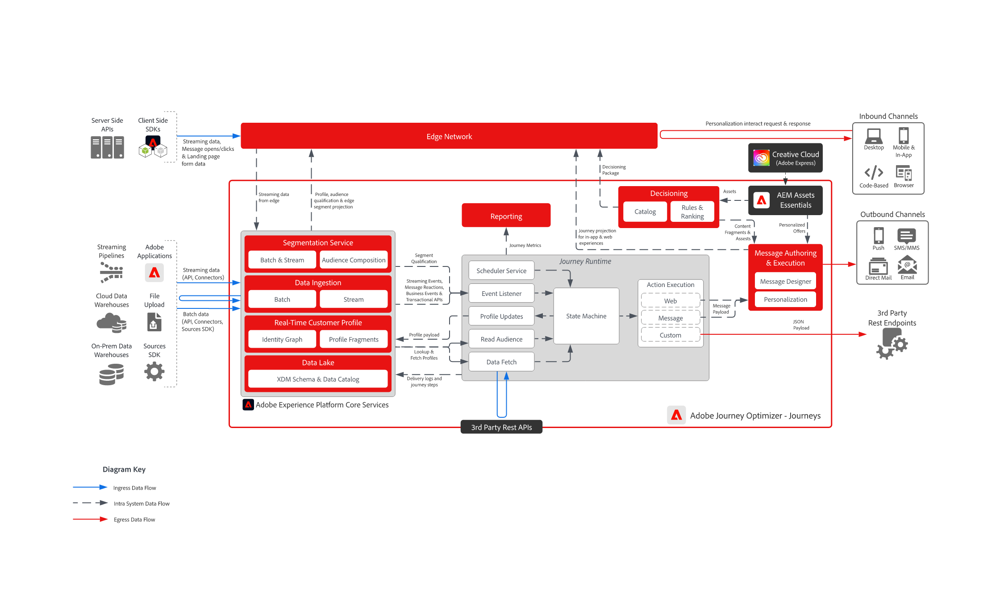

# [!DNL Journey Optimizer] - Journey

>[!TIP]
>Diese Architektur wird auch als Anwendungsfallmuster [&#x200B; Kampagnenverwaltung &#x200B;](/help/blueprints/use-case-patterns/campaign-management-orchestration/event-triggered-messaging.md) Orchestrierung dokumentiert.

Adobe Journey Optimizer-Journey sind ereignisgesteuerte Echtzeit-Workflows, die auf der Grundlage individueller Kundenverhaltensweisen personalisierte, mehrstufige Erlebnisse bereitstellen. Sie unterstützen eine breite Palette von Kanälen, einschließlich E-Mail, SMS, Push-Benachrichtigungen, In-App-Messaging, Code-basierte Erlebnisse und benutzerdefinierte API-basierte Integrationen, die es Marken ermöglichen, Kunden über ihre bevorzugten Touchpoints kontextuell anzusprechen.

 

## Architektur

{width="1000" zoomable="yes"}

 

## Überlegungen zur Architektur für Journey

- **Profilfrische**: AJO-Journey verwenden Echtzeit-Updates für das Kundenprofil. Stellen Sie sicher, dass Datenquellen, die in Adobe Experience Platform (AEP) eingespeist werden, für die Aufnahme mit geringer Latenz konfiguriert sind, um die Profilgenauigkeit aufrechtzuerhalten.
- **Skalierbare Ereignisverarbeitung:** Stellen Sie sicher, dass die Infrastruktur große Mengen an Journey-Triggern und den Nachrichtenversand verarbeiten kann.
- **Modulare Integration:** Design-APIs und benutzerdefinierte Aktionen zur Verbindung von AJO mit externen Systemen für die dynamische Personalisierung.
- **Identitätsauflösung**: Eine genaue Zuordnung von Kundenidentitäten über Geräte und Kanäle hinweg ist wichtig. Falsch ausgerichtete Identitäten können zu fehlerhaften oder fehlgeleiteten Journey führen.
- **Zeitpunkt der Segmentqualifizierung**: Zielgruppenbasierte Journey sind von der Segmentzugehörigkeit abhängig. Erfahren Sie, wie oft Segmente ausgewertet werden und wie sich dieses Timing auf den Journey-Einstieg und die Personalisierung auswirkt.
- **Journey-Einstiegsbedingungen**: Profile müssen bestimmte Bedingungen erfüllen, um eine Journey aufzurufen. Diese Bedingungen sollten sorgfältig gestaltet werden, um unbeabsichtigte Ausschlüsse oder Überschneidungen zu vermeiden.
- **Zielgruppenauswertung und Latenz**: Die Schritte „Zielgruppe lesen“ hängen von Segmentauswertungen in Adobe Experience Platform ab, die möglicherweise nicht in Echtzeit erfolgen. Architekten-Journey mit Kenntnis der Auswertungshäufigkeit und -latenz, um Verzögerungen bei der Zielgruppen-Qualifizierung zu vermeiden und eine zeitnahe Personalisierung sicherzustellen.

 

## Leitlinien

[Produkt-Link zu [!DNL Journey Optimizer]-Schutzmechanismen](https://experienceleague.adobe.com/en/docs/journey-optimizer/using/get-started/guardrails.html)

[Leitplanken und Leitlinien für End-to-End-Latenzen](https://experienceleague.adobe.com/docs/blueprints-learn/architecture/architecture-overview/deployment/guardrails.html?lang=de)

 

## Verwandte Dokumentation

- [[!DNL Experience Platform] Dokumentation](https://experienceleague.adobe.com/docs/experience-platform.html?lang=de)
- [Dokumentation zu [!DNL Experience Platform] Tags](https://experienceleague.adobe.com/docs/experience-platform/tags/home.html?lang=de)
- [[!DNL Experience Platform Mobile SDK] Dokumentation](https://experienceleague.adobe.com/docs/mobile.html?lang=de)
- [[!DNL Journey Optimizer] Dokumentation](https://experienceleague.adobe.com/docs/journey-optimizer/using/ajo-home.html?lang=de)
- [[!DNL Journey Optimizer] Produktbeschreibung](https://helpx.adobe.com/de/legal/product-descriptions/adobe-journey-optimizer.html)
