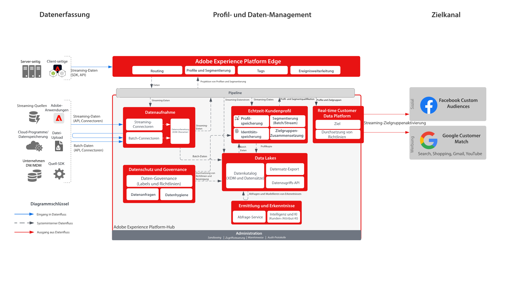

# Aktivierung für Social Media- und Werbeziele von RTCDP

Nehmen Sie Kundendaten aus verschiedenen Quellen auf, um eine einzige Profilansicht des Kunden zu erstellen. Sie können diese Profile segmentieren, um Zielgruppen für Marketing und Personalisierung zu erstellen, diese Zielgruppen in Werbenetzwerken wie Facebook und Google freigeben, um Personalisierungskampagnen auf diese Zielgruppen auszurichten und sie für diese Zielgruppen freizugeben.

## Anwendungsfälle

* Zielgruppen-Targeting für bekannte Zielgruppen in Social-Media- und Werbezielen.
* Online-Personalisierung mit Online- und Offline-Attributen.

## Programme

* Real-time Customer Data Platform

## Architektur

## Implementierungsschritte

1. Konfigurieren Sie Identitäts-Namespaces, die in Profil-Datenquellen verwendet werden sollen.
   * Verwenden Sie die vorkonfigurierten Namespaces wie „Email“ und „Email SHA256 Hash“, sofern verfügbar.
   * Facebook verfügt über eine Liste unterstützter Identitäten. Für die Aktivierung für Facebook Custom Audiences muss eine der unterstützten Identitäten in den zu aktivierenden Profilen verfügbar sein.
   * Die folgenden Identitäten werden derzeit von Facebook unterstützt: GAID, IDFA, phone_sha256, email_lc_sha256, extern_id.
   * Weitere Details finden Sie im [Handbuch für das Ziel Facebook](https://experienceleague.adobe.com/docs/experience-platform/destinations/catalog/social/facebook.html?lang=de).
   * Google Customer Match verfügt über eine Liste unterstützter Identitäten. Für die Aktivierung für Google Customer Match muss eine der unterstützten Identitäten in den zu aktivierenden Profilen verfügbar sein.
   * Die folgenden Identitäten werden derzeit von Google Customer Match unterstützt: GAID, IDFA, phone_sha256_e.164, email_lc_sha256, user_id.
   * Weitere Details finden Sie im [Handbuch für das Ziel Google Customer Match](https://experienceleague.adobe.com/docs/experience-platform/destinations/catalog/advertising/google-customer-match.html?lang=de).
   * Erstellen Sie benutzerdefinierte Namespaces, wenn für die entsprechenden Identitäten keine vorkonfigurierten Namespaces verfügbar sind.
1. Konfigurieren Sie Schemas und Datensätze für die Profil-Datenquellen.
   * Erstellen Sie Profildatensatz-Schemas für alle Profildatensatz-Quelldaten.
      * Geben Sie die primäre Identität und sekundäre Identitäten für jedes Schema an.
      * Aktivieren Sie das Schema zur Profilaufnahme.
   * Erstellen Sie Profildatensätze für alle Profildatensatz-Quelldaten, indem Sie das zugehörige Schema zuweisen.
      * Aktivieren Sie den Datensatz zur Profilaufnahme.
   * Erstellen Sie Profil-Erlebnisereignis-Schemas für alle auf Zeitserien basierenden Quelldaten des Profils.
      * Geben Sie die primäre Identität und sekundäre Identitäten für das Schema an.
   * Aktivieren Sie das Schema zur Profilaufnahme.
   * Erstellen Sie Profil-Erlebnisereignis-Datensätze für alle Profil-Erlebnisereignis-Quelldaten, indem Sie das zugehörige Schema zuweisen.
      * Aktivieren Sie den Datensatz zur Profilaufnahme.
1. Nehmen Sie die Quelldaten über einen Quell-Connector in den oben konfigurierten zugehörigen Datensatz auf.
   * Konfigurieren Sie das Quell-Connector-Konto mit Anmeldedaten.
   * Konfigurieren Sie einen Datenfluss zur Aufnahme der Daten aus der Quelldatei oder dem Ordnerverzeichnis entsprechend einem festgelegten Zeitplan in den angegebenen Datensatz.
   * Ordnen Sie sämtliche Felder aus den Quelldaten dem Zielschema zu.
   * Wandeln Sie sämtliche Felder in das korrekte Format für die Aufnahme in Experience Platform um.
      * Datumstransformationen
      * Wandeln Sie gegebenenfalls – z. B. bei E-Mail-Adressen – in Kleinbuchstaben um
      * Mustertransformationen (z. B. Telefonnummern)
      * Fügen Sie eindeutige Datensatz-IDs für Erlebnisereignis-Datensätze hinzu, wenn diese nicht in den Quelldaten vorhanden sind.
      * Wandeln Sie Arrays und Karten-Typfelder um, um die korrekte Zuordnung und Modellierung von Arrays und Karten bei der Segmentierung in Experience Platform sicherzustellen.
1. Konfigurieren Sie die Profilzusammenführungs-Richtlinie, um die korrekte Konfiguration des Identitätsdiagramms sicherzustellen und festzulegen, welche Datensätze beim Zusammenführen von Profilen übernommen werden sollen.
1. Nachdem Datenflüsse ausgeführt wurden, stellen Sie sicher, dass die Aufnahme von Profildaten erfolgreich und ohne Fehler durchgeführt wurde.
   * Prüfen Sie das Identitätsdiagramm mehrerer Profile, um die korrekte Verarbeitung von Identitätsbeziehungen sicherzustellen.
   * Prüfen Sie die Attribute und Ereignisse mehrerer Profile, um die korrekte Aufnahme von Attributen und Ereignissen in die Profile sicherzustellen.
1. Erstellen Sie Segmente, um Profil-Zielgruppen zu erstellen
   * Erstellen Sie im Segment Builder mit Regeln Segmente anhand von Attributen und Ereignissen.
   * Speichern Sie das Segment zur Evaluierung. Segmente werden entsprechend dem angegebenen Zeitplan einmal täglich evaluiert.
      * Wenn die Segmentregeln die Streaming-Segmentierung vorsehen, wird das Segment evaluiert, wenn neue Streaming-Daten für die Profile aufgenommen werden. Streaming-Segmente werden auch einmal täglich während der geplanten Batch-Segmentierung evaluiert.
1. Stellen Sie sicher, dass die Segmentergebnisse den Erwartungen entsprechen.
   * Prüfen Sie die Zahl der Segmentergebnisse für die vorhandenen Segmente.
   * Prüfen Sie das Profil, das im Segment vorhanden sein sollte, um sicherzustellen, dass die Segmentzugehörigkeit im Bereich des Profils für die Segmentzugehörigkeit enthalten ist.
1. Konfigurieren Sie die Übermittlung der Zielgruppe an das Ziel in der Konfiguration des Ziels.
   * Weitere Details zur Konfiguration von Facebook als Ziel finden Sie im [Handbuch für das Ziel Facebook](https://experienceleague.adobe.com/docs/experience-platform/destinations/catalog/social/facebook.html?lang=de).
   * Weitere Details zur Konfiguration von Google Customer Match als Ziel finden Sie im [Handbuch für das Ziel Google Customer Match](https://experienceleague.adobe.com/docs/experience-platform/destinations/catalog/advertising/google-customer-match.html?lang=de).
   * Wenn Sie ein Ziel konfigurieren, wählen Sie aus, welche Zielgruppe Sie für das Ziel aktivieren möchten.
   * Legen Sie das geplante Startdatum fest, an dem der Ziel-Datenfluss mit der Übermittlung der Zielgruppe für das Ziel beginnen soll.
   * Jedes Ziel hat erforderliche und optionale Attribute, die gesendet werden.
      * Für Facebook muss eine der erforderlichen Identitäten enthalten sein. Diese wird zum Abgleich der Profile in der Zielgruppe in Experience Platform mit einem Profil verwendet, das Facebook ansprechen kann.
      * Für Google Customer Match muss eine der erforderlichen Identitäten enthalten sein. Diese wird zum Abgleich der Profile in der Zielgruppe in Experience Platform mit einem Profil verwendet, das Google Customer Match ansprechen kann.
   * Jedes Ziel verfügt auch über einen festgelegten Übermittlungstyp – Streaming, Batch, dateibasiert oder JSON-Payload.
      * Für Facebook werden Zielgruppenzugehörigkeiten im Streaming-Modus an einen Facebook-Endpunkt im JSON-Format übermittelt.
      * Zielgruppen-Zugehörigkeiten werden für Google Customer Match via Streaming im JSON-Format an einen Google Customer Match-Endpunkt bereitgestellt.
      * Zielgruppenzugehörigkeiten werden im Streaming-Modus entsprechend der Streaming- oder Batch-Segmentierungs-Evaluierung in Experience Platform übermittelt.
1. Stellen Sie sicher, dass der Zielfluss die Zielgruppe wie erwartet an das Ziel übermittelt hat.
   * Prüfen Sie in der Monitoring-Schnittstelle, ob die Zielgruppe mit der erwarteten Anzahl an Profilen übermittelt wurde. Die Zielgruppengröße sollte die erwartete Anzahl aktivierter Profile widerspiegeln. Beachten Sie dabei, dass bestimmte Ziele wie Facebook und Google bestimmte Felder erfordern, z. B. eine E-Mail-Hash-Identität. Wenn diese Felder nicht in einem Profil vorhanden sind, das Teil der Zielgruppe ist, wird dieses im Ziel nicht aktiviert.
   * Prüfen Sie übersprungene Profile auf fehlende Profilidentitäten oder fehlende erforderliche Attribute.
   * Prüfen Sie, ob andere Fehler vorliegen, die behoben werden müssen.
1. Prüfen Sie, ob die Zielgruppe im Ziel mit der erwarteten Anzahl an Zielgruppenzugehörigkeiten aktiviert wurde.
   * Melden Sie sich beim Portal von Facebook Custom Audiences an, um sicherzustellen, dass die Zielgruppe aus Real-time Customer Data Platform übermittelt wurde und dass die Anzahl der Profile in der Zielgruppe in Facebook in etwa der Anzahl der Profile in der Zielgruppe in Real-time Customer Data Platform entspricht.
   * Wechseln Sie nach Abschluss des Aktivierungsflusses zu Ihrem Google Ads-Konto. Die aktivierten Segmente werden in Ihrem Google-Konto als Kundenlisten angezeigt. Beachten Sie, dass abhängig von Ihrer Segmentgröße einige Zielgruppen nicht befüllt werden, wenn nicht mehr als 100 aktive Benutzer vorliegen.

## Leitlinien

[Leitlinien für Profile und Segmentierung](https://experienceleague.adobe.com/docs/experience-platform/profile/guardrails.html?lang=de)

## Verwandte Dokumentation

Aktivierung für Facebook Custom Audiences – [Zielkonfiguration](https://experienceleague.adobe.com/docs/experience-platform/destinations/catalog/social/facebook.html?lang=de)

Aktivierung für Google Customer Match - [Zielkonfiguration](https://experienceleague.adobe.com/docs/experience-platform/destinations/catalog/advertising/google-customer-match.html?lang=de)