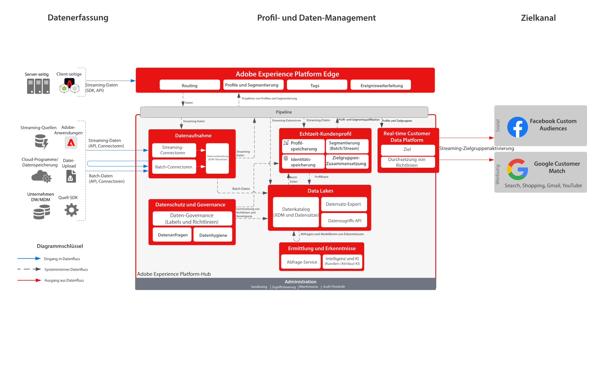

# Audience Activation zu Social-Media- und Advertising-Zielen

>[!TIP]
>Diese Blueprint ist auch als Anwendungsfallmuster [&#x200B; Audience Building &#x200B;](/help/blueprints/use-case-patterns/audience-building-activation/audience-activation-to-destinations.md) Activation verfügbar.

Nehmen Sie Kundendaten aus verschiedenen Quellen auf, um eine einzige Profilansicht des Kunden zu erstellen. Sie können diese Profile segmentieren, um Zielgruppen für Marketing und Personalisierung zu erstellen, und diese Zielgruppen in Werbenetzwerken wie Facebook und Google freigeben, um Personalisierungskampagnen auf diese Zielgruppen auszurichten und durchzuführen.

## Anwendungsfälle

* Zielgruppen-Targeting für bekannte Zielgruppen in Social-Media- und Werbezielen.
* Online-Personalisierung mit Online- und Offline-Attributen.

## Programme

* Real-time Customer Data Platform

## Architektur

## Leitlinien

[Leitplanken für Profil und Segmentierung](https://experienceleague.adobe.com/docs/experience-platform/profile/guardrails.html?lang=de)

## Verwandte Dokumentation

Aktivierung für Facebook Custom Audiences – [Zielkonfiguration](https://experienceleague.adobe.com/docs/experience-platform/destinations/catalog/social/facebook.html?lang=de)

Aktivierung für Google Customer Match - [Zielkonfiguration](https://experienceleague.adobe.com/docs/experience-platform/destinations/catalog/advertising/google-customer-match.html?lang=de)