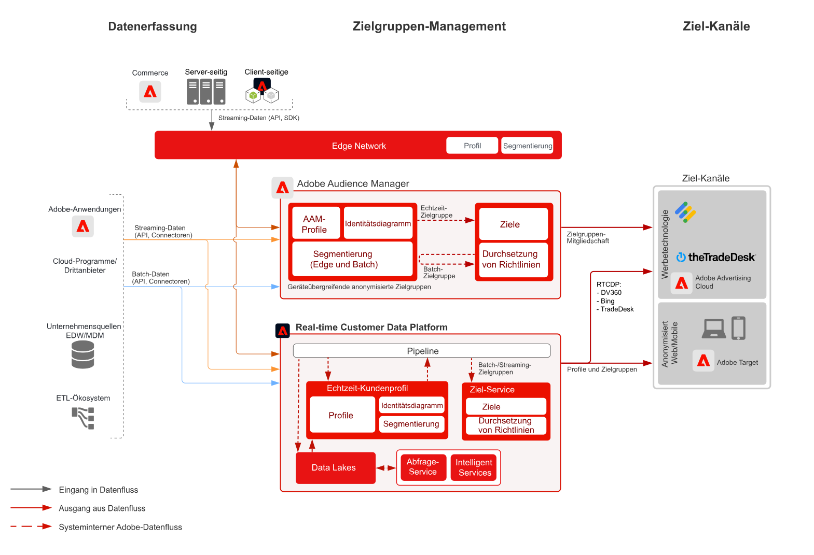

# Entwurf der anonymen Audience Activation

Die anonyme Zielgruppenaktivierung ermöglicht Ihnen, Zielgruppen über Web-, Mobile- und Werbekanäle hinweg auf der Grundlage anonymer Geräte- und Verhaltensdaten anzusprechen und zu personalisieren.

## Anwendungsbeispiele

* Führen Sie eine anonyme Zielgruppenbestimmung und Personalisierung für digitale Zielgruppen auf der Website, in der Mobile App oder in unterstützten Werbekanälen durch.
* Optimieren Sie Landingpage- und Vorauthentifizierungsverfahren basierend auf bekannten Geräte- und Verhaltenseigenschaften.
* Nutzen Sie das Datennetzwerk von Audience Manager-Drittanbietern, um Ihre Zielgruppen für das Targeting weiter einzugrenzen bzw. zu erweitern.

## Programme

* Audience Manager
* Real-time Customer Data Platform

Sowohl Audience Manager als auch Real-time Customer Data Platform können verwendet werden, um die anonyme Zielgruppenaktivierung für Onsite- und Werbeziele zu ermöglichen. Beachten Sie, dass Real-time Customer Data Platform nur eine Teilmenge von Werbezielen mit anonymen Geräte-IDs unterstützt. Näheres dazu finden Sie im [Dokumentation zu Zielen](https://experienceleague.adobe.com/docs/experience-platform/destinations/catalog/advertising/overview.html?lang=de).

Microsoft Bing, Google DV360 und TradeDesk sind die am häufigsten unterstützten Real-time Customer Data Platform-Werbeziele für das Targeting auf der Basis anonymer Geräte. Darüber hinaus unterstützt Real-time Customer Data Platform zahlreiche bekannte kundenbasierte Ziele, die im [Dokumentation zu Zielen](https://experienceleague.adobe.com/docs/experience-platform/destinations/catalog/advertising/overview.html?lang=de) und wie in [Bekannter Blueprint zur Kundenaktivierung](https://experienceleague.adobe.com/docs/blueprints-learn/architecture/audience-activation/known-customer-audience-activation/known.html?lang=de).

## Architektur

 

## Implementierungsschritte für den Audience Manager

* Weitere Informationen zur Implementierung von Audience Manager finden Sie in der folgenden [Dokumentation](https://experienceleague.adobe.com/docs/audience-manager/user-guide/implementation-integration-guides/implement-audience-manager.html?lang=de).

## Implementierungsschritte für Real-time Customer Data Platform

* Informationen zu den Implementierungsschritten von Real-time Customer Data Platform finden Sie in der folgenden [Dokumentation](https://experienceleague.adobe.com/docs/blueprints-learn/architecture/audience-activation/known-customer-audience-activation/known.html?lang=de).

## Verwandte Dokumentation

* [Audience Manager](https://experienceleague.adobe.com/docs/audience-manager.html?lang=de)
* [Experience Cloud-[!UICONTROL Zielgruppen]](https://experienceleague.adobe.com/docs/core-services/interface/audiences/audience-library.html?lang=de)
* [Integration von Audience Manager mit Target](https://experienceleague.adobe.com/docs/audience-manager/user-guide/implementation-integration-guides/integration-other-solutions/aam-target-integration.html?lang=de)
* [Segmentfreigabe in Adobe Analytics über Audience Manager](https://experienceleague.adobe.com/docs/analytics/components/segmentation/segmentation-workflow/seg-publish.html?lang=de)
* [Bekannter Blueprint zur Kundenaktivierung](https://experienceleague.adobe.com/docs/blueprints-learn/architecture/audience-activation/known-customer-audience-activation/known.html?lang=de).
* [Real-time Customer Data Platform](https://experienceleague.adobe.com/docs/experience-platform/rtcdp/overview.html?lang=de)
