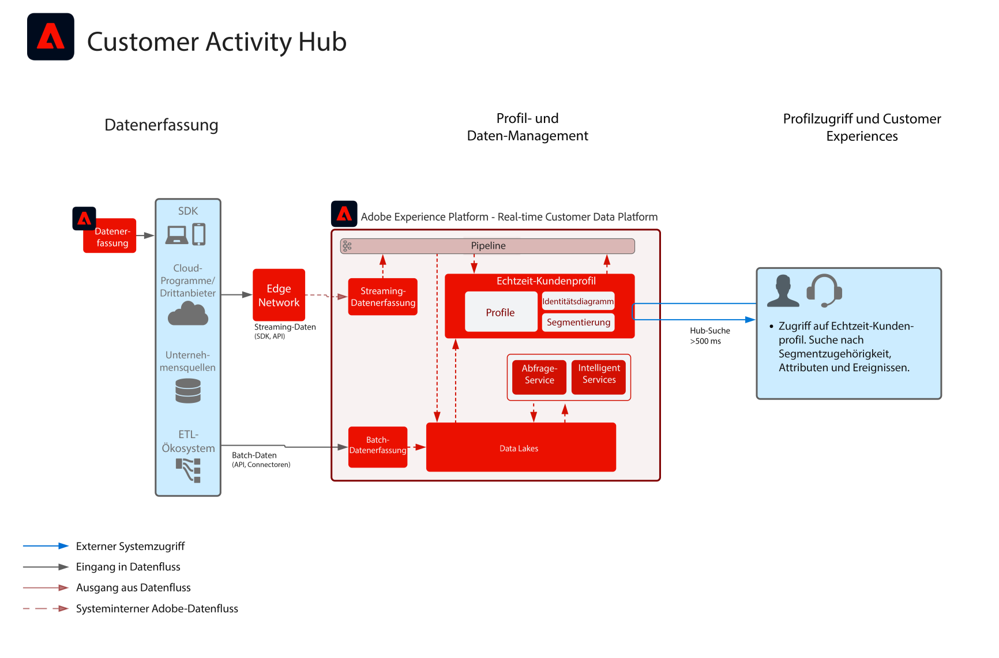

# Blueprint: Customer Activity Hub

Die Blueprint „Customer Activity Hub“ zeigt, wie externe Programme auf das [!UICONTROL Echtzeit-Kundenprofil] von Adobe Experience Platform zugreifen können.

Externe Anwendungen können mit einer API-GET auf Profil zugreifen. Attribute, Ereignisse, Segmentzugehörigkeiten und modellgestützte Funktionen, die im Profil gespeichert sind, können dann in diesen externen Drittanbieterprogrammen verwendet werden.

Mit dieser Funktion können Sie auf umfangreichen Kontext zugreifen, wenn ein Kunde im Callcenter anruft. Der Support-Mitarbeiter hat beispielsweise Einblick in den Lebenszeitwert des Kunden, seine Abwanderungsneigung und die ihm bekannten Marketing-Kampagnen. Vertriebsmitarbeiter können ebenfalls von mehr Kontext und Erkenntnissen über Kunden profitieren.

>[!NOTE]
>
>Die derzeit von der API für die Profilsuche unterstützte Latenz beträgt etwa 500 Millisekunden. Somit ist diese Herangehensweise für die Integration des Profils mit Echtzeit-Entscheidungs-Engines wie die Same-Page-Web- oder Mobile-Personalisierung nicht geeignet.

## Anwendungsfälle

* Besserer Verbraucherkontext für mitarbeitergestützte Interaktionen wie Support- und Vertriebserlebnisse. Dank der Profilsuche in Experience Platform erhalten Mitarbeiter Kontext zum Verbraucher wie kürzlich durchgeführte Käufe, Kampagneninteraktionen, Neigungen, Zielgruppenzugehörigkeiten und andere Attribute sowie Erkenntnisse, die im Echtzeit-Kundenprofil gespeichert sind.

## Architektur

## Leitlinien

* [Leitlinien für Echtzeit-Kundenprofildaten](https://experienceleague.adobe.com/docs/experience-platform/profile/guardrails.html?lang=de)

## Implementierungsschritte

1. [Erstellen Sie ](https://experienceleague.adobe.com/docs/platform-learn/tutorials/schemas/create-a-schema.html) Schemata für Daten, die aufgenommen werden sollen.
1. [Erstellen Sie ](https://experienceleague.adobe.com/docs/platform-learn/tutorials/data-ingestion/create-datasets-and-ingest-data.html) Datensätze, damit Daten erfasst werden.
1. [Konfigurieren Sie die korrekten Identitäten und Identitäts-Namespaces im Schema, um sicherzustellen, dass aufgenommene Daten zu einem einheitlichen Profil zusammengefügt werden können.](https://experienceleague.adobe.com/docs/platform-learn/tutorials/identities/label-ingest-and-verify-identity-data.html)
1. [Aktivieren Sie die Schema und Datensätze zum Profil](https://experienceleague.adobe.com/docs/platform-learn/tutorials/profiles/bring-data-into-the-real-time-customer-profile.html).
1. [Aufnehmen der Daten in Experience Platform.](https://experienceleague.adobe.com/?recommended=ExperiencePlatform-D-1-2020.1.dataingestion)
1. [Einrichten von Zusammenführungsrichtlinien](https://experienceleague.adobe.com/docs/platform-learn/tutorials/profiles/create-merge-policies.html)
1. Verwenden Sie die [Entities-API, um ein Profil-Attribut](https://experienceleague.adobe.com/docs/experience-platform/profile/api/entities.html) nachzuschlagen, entweder von der Datensatzentität oder der Experience Ereignis-Entität.

## Verwandte Dokumentation

* [Produktbeschreibung zu Adobe Experience Platform Activation](https://helpx.adobe.com/de/legal/product-descriptions/adobe-experience-platform0.html)
* [Dokumentation zum Echtzeit-Kundenprofil](https://experienceleague.adobe.com/docs/experience-platform/profile/home.html?lang=de)
* [Leitlinien zum Profil](https://experienceleague.adobe.com/docs/experience-platform/profile/guardrails.html)
* [API für die Profilsuche](https://www.adobe.io/apis/experienceplatform/home/api-reference.html)
