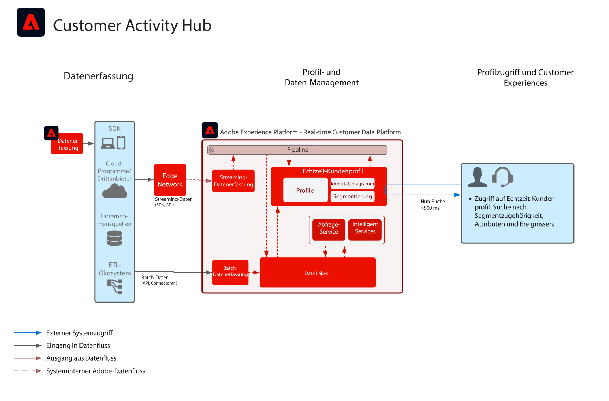

# Echtzeit-Profilzugriff für Support- und Vertriebsszenarien

>[!TIP]
>Diese Blueprint ist auch als Anwendungsfallmuster [&#x200B; Audience Building &#x200B;](/help/blueprints/use-case-patterns/audience-building-activation/real-time-profile-lookup.md) Activation verfügbar.

Der Blueprint „Echtzeit-Profilzugriff für Support- und Vertriebsszenarien“ zeigt, wie externe Anwendungen auf das Echtzeit[!UICONTROL Kundenprofil von Adobe Experience Platform zugreifen &#x200B;].

Externe Programme können über API-GET-Anfragen auf Profile zugreifen. Attribute, Ereignisse, Segmentzugehörigkeiten und modellgestützte Funktionen, die im Profil gespeichert sind, können dann in diesen externen Drittanbieterprogrammen verwendet werden.

Mit dieser Funktion können Sie auf umfangreichen Kontext zugreifen, wenn ein Kunde im Callcenter anruft. Der Support-Mitarbeiter hat beispielsweise Einblick in den Lebenszeitwert des Kunden, seine Abwanderungsneigung und die ihm bekannten Marketing-Kampagnen. Vertriebsmitarbeiter können ebenfalls von mehr Kontext und Erkenntnissen über Kunden profitieren.

>[!NOTE]
>
>Die Profilsuche im Hub ist nicht für Anwendungsfälle mit hohem Durchsatz und geringer Latenz vorgesehen, wie z. B. Personalisierung eingehender Web-/Mobilgeräte. Die Profilsuche im Hub ist für Szenarien mit niedrigerer Latenz vorgesehen, wie z. B. Support durch Agenten oder Vertriebsinteraktionen. Für Szenarien mit geringer Latenz, hohem Durchsatz, wie Web-/Mobile-Personalisierung oder Echtzeit-Offer Decisioning, sollte das Edge-Profil genutzt werden. Das Edge-Profil ermöglicht den Echtzeitzugriff über die [benutzerdefinierte Personalization-Verbindung](https://experienceleague.adobe.com/en/docs/experience-platform/destinations/catalog/personalization/custom-personalization) von Real-time Customer Data Platform.

## Anwendungsfälle

* Besserer Verbraucherkontext für mitarbeitergestützte Interaktionen wie Support- und Vertriebserlebnisse. Dank der Profilsuche in Experience Platform erhalten Mitarbeiter Kontext zum Verbraucher wie kürzlich durchgeführte Käufe, Kampagneninteraktionen, Neigungen, Zielgruppenzugehörigkeiten und andere Attribute sowie Erkenntnisse, die im Echtzeit-Kundenprofil gespeichert sind.

## Architektur

## Leitlinien

* [Leitplanken für [!UICONTROL Echtzeit-])](https://experienceleague.adobe.com/docs/experience-platform/profile/guardrails.html?lang=de)

## Verwandte Dokumentation

* [Adobe Experience Platform Activation - Produktbeschreibung](https://helpx.adobe.com/de/legal/product-descriptions/adobe-experience-platform0.html)
* [[!UICONTROL Echtzeit-Kundenprofil] Dokumentation](https://experienceleague.adobe.com/docs/experience-platform/profile/home.html?lang=de)
* [Leitplanken für Profile](https://experienceleague.adobe.com/docs/experience-platform/profile/guardrails.html?lang=de)
* [API für die Profilsuche](https://www.adobe.io/apis/experienceplatform/home/api-reference.html)
