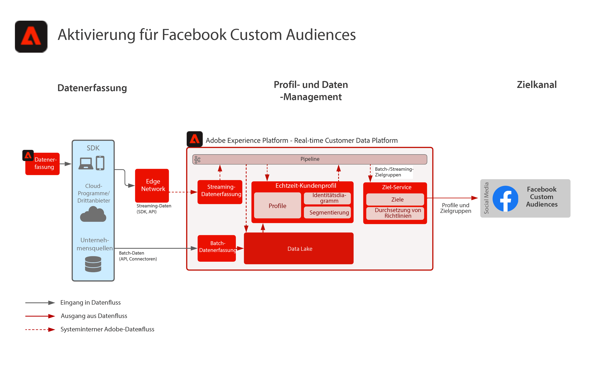

# Aktivierung für benutzerdefinierte Facebook-Zielgruppen

Erfassen Sie Kundendaten aus mehreren Quellen, um eine Profilansicht des Kunden zu erstellen, segmentieren Sie diese Profile in erstellte Zielgruppen für Marketing und Personalisierung, geben Sie diese Zielgruppen in Social-Anzeigennetzwerken wie Facebook frei, um Zielgruppen mit diesen Zielgruppen auszuwählen und Personalisierungskampagnen durchzuführen.

## Anwendungsfälle

* Zielgruppen-Targeting für bekannte Zielgruppen in Social-Media- und Werbezielen.
* Online-Personalisierung mit Online- und Offline-Attributen.

## Programme

* Real-time Customer Data Platform

## Architektur

## Implementierungsschritte

1. Konfigurieren Sie Identitäts-Namespaces, die in Profildatenquellen verwendet werden sollen.
   * Verwenden Sie native Namespaces wie E-Mail, E-Mail SHA256-Hash, sofern verfügbar.
   * Facebook verfügt über eine Liste unterstützter Identitäten. Um für benutzerdefinierte Facebook-Zielgruppen aktiviert zu werden, muss eine der unterstützten Identitäten in den Profilen vorhanden sein, die aktiviert werden sollen.
   * Die folgenden Identitäten werden derzeit von Facebook unterstützt: GAID, IDFA, phone_sha256, email_lc_sha256, extern_id.
   * Weitere Informationen finden Sie unter [Facebook Destination Guide](https://experienceleague.adobe.com/docs/experience-platform/destinations/catalog/social/facebook.html).
   * Erstellen Sie benutzerdefinierte Namespaces, in denen native Namespaces nicht für die entsprechenden Identitäten verfügbar sind.
1. Konfigurieren Sie Profildatenquellenschemata und -datensätze.
   * Erstellen Sie Profildatensatzschemata für alle Profildatensatzquelldaten.
      * Geben Sie die primäre Identität und die sekundären Identitäten für jedes Schema an.
      * Aktivieren Sie das Schema für die Profilerfassung.
   * Erstellen Sie Profildatensätze für alle Profildatensatzquelldaten und weisen Sie das zugehörige Schema zu.
      * Aktivieren Sie den Datensatz für die Profilaufnahme.
   * Erstellen Sie Profilerlebnisereignis-Schemas für alle Profilzeitreihen-basierten Quelldaten.
      * Geben Sie die primäre Identität und die sekundären Identitäten für das Schema an.
   * Aktivieren Sie das Schema für die Profilerfassung.
   * Erstellen Sie Profilerlebnisereignis-Datensätze für alle Profilerlebnisereignis-Quelldaten und weisen Sie das zugehörige Schema zu.
      * Aktivieren Sie den Datensatz für die Profilaufnahme.
1. Erfassen Sie die Quelldaten mithilfe eines Quell-Connectors in den oben konfigurierten zugehörigen Datensatz.
   * Konfigurieren Sie das Quell-Connector-Konto mit Anmeldeinformationen.
   * Konfigurieren Sie einen Datenfluss, um die Daten aus der Quelldatei oder dem Ordnerspeicherort zu einem festgelegten Zeitplan in den angegebenen Datensatz aufzunehmen.
   * Ordnen Sie alle Felder aus den Quelldaten dem Zielschema zu.
   * Wandeln Sie alle Felder in das richtige Format für die Aufnahme in Experience Platform um.
      * Datumsumwandlungen
      * Gegebenenfalls in Kleinbuchstaben umwandeln, z. B. E-Mail-Adresse
      * Musterumwandlungen (z. B. Telefonnummer)
      * Fügen Sie eindeutige Datensatz-IDs für Erlebnisereignisdatensätze hinzu, wenn diese nicht in den Quelldaten enthalten sind.
      * Transformieren Sie Arrays und Zuordnungsfelder, um eine korrekte Zuordnung und Modellierung von Arrays und Zuordnungen zur Segmentierung in Experience Platform sicherzustellen.
1. Konfigurieren Sie die Richtlinie zur Profilzusammenführung, um die korrekte Konfiguration des Identitätsdiagramms sicherzustellen und sicherzustellen, welche Datensätze in die Profilzusammenführung einbezogen werden sollen.
1. Nachdem die Datenflüsse ausgeführt wurden, stellen Sie sicher, dass die Profildatenerfassung ohne Fehler erfolgreich war.
   * Inspect das Identitätsdiagramm mehrerer Profile, um eine korrekte Verarbeitung von Identitätsbeziehungen sicherzustellen.
   * Inspect die Attribute und Ereignisse verschiedener Profile, um die korrekte Aufnahme von Attributen und Ereignissen in die Profile sicherzustellen.
1. Erstellen von Segmenten zum Erstellen von Profilzielgruppen
   * Erstellen Sie Segmente im Segment Builder mithilfe von Regeln für Attribute und Ereignisse.
   * Speichern Sie das Segment zur Auswertung. Die Auswertung von Segmenten erfolgt einmal täglich nach dem festgelegten Zeitplan.
      * Wenn die Segmentregeln für Streaming-Segmentierung geeignet sind, wird das Segment ausgewertet, da neue Streaming-Daten für die Profile erfasst werden. Streaming-Segmente werden während der geplanten Batch-Segmentierung auch einmal täglich ausgewertet.
1. Stellen Sie sicher, dass die Segmentergebnisse erwartungsgemäß sind.
   * Überprüfen Sie die Anzahl der Segmentergebnisse für die angegebenen Segmente.
   * Untersuchen Sie das Profil, das in das Segment aufgenommen werden soll, um sicherzustellen, dass die Segmentzugehörigkeit im Segmentzugehörigkeitsteil des Profils enthalten ist.
1. Konfigurieren Sie in der Zielkonfiguration den Versand der Audience an das Ziel.
   * Siehe [Facebook Destination Guide](https://experienceleague.adobe.com/docs/experience-platform/destinations/catalog/social/facebook.html) für weitere Informationen zur Konfiguration des Facebook-Ziels.
   * Wählen Sie beim Konfigurieren eines Ziels aus, welche Zielgruppe Sie für das Ziel aktivieren möchten.
   * Legen Sie das geplante Startdatum fest, an dem der Ziel-Datenfluss die Zielgruppe an das Ziel senden soll.
   * Jedes Ziel verfügt über erforderliche und optionale Attribute, die gesendet werden.
      * Für Facebook muss eine der erforderlichen Identitäten enthalten sein und wird verwendet, um die Profile in den Zielgruppen in Experience Platform mit einem von Facebook anvisierten Profil abzugleichen.
   * Jedes Ziel hat auch einen bestimmten Bereitstellungstyp, ob Streaming oder Batch, dateibasierte oder JSON-Payload.
      * Bei Facebook werden Zielgruppenmitgliedschaften im Streaming-Modus an einen Facebook-Endpunkt im JSON-Format bereitgestellt.
      * Zielgruppenmitgliedschaften werden im Streaming-Modus nach der Streaming- oder Batch-Segmentierungsbewertung in Experience Platform bereitgestellt.
1. Stellen Sie sicher, dass der Zielfluss die Zielgruppe wie erwartet an das Ziel geliefert hat.
   * Überprüfen Sie die Monitoring-Oberfläche, um sicherzustellen, dass die Audience mit der erwarteten Anzahl von Profilen bereitgestellt wurde. Die Zielgruppengröße sollte die erwartete Anzahl aktivierter Profile widerspiegeln, wobei darauf hingewiesen wird, dass für bestimmte Zielgruppen wie Facebook bestimmte Felder erforderlich sind, z. B. eine E-Mail-Hash-Identität. Wenn diese nicht in dem Profil vorhanden ist, das Mitglied der Zielgruppe ist, wird sie nicht für das Ziel aktiviert.
   * Suchen Sie nach übersprungenen Profilen, wenn Profilidentitäten fehlen oder Attribute fehlen, die obligatorisch waren.
   * Überprüfen Sie, ob weitere Fehler behoben werden müssen.
1. Überprüfen Sie, ob die Zielgruppe für das Endziel mit der erwarteten Anzahl von Zielgruppenmitgliedschaften aktiviert wurde.
   * Melden Sie sich beim Facebook Custom Audience-Portal an, um zu überprüfen, ob die Zielgruppe aus Real-time Customer Data Platform bereitgestellt wurde und ob die Übereinstimmungsrate der Profile in der Zielgruppe in Facebook mit der Anzahl der Profile in der Zielgruppe aus Real-time Customer Data Platform übereinstimmt.

## Leitlinien

[Limits für Profil und Segmentierung](https://experienceleague.adobe.com/docs/experience-platform/profile/guardrails.html?lang=de)

## Verwandte Dokumentation

Aktivierung für benutzerdefinierte Facebook-Zielgruppen - [Zielkonfiguration](https://experienceleague.adobe.com/docs/experience-platform/destinations/catalog/social/facebook.html)