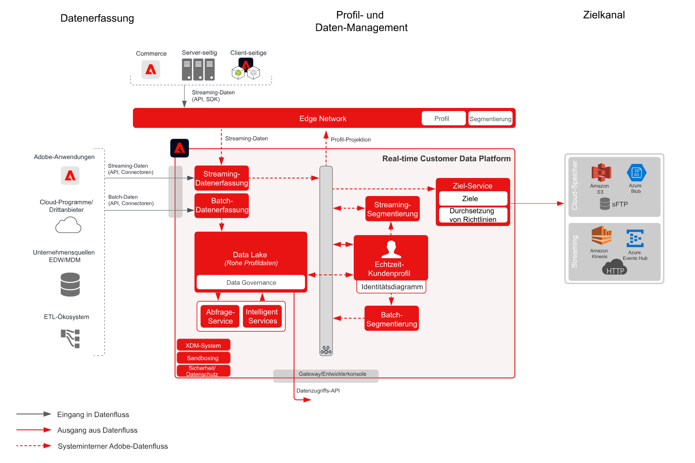

# Blueprint für die Aktivierung von Audiencen und Profilen zu Unternehmenszielen

Geben Sie Profil- und Audiencen-Änderungen und Ereignis im Streaming- oder Batch-Format von [!UICONTROL Kundendatenplattform in Echtzeit] in Unternehmensdatenspeicher und -anwendungen frei. Diese Profil- und Audience-Ereignis können verwendet werden, um eine Verkaufs- oder Supportaktion für den Kunden einzuleiten, z. B. im Anschluss an einen abgebrochenen Antragsprozess oder eine Webinar-Registrierung, oder um Unternehmensanwendungen mit den neuesten Kundenattributen und Informationen von [!UICONTROL Kundendatenplattform in Echtzeit] zu aktualisieren.

## Anwendungsfälle

* Aktivierung von Profil und Audience zu Cloud-Datenspeicherung-Zielen oder Streaming-Zielen für die Unternehmensverfolgung, Datenspeicherung, Analyse und Aktivierung von Kundendaten und -einsichten.

## Programme

* Adobe Experience Platform Aktivierung

## Architektur

## Leitlinien

Lesen Sie die auf der Seite &quot;Übersicht über die Audience und Profil-Aktivierung&quot;beschriebenen Garanten - [LINK](overview.md)

## Implementierungsschritte

1. Erstellen Sie Schema für die Datenerfassung.
1. Erstellen Sie Datensätze, damit Daten erfasst werden.
1. Konfigurieren Sie die korrekten Identitäten und Identitäts-Namespaces im Schema, um sicherzustellen, dass aufgenommene Daten zu einem einheitlichen Profil zusammengefügt werden können.
1. Aktivieren Sie die Schema und Datensätze für die Verarbeitung von Profilen.
1. Konfigurieren Sie alle Quellen für die Datenerfassung.
1. Autorensegmente in Experience Platform, die im Batch- oder Streaming-Verfahren ausgewertet werden sollen. Das System stellt automatisch fest, ob das Segment per Batch oder Streaming evaluiert wird.
1. Konfigurieren Sie Ziele für die Freigabe von Profilattributen Zielgruppenzugehörigkeiten zu gewünschten Zielen.

## Verwandte Dokumentation

* [Dokumentation zu Zielen](https://experienceleague.adobe.com/docs/experience-platform/destinations/catalog/overview.html?lang=de)
* [Übersicht über die Ziele der Cloud-Datenspeicherung](https://experienceleague.adobe.com/docs/experience-platform/destinations/catalog/cloud-storage/overview.html?lang=en#catalog)
* [HTTP-Ziel](https://experienceleague.adobe.com/docs/experience-platform/destinations/catalog/http-destination.html?lang=en#overview)
* [Produktbeschreibung zu Real-Time Customer Data Platform](https://helpx.adobe.com/de/legal/product-descriptions/real-time-customer-data-platform.html)
* [Profil- und Segmentierungsrichtlinien](https://experienceleague.adobe.com/docs/experience-platform/profile/guardrails.html?lang=de)
* [Dokumentation zur Segmentierung](https://experienceleague.adobe.com/docs/experience-platform/segmentation/api/streaming-segmentation.html?lang=de)

## Verwandte Videos und Tutorials

* [Überblick über Real-Time Customer Data Platform](https://experienceleague.adobe.com/docs/platform-learn/tutorials/application-services/rtcdp/understanding-the-real-time-customer-data-platform.html?lang=de)
* [[!UICONTROL Demo zu Real-Time Customer Data Platform]](https://experienceleague.adobe.com/docs/platform-learn/tutorials/application-services/rtcdp/demo.html?lang=de)
* [Erstellen von Segmenten](https://experienceleague.adobe.com/docs/platform-learn/tutorials/segments/create-segments.html?lang=de)
