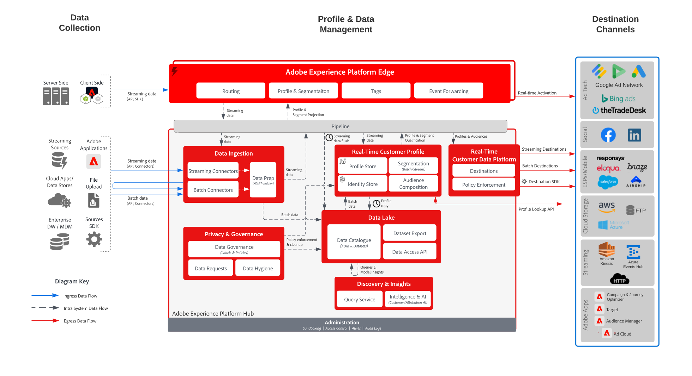

# Blueprint: Aktivierung einer bekannten Kundin/eines bekannten Kunden

Verwenden Sie Offline-Attribute und -Ereignisse, wie Offline-Bestellungen, Transaktionen, CRM oder Treuedaten gemeinsam mit Online-Verhaltensdaten für Online-Targeting und Personalisierung.

Erweiterte Kennungen mit integrierten Governance-Steuerelementen bieten mehr Möglichkeiten zur Kommunikation mit bekannten Kunden. Aktivieren Sie Zielgruppen für bekannte, profilbasierte Ziele, wie E-Mail-Anbieter, Social Media und Werbeziele.

Zusätzliche Details finden Sie in der [Blueprint zur Zielgruppen- und Profilaktivierung mit Experience Cloud-Programmen](platform-and-applications.md), insbesondere zu Integrationen zwischen Experience Platform und Experience Cloud-Programmen.

## Anwendungsfälle

* Zielgruppen-Targeting für bekannte Zielgruppen in Social-Media- und Werbezielen.
* Online-Personalisierung mit Online- und Offline-Attributen.
* Aktivierung von Zielgruppen für bekannte Kanäle, wie E-Mail und SMS.

## Programme

* [!UICONTROL Real-Time Customer Data Platform]
* Personenbasierte Ziele von Audience Manager können auch für personenbasierte Aktivierungen für Facebook, LinkedIn und Google-Kundenabgleich genutzt werden.

## Architektur

### Aktivierung einer bekannten Kundin/eines bekannten Kunden über Real-time Customer Data Platform

 

### Aktivierung einer bekannten Kundin/eines bekannten Kunden über personenbasierte Ziele von Audience Manager

 

## Leitlinien

[Beachten Sie die Leitlinien auf der Übersichtsseite zur Zielgruppen- und Profilaktivierung](https://experienceleague.adobe.com/docs/blueprints-learn/architecture/audience-activation/overview.html?lang=de#guardrails-for-audience-and-profile-activation-blueprints).

## Implementierungsschritte für Real-time Customer Data Platform

1. [Erstellen Sie Schemas](https://experienceleague.adobe.com/?recommended=ExperiencePlatform-D-1-2021.1.xdm&amp;lang=de) für die zu erfassenden Daten.
1. [Erstellen Sie Datensätze](https://experienceleague.adobe.com/docs/platform-learn/tutorials/data-ingestion/create-datasets-and-ingest-data.html?lang=de) für die zu erfassenden Daten.
1. [Konfigurieren Sie die korrekten Identitäten und Identitäts-Namespaces](https://experienceleague.adobe.com/docs/platform-learn/tutorials/identities/label-ingest-and-verify-identity-data.html?lang=de) im Schema, um sicherzustellen, dass aufgenommene Daten zu einem einheitlichen Profil zusammengefügt werden können.
1. [Aktivieren Sie die Schemas und Datensätze für Profile](https://experienceleague.adobe.com/docs/platform-learn/tutorials/profiles/bring-data-into-the-real-time-customer-profile.html?lang=de).
1. [Aufnehmen der Daten](https://experienceleague.adobe.com/?recommended=ExperiencePlatform-D-1-2020.1.dataingestion&amp;lang=de) in Experience Platform.
1. [Stellen Sie in [!UICONTROL Real-Time Customer Data Platform] die Segmentfreigabe](https://www.adobe.com/go/audiences) zwischen Experience Platform und Audience Manager für Zielgruppen bereit, die in Experience Platform für die Freigabe an Audience Manager definiert sind.
1. [Erstellen Sie Segmente](https://experienceleague.adobe.com/docs/platform-learn/tutorials/segments/create-segments.html?lang=de) in Experience Platform. Das System stellt automatisch fest, ob das Segment per Batch oder Streaming evaluiert wird.
1. [Konfigurieren Sie Ziele](https://experienceleague.adobe.com/docs/platform-learn/tutorials/destinations/create-destinations-and-activate-data.html?lang=de) für die Freigabe von Profilattributen und Zielgruppenzugehörigkeiten zu gewünschten Zielen.

## Überlegungen bei der Implementierung

* Die Freigabe von Profildaten an Ziele erfordert, dass der spezifische Identitätswert, der vom Ziel in der Ziel-Payload verwendet wird, mit eingeschlossen wird. Jede Identität, die für ein Ziel notwendig ist, muss in Platform aufgenommen und als eine Identität für das [!UICONTROL Echtzeit-Kundenprofil] konfiguriert werden.

* In der Blueprint [Zielgruppen- und Profilaktivierung mit Experience Cloud-Programmen](platform-and-applications.md) finden Sie weitere Informationen zur Freigabe von Zielgruppen aus Real-time Customer Data Platform für Audience Manager, Analytics, Target, Campaign und Journey Optimizer.

## Implementierungsschritte für personenbezogene Ziele in Audience Manager

* Weitere Informationen zur Implementierung von Audience Manager finden Sie in der folgenden [Dokumentation](https://experienceleague.adobe.com/docs/audience-manager/user-guide/implementation-integration-guides/implement-audience-manager.html?lang=de).

* Weitere Informationen zur Implementierung von personenbasierten Zielen in Audience Manager finden Sie in der folgenden [Dokumentation](https://experienceleague.adobe.com/docs/audience-manager/user-guide/faqs/faq-people-based-destinations.html?lang=de).

## Verwandte Dokumentation

* Produktbeschreibung zu [[!UICONTROL Real-time Customer Data Platform] ](https://helpx.adobe.com/de/legal/product-descriptions/real-time-customer-data-platform.html)
* [Richtlinien für Profile und Segmentierung](https://experienceleague.adobe.com/docs/experience-platform/profile/guardrails.html?lang=de)
* [Dokumentation zur Segmentierung](https://experienceleague.adobe.com/docs/experience-platform/segmentation/api/streaming-segmentation.html?lang=de)
* [Dokumentation zu Zielen](https://experienceleague.adobe.com/docs/experience-platform/destinations/catalog/overview.html?lang=de)

## Verwandte Videos und Tutorials

* Überblick über [[!UICONTROL Real-Time Customer Data Platform] ](https://experienceleague.adobe.com/docs/platform-learn/tutorials/application-services/rtcdp/understanding-the-real-time-customer-data-platform.html?lang=de)
* [Demo zu [!UICONTROL Real-Time Customer Data Platform]](https://experienceleague.adobe.com/docs/platform-learn/tutorials/application-services/rtcdp/demo.html?lang=de)
* [Erstellen von Segmenten](https://experienceleague.adobe.com/docs/platform-learn/tutorials/segments/create-segments.html?lang=de)
