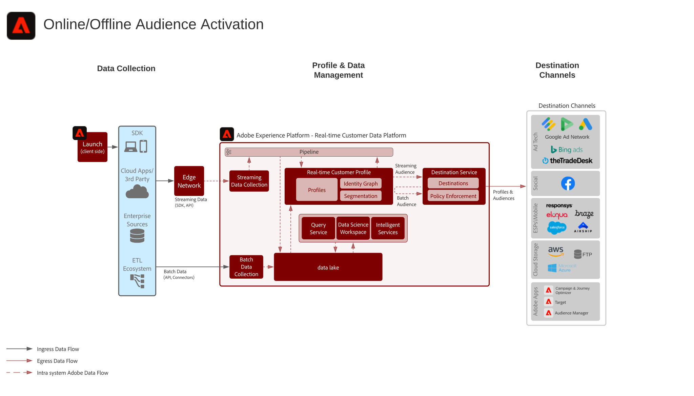

# Blueprint zur Online-/Offline-Audience Activation

Verwenden Sie Offline-Attribute und -Ereignisse, wie Offline-Bestellungen, Transaktionen, CRM oder Treue-Daten gemeinsam mit Online-Verhaltensdaten für Online-Targeting und Personalisierung.

Aktivieren Sie Zielgruppen für bekannte, profilbasierte Ziele, wie E-Mail-Anbieter, Social Media und Werbeziele.

## Anwendungsfälle

* Zielgruppen-Targeting für bekannte Zielgruppen in Social-Media- und Werbezielen.
* Online-Personalisierung mit Online- und Offline-Attributen.
* Aktivierung von Zielgruppen für bekannte Kanäle, wie E-Mail und SMS.

## Programme

* Adobe Experience Platform
* [!UICONTROL Real-Time Customer Data Platform]

## Architektur

### Online-/Offline-Audience Activation mit Zielen

 

### Online-/Offline-Audience Activation mit Experience Cloud-Anwendungen

## Leitlinien

Lesen Sie die auf der Seite &quot;Übersicht über die Audience und Profil-Aktivierung&quot;beschriebenen Garanten - [LINK](overview.md)

## Implementierungsschritte

1. [Erstellen Sie ](https://experienceleague.adobe.com/docs/platform-learn/tutorials/schemas/create-a-schema.html) Schemata für Daten, die aufgenommen werden sollen.
1. [Erstellen Sie ](https://experienceleague.adobe.com/docs/platform-learn/tutorials/data-ingestion/create-datasets-and-ingest-data.html) Datensätze, damit Daten erfasst werden.
1. [Konfigurieren Sie die korrekten Identitäten und Identitäts-Namespaces im Schema, um sicherzustellen, dass aufgenommene Daten zu einem einheitlichen Profil zusammengefügt werden können.](https://experienceleague.adobe.com/docs/platform-learn/tutorials/identities/label-ingest-and-verify-identity-data.html)
1. [Aktivieren Sie das Schema und Datensätze für Profile](https://experienceleague.adobe.com/docs/platform-learn/tutorials/profiles/bring-data-into-the-real-time-customer-profile.html).
1. [Nehmen Sie Daten in Platform auf](https://experienceleague.adobe.com/?recommended=ExperiencePlatform-D-1-2020.1.dataingestion).
1. [Stellen Sie in Real-Time Customer Data Platform die Segmentfreigabe zwischen Experience Platform und Audience Manager für Zielgruppen bereit, die in Experience Platform für die Freigabe an Audience Manager definiert sind.](https://www.adobe.com/go/audiences)
1. [Erstellen Sie Segmente in Experience Platform](https://experienceleague.adobe.com/docs/platform-learn/tutorials/segments/create-segments.html?lang=de), die im Batch- oder Streaming-Verfahren ausgewertet werden sollen. Das System stellt automatisch fest, ob das Segment per Batch oder Streaming evaluiert wird.
1. [Konfigurieren Sie Ziele für die Freigabe von Profilattributen Zielgruppenzugehörigkeiten zu gewünschten Zielen.](https://experienceleague.adobe.com/docs/platform-learn/tutorials/destinations/create-destinations-and-activate-data.html)

## Überlegungen bei der Implementierung

* Die Freigabe von Profildaten an Ziele erfordert, dass der spezifische Identitätswert, der vom Ziel in der Ziel-Payload verwendet wird, mit eingeschlossen wird. Jede für ein Zielgruppen-Ziel erforderliche Identität muss in Platform integriert und als Identitätsdatei für das [!UICONTROL Echtzeit-Profil des Kunden] konfiguriert werden.

* Für Aktivierungsszenarien, in denen Zielgruppen über Experience Platform für Audience Manager freigegeben werden, werden alle im [!UICONTROL Echtzeit-Kundenprofil] enthaltenen Identitäten für Audience Manager freigegeben. Die Zielgruppen aus Experience Platform können über Audience Manager-Ziele freigegeben werden, wenn die erforderlichen Zielidentitäten im [!UICONTROL Echtzeit-Kundenprofil] enthalten sind oder wenn Identitäten im [!UICONTROL Echtzeit-Kundenprofil] mit den erforderlichen Zielidentitäten verbunden werden können, die in Audience Manager verknüpft sind.

## Verwandte Dokumentation

* [Produktbeschreibung zu Real-Time Customer Data Platform](https://helpx.adobe.com/de/legal/product-descriptions/real-time-customer-data-platform.html)
* [Profil- und Segmentierungsrichtlinien](https://experienceleague.adobe.com/docs/experience-platform/profile/guardrails.html?lang=de)
* [Dokumentation zur Segmentierung](https://experienceleague.adobe.com/docs/experience-platform/segmentation/api/streaming-segmentation.html?lang=de)
* [Dokumentation zu Zielen](https://experienceleague.adobe.com/docs/experience-platform/destinations/catalog/overview.html?lang=de)

## Verwandte Videos und Tutorials

* [Überblick über Real-Time Customer Data Platform](https://experienceleague.adobe.com/docs/platform-learn/tutorials/application-services/rtcdp/understanding-the-real-time-customer-data-platform.html?lang=de)
* [[!UICONTROL Demo zu Real-Time Customer Data Platform]](https://experienceleague.adobe.com/docs/platform-learn/tutorials/application-services/rtcdp/demo.html?lang=de)
* [Erstellen von Segmenten](https://experienceleague.adobe.com/docs/platform-learn/tutorials/segments/create-segments.html)
