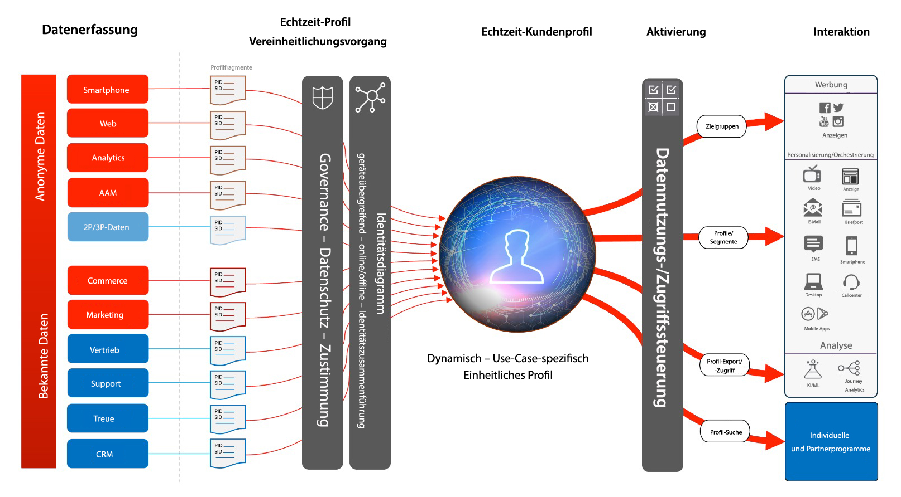
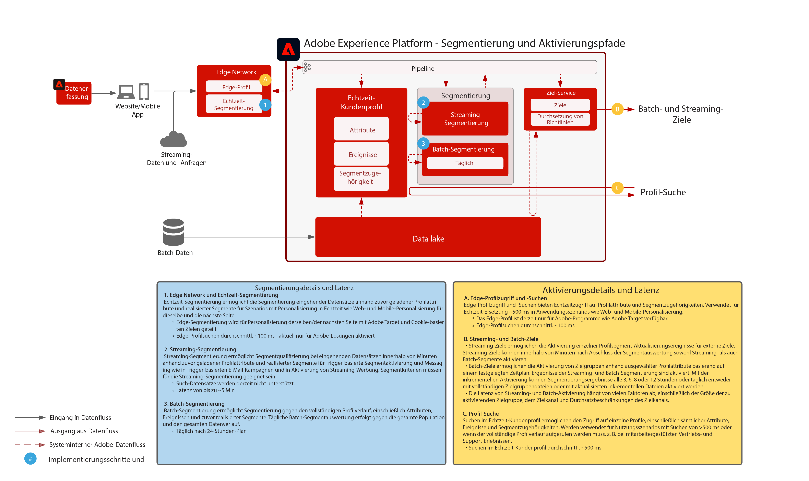

# Aktivierung von Zielgruppen und Profilen

Die Zielgruppen- und Profilaktivierung ist der Schlüssel zum Erfolg in der Welt des Data-driven Marketing. Allerdings orientieren sich viele Marken bei der Aktivierung noch immer zunächst am Kanal, was häufig in inkonsistenter Reichweite und Personalisierung endet.

Wenn der Kanal an erster Stelle steht, fungiert jeder Kanal als Silo, in dem Personalisierung für Kunden erfolgt, die auf diesem Kanal mit der Marke interagieren. Diese Herangehensweise spiegelt nicht die Realität wider, in der Kunden über viele verschiedene Touchpoints hinweg mit der Marke interagieren. Mit Zielgruppen- und Profilaktivierung können Marken Kundeninteraktionen über verschiedene Kanäle hinweg miteinander verknüpfen und so Content für eine zentrale Zielgruppe bereitstellen, die auf allen Kanälen aktiviert werden kann.

| Blueprint | Beschreibung | Experience Cloud-Programme |
|---|---|---|
| **[Anonyme Zielgruppenaktivierung](anonymous.md)** | <ul><li>Identifizieren Sie Zielgruppen basierend auf anonymen und verhaltensbasierten Kundendaten über Web- und Werbekanäle hinweg.</li><li>Third-Party-Zielgruppendaten können für bessere Personalisierung integriert werden.</li></ul> | <ul><li>Adobe Audience Manager</li></ul> |
| **[Aktivierung eines bekannten Kunden](known.md)** | <ul><li>Aktivierung für bekannte, profilbasierte Ziele, wie E-Mail-Anbieter, Social Media und Werbeziele. </li><li>Nutzung von Offline-Attributen und -Ereignissen, wie Offline-Bestellungen, Transaktionen, CRM- oder Treuedaten gemeinsam mit Online-Verhaltensdaten für Online-Targeting und -Personalisierung.</li></ul> | <ul><li>Adobe Experience Platform</li><li> [!UICONTROL Real-Time Customer Data Platform]</li><li>Adobe Audience Manager (optional)</li></ul> |
| **[Zielgruppen- und Profilaktivierung mit Experience Cloud-Programmen](platform-and-applications.md)** | <ul><li>Verwalten Sie Profile und Zielgruppen in Experience Platform und geben Sie sie für Experience Cloud-Programme frei.</li><li>Erstellen Sie umfassende Kundensegmente und Einblicke in Experience Platform und geben Sie sie für Experience Cloud-Programme frei.</li></ul> | <ul><li>Adobe Experience Platform</li><li>[!UICONTROL Real-Time Customer Data Platform]</li><li>Experience Platform Activation</li><li>Experience Cloud-Programme</li></ul> |

## Architektur des Echtzeit-Kundenprofils

In der folgenden Abbildung werden die Kernkomponenten des Echtzeit-Kundenprofils in Experience Platform beschrieben.

Zunächst werden Datenquellen in Experience Platform aufgenommen. Wenn die Datenquelle für die Verarbeitung von Profilen konfiguriert ist, wird sie in das Echtzeit-Kundenprofil aufgenommen. Für jede Datenquelle und für jeden für eine Datenquelle konfigurierten primären ID-Datensatz wird ein Profilfragment oder Dokument erstellt. Außerdem werden Daten, wenn sie in das Profil aufgenommen werden, auch vom Identity Service verarbeitet. Jeder Datensatz aus den Datenquellen, für die im Schema mehrere Identitäten markiert sind, und die entsprechenden Werte aus dem Datensatz werden als Identitätsbeziehung innerhalb des Identity Service verarbeitet.

Beachten Sie, dass Datensätze mit nur einer Identität nicht vom Identity Service verarbeitet werden, da solche Datensätze über keine Identitäts-Links verfügen, mit denen das Diagramm weiter gefüllt werden kann. Beachten Sie außerdem, dass der Identity Service keine primären Identitäten von sekundären Identitäten unterscheidet. Es verarbeitet einfach Identitätsbeziehungen über Identitäten hinweg.

Das Zusammenführen von Profilfragmenten erfolgt, da das Identitätsdiagramm die Beziehungen zwischen den verschiedenen Quell-Profilfragmenten bereitstellt, die zueinander in Beziehung stehen. Die Zusammenführungsrichtlinie bestimmt, welche Quellfragmente und welches Identitätsdiagramm für die Zusammenführung der Fragmente verwendet werden. Bei jedem Zugriff auf das Profil erfolgt eine Zusammenführung der Profilfragmente, um die aktuellste kombinierte Ansicht des Profils zu gewährleisten. Governance- und Richtlinienregeln stellen sicher, dass nur die autorisierten Segmente und Attribute für die angegebenen Ziele aktiviert werden können.

## Überblick über Segmentierung und Ziel

Die folgende Abbildung zeigt die verschiedenen Segmentierungsmethoden sowie die verschiedenen Aktivierungsmuster für Profile und Zielgruppen.

## Blueprints: Leitlinien für Zielgruppen- und Profilaktivierung

* [Richtlinien für Profile und Segmentierung](https://experienceleague.adobe.com/docs/experience-platform/profile/guardrails.html?lang=de)

### Aktivieren von Attributen und Identitäten

* [!UICONTROL Real-Time Customer Data Platform] kann Zielgruppenzugehörigkeiten sowie Attribut- und Identitätsänderungen für Profile aktivieren, die zu Segmenten gehören, die zur Aktivierung ausgewählt sind. Wenn Sie Attribute oder Identitäten aktivieren möchten, müssen Sie ein globales Segment definieren, das alle Profile enthält, an die Attribut- und Identitätsaktualisierungen gesendet werden. An diesem Punkt können Sie das Segment und die gewünschten Attribute auswählen, die im Zuge der Zielkonfiguration aktiviert werden sollen.
* Beachten Sie, dass Batch-Ziele nicht die Aktivierung von Ereignissen unterstützen, bei denen nur Attribute geändert werden. Vollständige oder inkrementelle Zielgruppenzugehörigkeiten können zusammen mit den ausgewählten Attributen zur Aktivierung gesendet werden.

### Aktivieren von Batch-Segmenten für Streaming-Ziele

* Die Aktivierung von Batch-Segmenten für Streaming-Ziele wird unterstützt. Da Profile anhand von Batch-Segmentierung für die Zielgruppenzugehörigkeit qualifiziert werden, kann diese Umsetzung durch Streaming-Aktivierung aktiviert werden.

### Aktivieren von Streaming-Segmenten für Batch-Ziele

* Das Streaming der Segmentaktivierung zu Batch-Zielen wird unterstützt. Profil-Segmentzugehörigkeiten werden gemäß dem Batch-Ziel-Zeitplan exportiert. Dies umfasst Segmentzugehörigkeiten, die sowohl über Streaming- als auch über Batch-Methoden bestimmt werden.

### Aktivieren von Erlebnisereignissen

* Die Aktivierung von unverarbeiteten Erlebnisereignissen wird nicht unterstützt. Zum Aktivieren für Erlebnisereignisse muss ein Segment mit den erforderlichen Regeln erstellt werden, die die Erlebnisereignis-Logik ein- oder ausschließen. Dadurch wird ein Segment erstellt, das für Erlebnisereignisse definiert wird. Die Segmentzugehörigkeit kann dann als Proxy zur Aktivierung von unverarbeiteten Erlebnisereignissen aktiviert werden. Sie können auch [!UICONTROL Launch Server Side] verwenden, um über das SDK erfasste unverarbeitete Erlebnisereignisse zu aktivieren.

## Verwandte Blog-Posts

* [[!DNL Blueprints for Audience Activation in Adobe Experience Platform]](https://medium.com/adobetech/a-blueprint-for-audience-activation-in-adobe-experience-platform-b2b30fae90fd)
* [[!DNL How Adobe Experience Platform Predictive Audiences improves Personalized Experiences]](https://medium.com/adobetech/how-adobe-experience-platform-predictive-audiences-improves-personalized-experiences-1f75a60cb7a3)
* [[!DNL Adobe Experience Platform Web SDK for Audience Management]](https://medium.com/adobetech/adobe-experience-platform-web-sdk-for-audience-management-751fa6d063bc)
