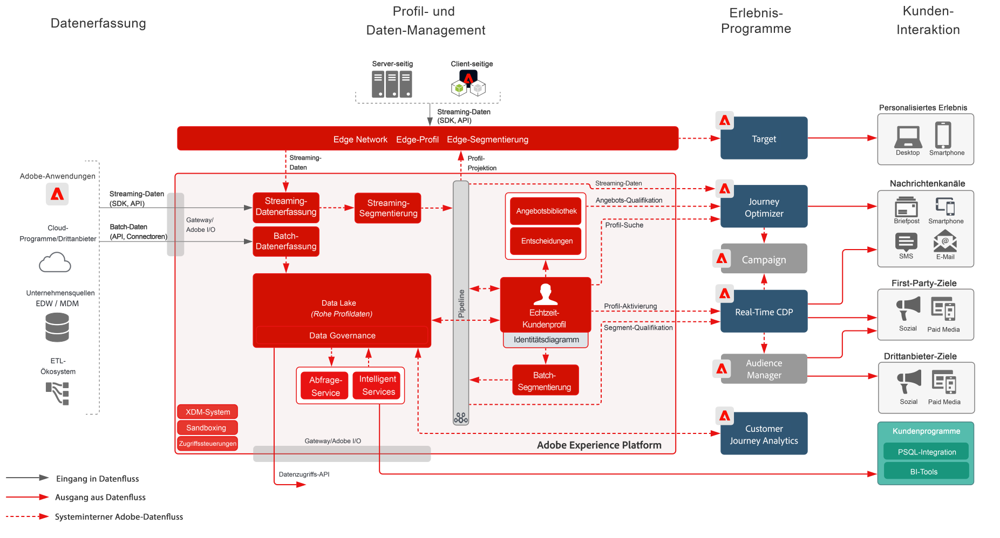

# Blueprint: Zielgruppen- und Profilaktivierung mit Experience Cloud-Programmen

Verwalten Sie Profile und Zielgruppen in Experience Platform und geben Sie sie für Experience Cloud-Programme frei. Erstellen Sie umfassende Kundensegmente und Einblicke in Experience Platform und geben Sie sie für Experience Cloud-Programme frei.

Die Aktivierung mit Experience Cloud-Anwendungen wird mit dem [Bekanntes Blueprint zur Kundenaktivierung](known.md).

## Anwendungsfälle

* Personalisierung und Targeting auf allen Kundeninteraktionskanälen, die auf Experience Cloud basieren
* Gemeinsame Nutzung von Zielgruppen- und Profildaten von Experience Platform und Experience Cloud-Programmen
* Erstellen Sie umfassende Insights aus kanalübergreifenden Daten, einschließlich Online-Verhaltensdaten und Datenwissenschaftsmodellen, um das Echtzeit-Kundenprofil in Experience Platform zu erweitern, das dann für Experience Cloud-Anwendungen freigegeben werden kann.

## Programme

* Adobe Experience Platform
* [!UICONTROL Real-Time Customer Data Platform]
* Experience Platform Activation
* Experience Cloud-Programme
   * Adobe Audience Manager
   * Adobe Target
   * Adobe Campaign
   * Journey Optimizer
   * Marketo Engage
   * Adobe Commerce
   * Customer Journey Analytics

## Architektur

Weitere Architekturdiagramme für Experience Platform-Integrationen mit Experience Cloud-Programmen finden Sie im Abschnitt [Architekturdiagramm zu Experience Platform und Programmen](https://experienceleague.adobe.com/docs/blueprints-learn/architecture/architecture-overview/platform-applications.html?lang=de).

### Zielgruppen- und Profilaktivierung mit Experience Cloud-Programmen

 

## Leitlinien

Beachten Sie die [Leitlinien auf der Übersichtsseite zur Zielgruppen- und Profilaktivierung](overview.md). und [Limits bei der Implementierung](../experience-platform/deployment/guardrails.md) Seite.

## Überlegungen bei der Implementierung

* Die Freigabe von Profildaten an Ziele erfordert, dass der spezifische Identitätswert, der vom Ziel in der Ziel-Payload verwendet wird, mit eingeschlossen wird. Jede Identität, die für ein Ziel notwendig ist, muss in Platform aufgenommen und als eine Identität für das [!UICONTROL Echtzeit-Kundenprofil] konfiguriert werden.

### Zielgruppenfreigabe von Real-time Customer Data Platform an Audience Manager

* Weitere Informationen finden Sie in der folgenden Dokumentation. [Segmentfreigabe für Experience Platform über Audience Manager und andere Experience Cloud-Lösungen](https://experienceleague.adobe.com/docs/audience-manager/user-guide/implementation-integration-guides/integration-experience-platform/aam-aep-audience-sharing.html?lang=de).

* Die Zielgruppenzugehörigkeit aus RT-CDP wird für Audience Manager per Streaming freigegeben, sobald die Segmentauswertung abgeschlossen ist. Sie wird unabhängig davon, ob die Segmentauswertung im Batch- oder Streaming-Modus erfolgte, in das Echtzeit-Kundenprofil geschrieben.
* Wenn das qualifizierte Profil die regionalen Routing-Informationen für zugehörige Profilgeräte enthält, wird die Zielgruppenzugehörigkeit von RTCDP auf dem zugehörigen Audience Manager Edge im Streaming-Modus qualifiziert. Wenn die regionalen Routing-Informationen in den letzten 14 Tagen auf ein Profil mit einem Zeitstempel angewendet wurden, werden sie im Streaming an der Audience Manager Edge ausgewertet. Wenn die RTCDP-Profile keine regionalen Routing-Informationen enthalten oder die regionalen Routing-Informationen älter als 14 Tage sind, werden die RTCDP-Zielgruppenmitgliedschaften zur Batch-basierten Auswertung und Aktivierung an den Audience Manager-Hub-Speicherort gesendet.
* Bei regionalen Routing-Informationen können diese Profile für die Edge-Aktivierung aktiviert werden. Dies erfolgt innerhalb von Minuten nach der Segmentqualifizierung durch die RTCDP. Profile, die nicht für die Edge-Aktivierung qualifiziert sind, qualifizieren sich für den Audience Manager-Hub und verfügen möglicherweise über einen 12 bis 24-Stunden-Zeitraum für die Verarbeitung.
* Regionale Routing-Informationen, für die das Audience Manager-Profil auf Edge gespeichert ist, können aus Audience Manager, dem Besucher-ID-Service, Analytics, Launch oder direkt aus dem Web SDK als separater Profildatensatz mit der XDM-Feldgruppe „Datenerfassung Regionsinformationen“ in Experience Platform gesammelt werden. Weitere Informationen finden Sie im Dokument für regionale Informationen. [Link](https://experienceleague.adobe.com/docs/id-service/using/reference/regions.html?lang=en).
* In Aktivierungsszenarios, in denen Zielgruppen aus Experience Platform für Audience Manager freigegeben werden, werden die folgenden Identitäten automatisch freigegeben: ECID, IDFA, GAID, gehashte E-Mail-Adressen (EMAIL_LC_SHA256), AdCloud ID. Benutzerdefinierte Namespaces werden derzeit nicht freigegeben.
* Die Zielgruppen aus Experience Platform können über Audience Manager-Ziele freigegeben werden, wenn die erforderlichen Zielidentitäten im [!UICONTROL Echtzeit-Kundenprofil] enthalten sind oder wenn Identitäten im [!UICONTROL Echtzeit-Kundenprofil] mit den erforderlichen Zielidentitäten verbunden werden können, die in Audience Manager verknüpft sind.

### Zielgruppenfreigabe aus Real-time Customer Data Platform für Target

* In der Blueprint [Personalisierung für bekannte Kunden – Target und RTCDP](https://experienceleague.adobe.com/docs/blueprints-learn/architecture/web-personalization/known-personalization.html?lang=de) finden Sie weitere Informationen zur Freigabe von Profilen und Zielgruppen aus Real-time Customer Data Platform für Target.

### Zielgruppenfreigabe aus Real-time Customer Data Platform für Campaign und Journey Optimizer

* In den [Blueprints zu Customer Journeys](https://experienceleague.adobe.com/docs/blueprints-learn/architecture/b2b-activation/b2bactivation.html?lang=en) finden Sie weitere Informationen zur Freigabe von Profilen und Zielgruppen aus Real-time Customer Data Platform für Campaign und Journey Optimizer.

### Zielgruppenfreigabe von Real-time Customer Data Platform nach Marketo Engage

* Siehe [B2B-Aktivierungs-Blueprints](https://experienceleague.adobe.com/docs/blueprints-learn/architecture/b2b-activation/b2bactivation.html?lang=en) Weitere Informationen zur Freigabe von Profilen und Audiences von Real-time Customer Data Platform für Marketo Engage.

### Zielgruppenfreigabe von Real-time Customer Data Platform an Customer Journey Analytics

* Siehe [Für Customer Journey Analytics freigegebene RTCDP-Zielgruppen](https://experienceleague.adobe.com/docs/analytics-platform/using/cja-usecases/ingest-aep-segments.html?lang=en) Weitere Informationen zur Freigabe von Real-time Customer Data Platform-Zielgruppen für Customer Journey Analytics.

## Verwandte Dokumentation

* Produktbeschreibung zu [[!UICONTROL Real-Time Customer Data Platform] ](https://helpx.adobe.com/de/legal/product-descriptions/real-time-customer-data-platform.html)
* [Richtlinien für Profile und Segmentierung](https://experienceleague.adobe.com/docs/experience-platform/profile/guardrails.html?lang=de)
* [Dokumentation zur Segmentierung](https://experienceleague.adobe.com/docs/experience-platform/segmentation/api/streaming-segmentation.html?lang=de)
* [Dokumentation zu Zielen](https://experienceleague.adobe.com/docs/experience-platform/destinations/catalog/overview.html?lang=de)

## Verwandte Videos und Tutorials

* Überblick über [[!UICONTROL Real-Time Customer Data Platform] ](https://experienceleague.adobe.com/docs/platform-learn/tutorials/application-services/rtcdp/understanding-the-real-time-customer-data-platform.html?lang=de)
* [Demo zu [!UICONTROL Real-Time Customer Data Platform]](https://experienceleague.adobe.com/docs/platform-learn/tutorials/application-services/rtcdp/demo.html?lang=de)
* [Erstellen von Segmenten](https://experienceleague.adobe.com/docs/platform-learn/tutorials/segments/create-segments.html?lang=de)
