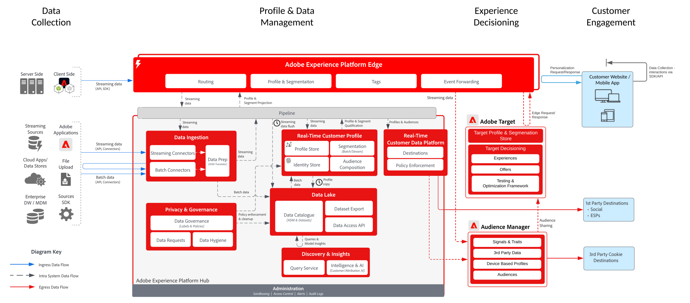

# Bekannte Kunden-Personalization mit Target

## Anwendungsfälle

* Online-Personalisierung mit bekannten Kundendaten
* Landingpage-Optimierung
* Personalisierung basierend auf vorherigen Produkt-/Content-Ansichten, Produkt-/Content-Affinität, Umgebungsattributen und Demografie neben Offline-Daten, wie Transaktionen, Treue- und CRM-Daten und Modellerkenntnissen
* Freigeben und Targeting von in Real-time Customer Data Platform definierten Zielgruppen auf Websites und mobilen Apps mit Adobe Target

## Programme

* [!UICONTROL Real-Time Customer Data Platform]
* Adobe Target

### Referenzdokumentation

* [Adobe Target-Verbindung für Real-time Customer Data Platform](https://experienceleague.adobe.com/docs/experience-platform/destinations/catalog/personalization/adobe-target-connection.html?lang=de)
* [Edge-Datenstrom-Konfiguration](https://experienceleague.adobe.com/docs/experience-platform/edge/fundamentals/datastreams.html?lang=de)

## Integrationsmuster

| Integrationsmuster | Fähigkeit | Voraussetzungen |
|--------------------|------------|---------------|
| **Echtzeit-Segmentauswertung auf der Edge, die von Real-time Customer Data Platform an Target freigegeben wurde** | - Auswerten von Zielgruppen in Echtzeit für die Personalisierung derselben oder der nächsten Seite auf der Edge.  - Alle Segmente, die im Streaming- oder Batch-Modus ausgewertet werden, werden auch auf die Edge Network projiziert, um sie in die Evaluierung und Personalisierung der Edge-Segmente einzubeziehen. | - Web-/Mobile-SDK muss für die Edge Network-Server-API implementiert werden.   - Der Datenstrom muss in Experience Edge mit aktivierter Erweiterung „Target“ und &quot;Experience Platform&quot; konfiguriert werden.   - Das Target-Ziel muss in Real-time Customer Data Platform-Zielen konfiguriert werden.  - Zur Integration mit Target ist dieselbe IMS-Org wie für die Experience Platform-Instanz erforderlich. |
| **Streaming- und Batch-Zielgruppenfreigabe von Real-time Customer Data Platform zu Target über den Edge-Ansatz** | - Teilen von Streaming- und Batch-Zielgruppen aus Real-time Customer Data Platform an Target über das Edge Network  - In Echtzeit ausgewertete Zielgruppen erfordern die Implementierung von Web SDK und Edge Network. | - Die Implementierung von Target über Web/Mobile SDK oder die Edge-API ist nicht erforderlich, um Streaming- und Batch-Zielgruppen von RTCDP für Target freizugeben, sondern ist erforderlich, um die Evaluierung von Edge-Segmenten in Echtzeit zu ermöglichen.  - Bei Verwendung von AT.js wird nur die Profilintegration mit dem ECID-Namespace unterstützt.  - Für die Suche nach benutzerdefinierten Identity-Namespaces auf der Edge ist die Bereitstellung der Web-SDK/Edge-API erforderlich und jede Identität muss in der Identitätszuordnung als Identität festgelegt werden.   - Das Target-Ziel muss in Real-time Customer Data Platform-Zielen konfiguriert werden, nur die standardmäßige Produktions-Sandbox in RTCDP wird unterstützt.  - Zur Integration mit Target ist dieselbe IMS-Org wie für die Experience Platform-Instanz erforderlich. |
| **Streaming- und Batch-Zielgruppenfreigabe von der Real-time Customer Data Platform zu Target und Audience Manager über den Audience Sharing Service-Ansatz** | - Dieses Integrationsmuster kann genutzt werden, wenn in Audience Manager eine zusätzliche Anreicherung aus Daten und Zielgruppen von Drittanbietern gewünscht wird. | - Web/Mobile SDK ist nicht erforderlich, um Streaming- und Batch-Zielgruppen für Target freizugeben, sondern ist erforderlich, um die Evaluierung von Edge-Segmenten in Echtzeit zu ermöglichen.  - Bei Verwendung von AT.js wird nur die Profilintegration mit dem ECID-Namespace unterstützt.  - Für die Suche nach benutzerdefinierten Identity-Namespaces auf der Edge ist die Bereitstellung der Web-SDK/Edge-API erforderlich und jede Identität muss in der Identitätszuordnung als Identität festgelegt werden.  - Zielgruppenprojektion über den Audience Sharing-Service muss bereitgestellt werden.   - Für die Integration mit Target ist dieselbe IMS-Organisation wie für die Experience Platform-Instanz erforderlich.  - Nur Zielgruppen aus der standardmäßigen Produktions-Sandbox unterstützen den Service „Audience Sharing Core“. |

## Echtzeit-, Streaming- und Batch-Zielgruppenfreigabe für Adobe Target

Architektur

Sequenzdetails

Übersicht – Architektur

## Implementierungsmuster

Die Personalisierung bekannter Kundinnen und Kunden wird über verschiedene Implementierungsverfahren unterstützt.

### Implementierungsmuster 1: [!DNL Edge Network] mit Web/Mobile SDK oder [!DNL Edge Network] API (empfohlener Ansatz)

* Verwenden der [!DNL Edge Network] mit der Web-/Mobile-SDK. Für die Edge-Echtzeit-Segmentierung ist das Implementierungsverfahren mit Web/Mobile SDKs oder der Edge-API erforderlich.
* [Siehe Experience Platform Web and Mobile SDK Blueprint](../experience-platform/deployment/websdk.md) für die SDK-basierte Implementierung.
* Zur Verwendung in der mobilen SDK muss die Erweiterung [Adobe Journey Optimizer - Decisioning](https://developer.adobe.com/client-sdks/edge/adobe-journey-optimizer-decisioning/) installiert sein.
* [Siehe die  [!DNL Edge Network] -Server-](https://experienceleague.adobe.com/docs/experience-platform/edge-network-server-api/overview.html?lang=de)) für eine API-basierte Implementierung von Adobe Target mit Edge-Profil.

### Implementierungsmuster 2 – Anwendungsspezifische SDKs

Verwendung herkömmlicher anwendungsspezifischer SDKs (z. B. AT.js und AppMeasurement.js). Die Edge-Echtzeit-Segmentevaluierung wird bei diesem Implementierungsverfahren nicht unterstützt. Doch das Streaming und die Batch-Zielgruppenfreigabe über den Experience Platform-Hub werden durch dieses Implementierungsverfahren unterstützt.

[Weitere Informationen finden Sie in der Dokumentation zum Adobe Target-Connector](https://experienceleague.adobe.com/de/docs/experience-platform/destinations/catalog/personalization/adobe-target-connection)
[Siehe programmspezifische SDK-Blueprint](../experience-platform/deployment/appsdk.md)

## Überlegungen bei der Implementierung

* Jede primäre Identität kann bei der Verwendung des oben beschriebenen Implementierungsmusters 1 mit dem [!DNL Edge Network] und Web SDK genutzt werden.
* Für die erste Personalisierung bei der Anmeldung mit bekannten Kundendaten, die zuvor in RTCDP aufgenommen wurden, muss die Personalisierungsanfrage über eine primäre Identität verfügen, die mit dem Diagramm Bekannte Kundenidentität in der Real-time Customer Data Platform übereinstimmt. Wenn die primäre ID auf ECID oder eine Identität festgelegt ist, die noch nicht mit dem bekannten Kundenprofil verknüpft wurde, dauert es mehrere Minuten, bis die Identitätszuordnung am Edge realisiert wird und die Edge-Personalisierung frühere aufgenommene bekannte Kundendaten enthält.
* Edge-Profile verfügen derzeit über eine 14-tägige TTL. Wenn sich ein Benutzer also nicht angemeldet hat oder am Edge 14 Tage lang nicht aktiv war, kann das Profil am Edge abgelaufen sein, und daher muss der Edge das Profil vom Hub abrufen, um die historische Profilansicht zu erhalten, um die Personalisierung zu unterstützen, die frühere aufgenommene Profilattribute und Segmente umfasst. Dies führt dann zu einer Personalisierung, wobei die historische Ansicht der Profile bei nachfolgenden Seitenansichten vs. der ersten Anmeldung erfolgt.

## Verwandte Dokumentation

### SDK-Dokumentation

* [Dokumentation zu Experience Platform Web SDK](https://experienceleague.adobe.com/docs/experience-platform/edge/home.html?lang=de)
* [Dokumentation zu Experience Platform Tags &#x200B;](https://experienceleague.adobe.com/docs/experience-platform/tags/home.html?lang=de)
* [Dokumentation zu Experience Cloud-ID-Service](https://experienceleague.adobe.com/docs/id-service/using/home.html?lang=de)

### Dokumentation zur Segmentierung

* [Überblick über Segmentierung in Experience Platform &#x200B;](https://experienceleague.adobe.com/docs/experience-platform/segmentation/home.html?lang=de)
* [Echtzeit-Segmentierung](https://experienceleague.adobe.com/docs/experience-platform/segmentation/ui/edge-segmentation.html?lang=de)
* [Streaming-Segmentierung](https://experienceleague.adobe.com/docs/experience-platform/segmentation/api/streaming-segmentation.html?lang=de)
* [Segmentfreigabe in Adobe Analytics über Adobe Audience Manager](https://experienceleague.adobe.com/docs/analytics/components/segmentation/segmentation-workflow/seg-publish.html?lang=de)
* [Konfiguration der Zusammenführungsrichtlinie](https://experienceleague.adobe.com/docs/experience-platform/profile/merge-policies/ui-guide.html?lang=de#create-a-merge-policy)

### Tutorials

* [Personalisierung des nächsten Treffers mit Real-Time CDP und Adobe Target](https://experienceleague.adobe.com/docs/platform-learn/tutorials/experience-cloud/next-hit-personalization.html?lang=de)
