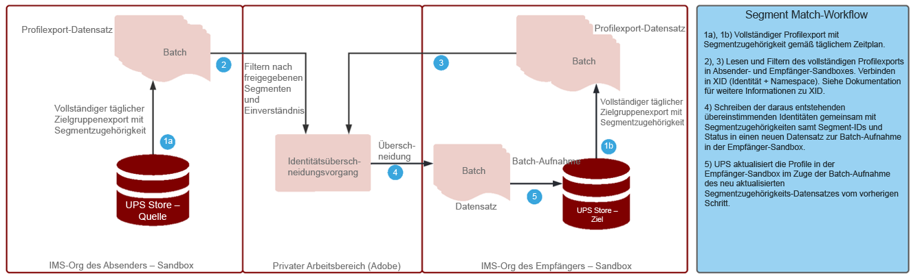

# Segmentübereinstimmung

Die Segmentübereinstimmung ermöglicht es Partnermarken, Zielgruppen in ihren jeweiligen Experience Platform-Umgebungen freizugeben. Der Schlüssel für Marken ist die Verbindung mit Kunden anhand von Daten, die aus ihren direkten Beziehungen zu Verbrauchern gesammelt werden. Mit besseren Verwaltungs-, Berechtigungs- und Präferenzmanagementsystemen können Marketingexperten ihre durch Erstanbieter authentifizierten Zielgruppen mit wichtigen Partnern weiter verbessern.

[!UICONTROL Segmentübereinstimmung] ist ein Datenerfassungsdienst, der Kunden von Experience Platform (AEP) ermöglicht (auch als _Partner_), um Segmentdaten auf der Grundlage gemeinsamer Branchenkennungen auf sichere, verwaltete und datenschutzfreundliche Weise auszutauschen.

Der Dienst ermöglicht es Kunden, übereinstimmende IDs sicher und neutral zu identifizieren, ohne ihre gesamte Datenbank offen legen zu müssen. Partner erhalten nur bestimmte Attribute (Segmentname) für überlappende IDs, wodurch eine schnellere und einfachere Freigabe auf steuerbare, einwilligungsgesteuerte Weise ermöglicht wird.

[!UICONTROL Segmentübereinstimmung] verwendet das Data Governance- und Zustimmungs-Framework von AEP als Backbone. Es ist für alle B2C- und B2P-Real-time Customer Data Platform-Kunden verfügbar. Hauptfunktionen von [!UICONTROL [!UICONTROL Segmentübereinstimmung]] include:

* Segmentfreigabe für Kunden mit überlappender Zustimmung
* Überschneidungsberichte vor der Freigabe für Einblicke in das geschätzte Übereinstimmungsvolumen
* Vollständig integrierte DULE-Richtlinie und Durchsetzung von Berechtigungen
* Framework für die Datenfreigabe-Zustimmung
* Daten-Feeds zum Organisieren von Segmenten und Partnern

## Programme

Marke für Herausgeber:

Der &quot;Anwendungsfall des Herausgebers&quot;ist am stärksten von der Einstellung von Drittanbieter-Cookies und ID-Daten für mobile Werbung betroffen. Dieser Anwendungsfall hat erhebliche Auswirkungen auf die Medien- und Unterhaltungsbranche, die sich auf den Verkauf von Werbung als Geschäftsmodell konzentriert. [!UICONTROL Segmentübereinstimmung] ist ein Pfad für Herausgeber mit großen Erstanbieterzielgruppen, die direkt mit ihren Werbetreibenden zusammenarbeiten möchten. Werbetreibende können direkt mit Herausgebern zusammenarbeiten, um für detaillierte Targeting- oder Prospektionskampagnen Werbung für passende Zielgruppen in Veröffentlichungseigenschaften zu schalten.

### Marke in Marke

Die Journey der Verbraucher sind nie linear. Ein Kunde kann beispielsweise einer Fluggesellschaft und seinem Kreditkartenunternehmen treu sein. Durch Verwendung von [!UICONTROL Segmentübereinstimmung], können die Fluggesellschaft und das Kreditkartenunternehmen eine Datenpartnerschaft erstellen, um sich überschneidende Zielgruppen zu verstehen und anschließend Angebote so anzupassen, dass sie den treuen Verbrauchern jedes einzelnen Unternehmens personalisierte Erlebnisse bieten.

### BU bis BU

Globale multinationale Unternehmen haben Herausforderungen bei der Datenzusammenarbeit zwischen unabhängig operierenden Geschäftsbereichen. Die Kombination von Daten in einer Sandbox ist u. U. aufgrund unterschiedlicher Datenschutzrichtlinien, Akquisen oder Verwaltungsberechtigungen in verschiedenen Geschäftseinheiten nicht möglich.

[!UICONTROL Segmentübereinstimmung] hilft unterschiedlichen Marketingteams in den verschiedensten Unternehmen, effizienter zusammenzuarbeiten und gleichzeitig unabhängig zu arbeiten

## Architektur


[!UICONTROL Segmentübereinstimmung] ist kein Daten-Marketplace, in dem Daten gekauft werden können. Vielmehr handelt es sich um eine AEP-Funktion, die mit Erstanbieterdaten mit ausgewählten Partnern arbeitet, wobei Datenschutz- und Einverständniskontrollen zur Zusammenarbeit verwendet werden. [!UICONTROL Segmentübereinstimmung] hilft, die Bemühungen auf die Verbesserung der Kundenbeziehungen und das Wachstum der Marke zu konzentrieren. Es ist von Vorteil, wenn bereits vorhandene Marken oder Partnerbeziehungen bestehen. [!UICONTROL Segmentübereinstimmung] Erlebnis ist einfach zu verwalten, skalierbar und ermöglicht es Administratoren, Segmente per Opt-in und unter Kontrolle freizugeben.

[!UICONTROL Segmentübereinstimmung] ermöglicht Folgendes:

* Segmentieren Sie Mitgliedschaftsdaten, die mithilfe von standardmäßigen personenbezogenen Kennungen, wie Hash-E-Mail-Adresse oder Telefonnummer, sicher unternehmensübergreifend portiert werden sollen.
* Eine Zielgruppen-Freigabe-Benutzeroberfläche und Workflows mit Benachrichtigungen
* Schätzungen vorab freigegebener Überschneidungen
* Einrichtung eines Self-Service-Partners
* Überschneidungen bei ausgewählten standardisierten Namespaces (Hash-E-Mail, Hash-Telefon, ECID, IDFA, GAID)
* Durchsetzung der Datenfreigabe-Zustimmung
* Freigegebenes Zielgruppen-Lebenszyklus-Management
* DULE-Durchsetzung im Freigabe-Workflow
* Tägliche Batch-Aktualisierungen

[!UICONTROL Segmentübereinstimmung] ermöglicht die Erstellung eines vernetzten Kundenerlebnisses. Unterstützte dauerhafte Kennungen sind Hash-E-Mails, Hash-Telefonnummern und Kennungen wie ECID, IDFA und GAID. Kunden können Feeds erstellen, die Zielgruppendaten zwischen Marken-Sandboxes abgleichen und verschieben, mit starken Governance-, Transparenz- und Rückruffunktionen für die Verwendung in Werbe- und Marketing-Aktivierungen

## Voraussetzungen

Die Voraussetzungen für [!UICONTROL Segmentübereinstimmung] sind:

* Aktive RT-CDP-Lizenz
* Unterstützte Standard-Hash-Kennungen sind SHA256-Hash-E-Mail, Hash-Telefon, ECID, Apple IDFA und GAID
* Datenschutz-Framework und Einverständnisstrategie
* Datenfreigabe-Vereinbarungen zwischen Kunden

## Sicherheit

### RBAC

Die [!UICONTROL Segmentübereinstimmung] Der Fluss zur Verwaltung von Partnern wird durch RBAC gesichert. Nur Personen mit der richtigen Berechtigung können Partner initiieren, akzeptieren oder verwalten. Dies kann im Abschnitt &quot;Datenerfassung&quot;des Produktprofils erfolgen. Die folgenden Berechtigungen sind erforderlich:


| Berechtigung | Beschreibung |
|---|---|
| **Verbindungen für Zielgruppenfreigabe verwalten** | Mit dieser Berechtigung können Sie den Partner-Handshake-Prozess abschließen, der zwei IMS-Organisationen verbindet, um die Aktivierung von [!UICONTROL Segmentübereinstimmung] Flüsse. |
| **Verwalten von Zielgruppenfreigaben** | Mit dieser Berechtigung können Sie Feeds erstellen, bearbeiten und veröffentlichen (das Datenpaket, das für [!UICONTROL Segmentübereinstimmung]) mit aktiven Partnern (Partnern, die vom Administrator mit **Zielgruppenfreigabe-Verbindungen** Zugriff). |

Siehe [amtliche Dokumentation](https://experienceleague.adobe.com/docs/experience-platform/segmentation/ui/segment-match/overview.html?lang=en#understanding-segment-match-permissions) , um mehr über die Berechtigungen zu erfahren.

### Kennung verbinden

Der Partnerverbindungsprozess wird vom **[!UICONTROL Kennung verbinden],** Hierbei handelt es sich um eine zufällig generierte Kennung, die einer bestimmten AEP-Sandbox zugeordnet ist. Diese Connect-ID ist erforderlich, um Partner-Sandboxes zu initiieren und zu verwalten. Es gibt auch die Möglichkeit, bei Bedarf eine Verbindungs-ID neu zu generieren, um eine Partnerverbindung neu zu konfigurieren.

### Governance

Alle Datensätze oder Datenattribute mit *C11* Die Vertragsbezeichnung ist auf [!UICONTROL Segmentübereinstimmung] Dienst. Segmente, die diese Attribute verwenden, können nicht für [!UICONTROL Segmentübereinstimmung]. Dadurch wird gesteuert, für welche Segmente verwendet werden können oder nicht [!UICONTROL Segmentübereinstimmung]. Darüber hinaus werden auch benutzerdefinierte Richtlinien und erstellte Marketing-Aktionen erzwungen. Standardmäßig sind Richtlinien deaktiviert und müssen für die Durchsetzung aktiviert sein. Einschränkungen wie E-Mail-Marketing und Onsite-Werbung, die bei der Freigabe von Segmenten ausgewählt werden, werden ebenfalls propagiert und für die Partner freigegeben.

### Einverständnis

Die Zustimmungseinstellungen für [!UICONTROL Segmentübereinstimmung] kann wie folgt verwaltet werden:

* Auf Unternehmensebene während des Onboarding die Opt-out- oder Opt-in-Einstellung für die Einwilligungsüberprüfung.

   Diese Einstellung bestimmt, ob Benutzerdaten freigegeben werden können oder nicht. Die Standardeinstellung ist auf &quot;Opt-out&quot;, das angibt, dass Benutzerdaten unter der Annahme freigegeben werden können, dass der AEP-Kunde bereits über die erforderliche Zustimmungsvereinbarung für die Verwendung von Daten-Sharing verfügt. Diese Einstellung kann geändert werden, indem Sie den Kundenbetreuer von Adobe kontaktieren und einen zusätzlichen Check einrichten, um AEP-Kunden zu zwingen, ihre Zustimmung explizit zu verfolgen.

* Festlegen des für Identitäten (idSpecific) spezifischen Attributs share mithilfe der [Feldergruppe &quot;Einwilligungen und Voreinstellungen&quot;](https://experienceleague.adobe.com/docs/experience-platform/xdm/field-groups/profile/consents.html?lang=en).

   Diese Feldergruppe stellt ein einzelnes Objekt-Feld bereit, das die Zustimmung gibt, um Zustimmungs- und Präferenzinformationen zu erfassen. [!UICONTROL Segmentübereinstimmung]enthält standardmäßig alle Identitäten, die nicht explizit abgemeldet wurden, z. B.:

   ```
   "share": {
   `                `"val": "n"
   `     `}
   ```

   Diese Einstellung kann geändert werden, indem Sie sich an den Kundenbetreuer der Adobe wenden und nur Identitäten mit explizitem Opt-in einschließen, z. B.:

   ```
   "share": {
   `                `"val": "y"
   `     `}
   ```

### Warnhinweise

Warnhinweise werden generiert, wenn eine Partnerverbindung initiiert wird oder wenn Segmentfeeds für Partner freigegeben werden.

## Arbeitsablauf einrichten

Der Workflow zum Einrichten der Partnerverbindung wird wie oben beschrieben mit dem RBAC verwaltet. Wenn die richtigen Berechtigungen vorhanden sind, erfordert die Verbindung zu einer Partner-Sandbox, dass die Connect-ID dieser Sandbox/Instanz innerhalb der Organisation des Partners freigegeben wird.

Sobald eine Verbindung vom sendenden Partner angefordert wird, muss sie auf der empfangenden Seite genehmigt werden, um eine sichere Partnereinrichtung zu gewährleisten. Der Handshake der Partnerverbindung stellt sicher, dass die Vereinbarung zwischen den beiden Organisationen besteht, und ermöglicht die Adobe, die [!UICONTROL Segmentübereinstimmung] im Namen der Organisation verarbeitet werden. Wenn die Verbindung genehmigt ist und sich im aktiven Status befindet, kann der Prozess der Segmentfreigabe von beiden Seiten aus initiiert werden.

### Segmentfreigabe

Die Segmentfreigabe mit dem Partner erfolgt nur, wenn eine Übereinstimmung für die ausgewählte Kennung vorhanden ist. Es kann eine Eins-zu-viele-Partnerbeziehung geben, d. h. Segmente können für mehrere Partner freigegeben werden.

Um die Segmentfreigabe zu starten, nachdem die Partnerverbindung eingerichtet wurde, sollte der sendende Partner einen Feed erstellen. Wählen Sie dann die Marketing-Anwendungsfälle oder -Aktionen aus, von denen die Segmentdaten zusammen mit den dauerhaften Kennungen ausgeschlossen werden sollen. Relevante Segmente können dann zum Feed zur Freigabe hinzugefügt werden.

Im Rahmen dieses Segmentfreigabe-Workflows kann der Versandpartner potenzielle hochwertige Segmente über geschätzte Überschneidungen ermitteln, bevor Daten verschoben werden.

Der gesamte Prozessablauf ist:


Diese Überschneidungsschätzungen bieten wichtige Einblicke, die Partnersuche und Daten, um Vereinbarungen zur Datenzusammenarbeit zu fördern. Es werden keine Kunden- oder Segmentdaten über Sandboxes hinweg verschoben, um diese Überschneidungsschätzmetriken zu erhalten. Die vom Kunden ausgewählten, vorab gehashten anwendbaren Identitäten in einer beliebigen Sandbox werden einer probabilistischen Datenstruktur hinzugefügt, die es der Adobe ermöglicht, Vereinigungs- und Schnittvorgänge zwischen ihnen durchzuführen. Diese Vorgänge helfen Ihnen [!UICONTROL Segmentübereinstimmung] die geschätzte Schnittmenge aus zwei Datenstrukturen abrufen, die aus Identitäten aus zwei verschiedenen Sandboxes bestehen, ohne die tatsächlichen Werte vergleichen zu müssen

Der Prozess der Identitätsüberschneidung hängt von der **täglicher vollständiger Profilexport** Datensatz aus Absender- und Empfänger-Sandboxes, um allgemeine Profile zu identifizieren, die zu den freigegebenen Segmenten gehören. Der detaillierte Prozessablauf für den Überschneidungsprozess ist unten dargestellt:



Nachdem die Segmentfreigabe vom Sendepartner abgeschlossen wurde, erhält der Empfänger eine Benachrichtigung über den freigegebenen Segmentfeed. Dieser Segment-Feed muss für ein Profil beim Empfänger aktiviert sein, um den Datenfluss für die Segmentmitgliedschaft zu starten. Nur die Segmentzugehörigkeit wird in die sich überschneidenden Profilfragmente der IMS-Organisation des Empfängers aufgenommen und keine zusätzliche Identität wird vom Absender an den Empfänger übertragen.

Das freigegebene Segment ist unter der `AEPSegmentMatch` Abschnitt **[!UICONTROL Zielgruppen]** im **[!UICONTROL Segment Builder]** und kann für die Einbeziehung oder Unterdrückung von Zielgruppen beim Erstellen von Segmenten in der Empfänger-Sandbox verwendet werden.

Tägliche Überschneidungen sorgen dafür, dass die Segmentzugehörigkeit zwischen Absender und Empfänger synchronisiert wird. Der Empfänger kann das Profil für den empfangenen Segment-Feed deaktivieren, um den Segmentfreigabevorgang anzuhalten.

#### Ausstieg/Einstieg aus Segmenten

Im Rahmen des vollständigen Profilexports hat der Status für die freigegebenen Segment-IDs unter der Segmentzugehörigkeit für Profile einen der entsprechenden Werte - _realisiert_, _beendet_ oder _vorhandene_ , um den aktuellen Status widerzuspiegeln.

Wenn während der täglichen Identitätsüberlappung die entsprechende Identität in der Empfänger-Sandbox vorhanden ist, werden diese Segmentzugehörigkeitsstatus für freigegebene Segmente zur Aufnahme an den Empfänger gesendet.

#### Segmentsperrung

Bei der Aufhebung/Löschung von Segmenten aus dem Absender handelt es sich um einen On-Demand-Prozess, bei dem die Liste aller Profile mit den gesperrten Segment-IDs vom Empfänger abgerufen wird. Die Segment-IDs werden aus der Segmentzugehörigkeit dieser Identitäten entfernt und am Empfänger neu gezählt. Diese Aktion überschreibt das vorhandene Segmentmitgliedschaftsfragment, das die Mitgliedschaft für dieses Segment löscht.

## Weitere Informationen

* [Segmentübereinstimmung](https://experienceleague.adobe.com/docs/experience-platform/segmentation/ui/segment-match/overview.html?lang=en#)
* [Berechtigungen](https://experienceleague.adobe.com/docs/experience-platform/access-control/home.html?lang=en)
* [Fehlerbehebung](https://experienceleague.adobe.com/docs/experience-platform/segmentation/ui/segment-match/troubleshooting.html?lang=en)
* [XID](https://experienceleague.adobe.com/docs/experience-platform/identity/api/list-native-id.html?lang=en)
