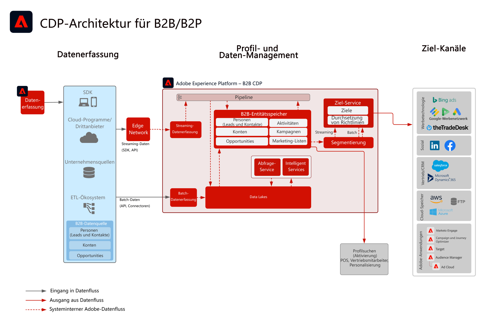

# Blueprint: B2B – Aktivierung von Zielgruppen und Profilen

Verwenden Sie Account-, Opportunity- und Lead-Informationen, die mit einem einzelnen Kundinnen bzw. Kunden verknüpft sind, um verwertbare B2B-Profile für verbesserte Personalisierung und Targeting auf allen Kanälen zu erstellen.

## Anwendungsfälle

* Erstellen Sie Zielgruppen von Personen für Targeting und Personalisierung auf allen Kanälen anhand von B2B-Daten zu Accounts Opportunities und Leads.
* Aktivieren Sie Zielgruppen für Targeting und Personalisierung für beliebige Experience Platform-Ziele.

## Programme

* Real-time Customer Data Platform B2B Edition

## Integrationsmuster

* B2B: Datenquellen (Marketo, Salesforce usw.) -> Real-time Customer Data Platform B2B Edition -> Ziele
Verschiedene B2B-Datenquellen können für die Zuordnung von Account-, Lead-, Opportunity- und Personendaten in der B2B Edition von Real-time Customer Data Platform verwendet werden.

## Architektur

 

## Leitlinien

* Beachten Sie, dass Leitlinien und Implementierungsschritte für Marketo Engage nur relevant sind, wenn Marketo Engage als Quelle und/oder Ziel verwendet wird.

* Weitere Informationen und Limits für End-to-End-Latenzen finden Sie im Abschnitt [Leitlinien zur Implementierung](../experience-platform/deployment/guardrails.md)

### Unterstützung mehrerer Instanzen und IMS-Organisationen:

Im Folgenden werden die unterstützten Muster für die Zuordnung von Experience Platform- und Marketo Engage-Instanzen beschrieben.

#### Marketo als Datenquelle für Experience Platform:

* Mehrere Marketo Engage-Instanzen für eine Experience Platform-Instanz werden unterstützt.
* Mehrere Marketo Engage-Instanzen für mehrere Experience Platform-Instanzen werden nicht unterstützt.
* Eine Marketo Engage-Instanz für mehrere Experience Platform-Instanzen wird nicht unterstützt.
* Eine Marketo Engage-Instanz für eine Experience Platform-Instanz und mehrere Sandboxes werden unterstützt.

#### Marketo als Ziel für Experience Platform:

* Experience Platform für mehrere Marketo Engage-Instanzen wird unterstützt
* Mehrere Experience Platform-Instanzen für eine Marketo Engage-Instanz werden unterstützt

#### Leitlinien für Profile und Segmentierung in Experience Platform:

* Die Leitlinien für Profil und Segmentierung in Experience Platform finden Sie unter [Leitlinien für Profile und Segmentierung](https://experienceleague.adobe.com/docs/experience-platform/profile/guardrails.html?lang=de)
* B2B-Segmente, die Accounts, Leads und Opportunities enthalten, verwenden Beziehungen mit mehreren Entitäten, die dazu führen, dass die Segmentbewertung in Batches erfolgt. Streaming-Segmentierung wird für Segmente unterstützt, die auf Personen und Ereignisse beschränkt sind.

#### Experience Platform - Marketo Engage-Quell-Connector:

* Die historische Aufstockung kann je nach Datenvolumen bis zu 7 Tage dauern.
* Laufende Datenaktualisierungen und -änderungen aus Marketo werden über die Streaming-API an Experience Platform gesendet. Dabei ist je nach Volumen eine Latenz von bis zu 5 Minuten beim Profil und ca. 15 Minuten beim Data Lake möglich.

#### Experience Platform - Marketo-Ziel-Connector:

* Die Freigabe von Streaming-Segmenten von Real-time Customer Data Platform an Marketo Engage kann bis zu 5 Minuten dauern.
* Die Batch-Segmentierung wird einmal täglich basierend auf dem Segmentierungsplan von Experience Platformen freigegeben. B2B-Segmente, die Accounts, Leads und Opportunities enthalten, verwenden Beziehungen mit mehreren Entitäten, die dazu führen, dass die Segmente in Batches aufgeteilt werden.

#### Marketo Engage-Leitlinien:

* Kontakte und Leads müssen direkt in Marketo Engage aufgenommen und definiert werden, damit die Real-time Customer Data Platform-Zielgruppe mit einem Marketo Engage-Kontakt und -Lead übereinstimmt.

#### Ziel-Leitlinien

* Spezifische Anweisungen zu Zielen finden Sie in der Dokumentation zu Zielen. [Ziel-Leitlinien](https://experienceleague.adobe.com/docs/experience-platform/destinations/guardrails.html?lang=de)

## Implementierungsschritte

Eine Anleitung zur Implementierung und Konfiguration der B2B Edition von Real-time Customer Data Platform finden Sie in der Dokumentation zur B2B Edition von Real-time Customer Data Platform. [B2B Edition von Real-time Customer Data Platform](https://experienceleague.adobe.com/docs/experience-platform/rtcdp/b2b-overview.html?lang=de)

Es gibt zwei mögliche Implementierungsmuster. Einerseits die Möglichkeit, B2B-Daten und -Profile aus Marketo Engage aufzunehmen, andererseits die Möglichkeit, B2B-Daten aus anderen CRM-Datenquellen zu aufzunehmen.

## Überlegungen bei der Implementierung

Anleitung zu wichtigen Erwägungen und Konfigurationen der Blueprint.

* CRM-Integration mit und ohne Marketo:
Wenn die Implementierung Marketo Engage als Quelle verwendet und Marketo Engage mit dem CRM verbunden ist, verwenden Sie den Marketo-Quell-Connector in Experience Platform, um die CRM-Daten in Experience Platform aufzunehmen. Verwenden Sie den Experience Platform-Quell-Connector, wenn zusätzliche Tabellen aufgenommen werden müssen. Wenn die Implementierung Marketo Engage nicht als Quelle verwendet, verbinden Sie die Quelle direkt über den Experience Platform-Connector der CRM-Quelle mit AEP.
* Lead-Initiierung und -Nurturing nur über die B2B Edition von Real-time Customer Data Platform wird nicht empfohlen. Für diesen Anwendungsfall wird die Verwendung eines Lead-Nurturing-Tools (wie Marketo Engage) empfohlen.
* Der Marketo Engage-Ziel-Connector für AEP, der Zielgruppen zur Aktivierung an Marketo Engage sendet, sendet nur E-Mail-Adressen und ECIDs. Wenn der Kontakt noch nicht vorhanden ist, wird kein neuer Lead erstellt. Folglich müssen Profil und Lead-Daten in Marketo Engage aufgenommen werden.

## Verwandte Dokumentation

* [B2B Edition von Real-time Customer Data Platform](https://experienceleague.adobe.com/docs/experience-platform/rtcdp/b2b-overview.html?lang=de)
* [Adobe Experience Platform](https://experienceleague.adobe.com/docs/experience-platform.html?lang=de)
* [Marketo Engage](https://experienceleague.adobe.com/docs/marketo/using/home.html?lang=de)
* [Adobe Experience Platform - Marketo-Quell-Connector](https://experienceleague.adobe.com/docs/experience-platform/sources/connectors/adobe-applications/marketo/marketo.html?lang=de)
* [Adobe Experience Platform - Marketo-Ziel-Connector](https://experienceleague.adobe.com/docs/marketo/using/product-docs/core-marketo-concepts/smart-lists-and-static-lists/static-lists/push-an-adobe-experience-cloud-segment-to-a-marketo-static-list.html?lang=de)
