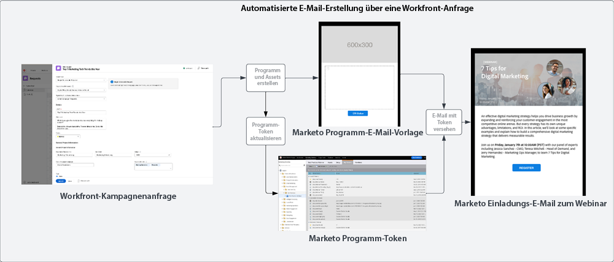
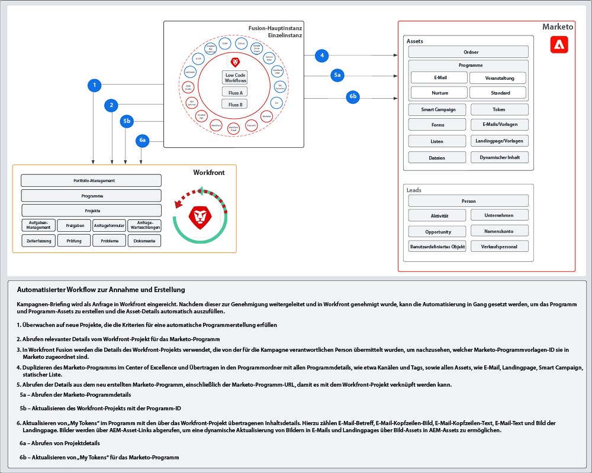

# Aufnahme und Erstellung {#intake-and-create}

Die Anzahl der Marketing-Anfragen, die an ein Marketing-Operations-Team gesendet werden, um neue Kampagnen zu starten, kann ein gut funktionierendes Team in eine Drehtür für sich wiederholende Aufgaben verwandeln, was zu einem Burnout und einer stagnierenden Innovation führt.

Durch die Einrichtung eines Verfahrens zur Übermittlung von Kampagnenanforderungen und die Automatisierung der Erstellung häufig angeforderter Marketingkampagnen haben Sie folgende Möglichkeiten: die Geschwindigkeit Ihrer Kampagnen zu erhöhen, Fehler zu reduzieren, Anforderungen an das richtige Mitglied der Marketing-Vorgänge weiterzuleiten, die Ressourcenauslastung auszugleichen und zu verbessern und mehr Ihrer Marketing-Vorgänge auf strategischere Aufgaben zu konzentrieren.

Mit Workfront und Marketo Engage ermöglicht eine System-zu-System-Verbindung Details von einem [Workfront-Anfrageformular](https://experienceleague.adobe.com/docs/workfront/using/administration-and-setup/customize/custom-forms/create-or-edit-a-custom-form.html){target=&quot;_blank&quot;} zum Erstellen eines Marketo Engage-Programms und anschließendes Ausfüllen von Schlüsselvariablen wie: Betreffzeilen, E-Mail-Kopie, Bilder, Daten, Zeiten, Ereignisinformationen und mehr.

Um diese Integration zu erreichen, verwenden Sie Workfront Fusion, eine Arbeitsautomatisierungsschicht, mit der Sie Workflows zwischen Workfront und anderen Systemen automatisieren können.

Der folgende Workflow zeigt eine Anforderung eines Webinars durch einen Kampagnenmanager, der ein Workfront-Anfrageformular verwendet. Die in der Anfrage übermittelten Details werden dann in einem Programm und einer E-Mail Trigger, die im Marketo Engage für das Webinar erstellt werden sollen. Darüber hinaus werden Details aus dem Anfrageformular übernommen, um den Inhalt der E-Mail zu füllen.

>[!TIP]
>
>Weitere Informationen zu den verschiedenen Objekttypen in Workfront, die für die Organisation der Marketingkampagnen verwendet werden, und zur Zuordnung zu einem Marketo Engage-Programm finden Sie im Abschnitt [Überblick über Marketo und Workfront](/help/blueprints/b2b/campaign-supply-chain/overview.md){target=&quot;_blank&quot;}.

## Vorbereiten Ihres Kampagnenentwicklungsprozesses für die Automatisierung {#prepare-your-campaign-development-process-for-automation}

Hinter jeder großartigen Workflow-Automatisierung steht ein definierter Prozess, der sicherstellt, dass Teams und Stakeholder von der Automatisierung optimal profitieren.

**Welche Arten von Marketing-Anfragen erhalten Sie?**

Denken Sie darüber nach, welche Arten von Marketing-Taktiken Sie ausführen werden, z. B. E-Mails, Pflege, Erstanbieter-Webinare und Veranstaltungen. Führen Sie auch Drittanbieter-Webinare oder Display-Anzeigen aus? Jede dieser Anforderungen sollte berücksichtigt werden, da sie möglicherweise spezifische Eingabefelder im Anfrageformular benötigen und verschiedenen Programmvorlagen in Marketo Engage zugeordnet werden, die geklont werden.

Außerdem möchten Sie wissen, ob Sie Kampagnen in mehreren Regionen ausführen. In diesem Fall sollten Sie ein Projekt in Workfront berücksichtigen, das mehrere Programme in Marketo Engage erstellt, wobei jedes Programm für unterschiedliche Sprachunterstützung steht.

Es ist wichtig, vorab zu wissen, welche Arten von Marketing-Anfragen Sie erwarten, um sicherzustellen, dass Anfragen automatisiert erleichtert werden können.

**Welche Informationen sollten in der Kampagnenanforderung erfasst werden?**

Denken Sie an die wichtigsten Informationen, die in Ihrem Anfrageformular für jede der verschiedenen ausgeführten Taktiken erfasst werden müssen. Im Folgenden finden Sie einige Beispiele für Informationen, die Sie in einem Workfront-Formular erfassen können, um die Kampagnenentwicklung zu automatisieren.

<table> 
  <tr> 
   <td><b>Marketing-Taktik</b></td>
   <td><b>Zu erfassende Informationen</b></td>
  </tr>
  <tr> 
   <td>Email Blast</td>
   <td>・ Email Subject 
・ Geplantes Datum 
・ E-Mail-Kopie 
・ Aktionsaufruf 
・ Bilder - AEM Assets-URLs können zur Verwendung in Marketo direkt referenziert werden 
・ Kriterien für die Zielgruppenqualifikation</td>
  </tr>
  <tr>
   <td>Webinar/Veranstaltung</td>
   <td>・ Ereignisname 
・ Ereignisdatum 
・ Ereigniszeit 
・ Veranstaltungsort 
・ Ereignisbeschreibung 
・ Webinar-Aufzeichnungsseite - PageURL OnDemand 
・ Sprechernamen 
・ Lautsprechertitel 
・ Lautsprecherbilder 
・ Benötigte E-Mails (Einladung, Bestätigung, Erinnerung, Follow-up) 
・ E-Mail-Kopfzeilenbild(e) 
・ Kriterien für die Zielgruppenqualifikation</td>
  </tr>
  <tr>
   <td>Krankenpflege</td>
   <td>・ Anzahl der E-Mails 
・ E-Mail-Kopie 
・ E-Mail-Header 
・ Aktionsaufruf 
・ Kriterien für die Zielgruppenqualifikation</td>
  </tr>
  </tbody>
</table>

>[!NOTE]
>
>Heute ist das programmgesteuerte Erstellen von Zielgruppen durch Automatisierung in Marketo Engage eingeschränkt, da Token in Smart-Listen nicht unterstützt werden. Das bedeutet, dass Zielgruppen entweder von einem Benutzer in Marketo Engage erstellt werden müssen oder wenn Sie eine vordefinierte Zielgruppe haben, mit der Sie kontinuierlich kommunizieren, können Sie eine konfigurierte Smart-Liste als Teil Ihrer Programmvorlage einfügen, die während des Automatisierungsprozesses geklont wird.

### Einrichtung Ihres Exzellenzzentrums {#establish-your-center-of-excellence}

Wenn Sie die Erstellung von Programmen automatisieren möchten, benötigen Sie ein Kompetenzzentrum für Marketo Engage. Ein Kompetenzzentrum umfasst vorlagenbasierte Programme und Assets, die den Kampagnenentwicklungsprozess beschleunigen und standardisieren. Sie können beispielsweise eine Programmvorlage für unterschiedliche Kampagnenanforderungen haben: E-Mail, Pflege, persönliche Veranstaltung und Webinar. Darüber hinaus können Sie mehrere E-Mail-Programmvorlagen verwenden, die Sie für verschiedene Regionen oder für verschiedene Arten von E-Mail-Ankündigungen verwenden.

Der Aufbau Ihres Kompetenzzentrums mit Programmvorlagen in Marketo Engage ist einer der ersten Schritte, um einen programmatischeren Ansatz für die Kampagnenausführung zu verfolgen und wird als Grundlage für die Automatisierung von Kampagnenanforderungen dienen.

Sobald Sie über eine Reihe wiederverwendbarer Programmvorlagen verfügen, können Sie Ihre Bemühungen mithilfe der in diesem Entwurf beschriebenen Automatisierung weiter skalieren, um die Kampagnenentwicklung schneller zu gestalten.

Weitere Informationen zur Einrichtung Ihres eigenen Kompetenzzentrums finden Sie im [Marketo Community](https://nation.marketo.com/t5/product-blogs/marketo-master-class-center-of-excellence-with-chelsea-kiko/ba-p/243221){target=&quot;_blank&quot;} für Best Practices.

### Verwenden von Token zum Ausfüllen von Inhalten {#use-tokens-to-populate-content}

Mit Marketo Engage können Token verwendet werden, um Inhalte in Kampagnen-Assets zu füllen. Nachdem Sie beispielsweise eine E-Mail-Vorlage aus Ihrem Kompetenzzentrum geklont haben, kann Workfront Fusion Details aus der Kampagnenanforderung in Workfront abrufen und an die My Tokens im Marketo Engage-Programm weiterleiten. Die Token-Werte können dann direkt in die E-Mail vererbt werden, um die E-Mail zu erstellen.

### Auffüllen von Bildern aus AEM Assets {#populate-images-from-aem-assets}

Sie können die Entwicklung von E-Mails und Landingpages weiter automatisieren, indem Sie Marketo Engage-Token in Kombination mit Links zu Assets in AEM Assets verwenden. Kampagnenanforderer können veröffentlichte Bild-Links von AEM Assets als Teil des Anfragevorgangs senden. Workfront Fusion kann diese Links dann mithilfe von Marketo Engage-Token in die HTML einer E-Mail einbetten.

Denken Sie daran, dass Sie Ihre Programme und Programmvorlagen in Marketo Engage erstellen müssen, um My Tokens zu verwenden, damit Fusion die Tokenwerte mit den in Workfront übermittelten Informationen aktualisieren kann.

>[!NOTE]
>
>AEM Assets muss diesen Workflow nicht unterstützen, kann aber einen optimierten Prozess für die Verwaltung von Kampagnen-Assets in der gesamten Kampagnenentwicklungs-Lieferkette ermöglichen.

### Zusammenstellen einer Suchbibliothek für alle Programmanforderungstypen {#assemble-a-lookup-library-for-all-program-request-types}

Bei der Automatisierung der Erstellung neuer Marketo Engage-Programme aus Workfront-Anforderungen ist es wichtig, einen Schritt in Ihre Workfront Fusion-Automatisierung einzuschließen, der Informationen aus der Workfront-Anfrage aufnehmen und nach den richtigen Programmvorlagen suchen kann, die in Marketo Engage geklont werden sollen.

Dazu können Sie einen Datensatz in Workfront Fusion importieren, der eine Liste aller verschiedenen Programmvorlagen in Ihrem Marketo Engage Center of Excellence enthält.

Einige grundlegende Informationen, die in Ihre Lookup-Bibliothek für Programmvorlagen aufgenommen werden sollen:

<table> 
  <tr> 
   <td><b>Spalte</b></td>
   <td><b>Beschreibung</b></td>
  </tr>
  <tr> 
   <td>Kampagnentyp</td>
   <td>Dabei kann es sich um E-Mail, Webinar, Pflege, Veranstaltung, Webinar von Drittanbietern, Listenimport etc. handeln. Der Kampagnentyp dient als lesbare Beschreibung für die angeforderten Informationen.</td>
  </tr>
  <tr> 
   <td>Workfront-Anforderungstyp</td>
   <td>Dies ist der Anfragetyp, der im Workfront-Formular ausgewählt wird. Dieser kann mit dem Kampagnentyp übereinstimmen, z. B. E-Mail, Webinar, Pflege oder Ereignis. Dies wird verwendet, um die im Workfront-Formular ausgewählte Eingabe einer Programmvorlage in Marketo zuzuordnen.</td>
  </tr>
  <tr> 
   <td>Workfront-Formular-ID</td>
   <td>Die eindeutige ID des Workfront-Anfrageformulars, das zur Überprüfung der Schreibanforderung verwendet wird, wird der Marketo Engage-Programmvorlage zugeordnet.</td>
  </tr>
  <tr> 
   <td>Marketo-Programm-ID</td>
   <td>Dies ist die Kennung der Programmvorlage in Marketo Engage, die der ausgeführten Anforderung zugeordnet ist. Wenn diese Informationen in Workfront Fusion verfügbar sind, kann Fusion die Anfrage an Marketo Engage stellen und genau wissen, welches Programm klont.</td>
  </tr>
  </tbody>
</table>

## Automatisierungsfluss aufnehmen und erstellen {#intake-and-create-automation-flow}

Hier ist ein Beispiel dafür, wie die Workflow-Logik in Fusion mithilfe von vordefinierten [Workfront](https://experienceleague.adobe.com/docs/workfront/using/adobe-workfront-fusion/fusion-apps-and-modules/workfront-modules.html){target=&quot;_blank&quot;} und [Marketo Engage](https://experienceleague.adobe.com/docs/workfront/using/adobe-workfront-fusion/fusion-apps-and-modules/marketo-modules.html){target=&quot;_blank&quot;} Module, mit denen Sie Automatisierung schneller bereitstellen können.

## Ressourcen {#resources}

* [Adobe Marketo Engage-Module](https://experienceleague.adobe.com/docs/workfront/using/adobe-workfront-fusion/fusion-apps-and-modules/marketo-modules.html){target=&quot;_blank&quot;}

* [Adobe Workfront-Module](https://experienceleague.adobe.com/docs/workfront/using/adobe-workfront-fusion/fusion-apps-and-modules/workfront-modules.html){target=&quot;_blank&quot;}

* [Überblick über Marketo und Workfront](/help/blueprints/b2b/campaign-supply-chain/overview.md){target=&quot;_blank&quot;}
