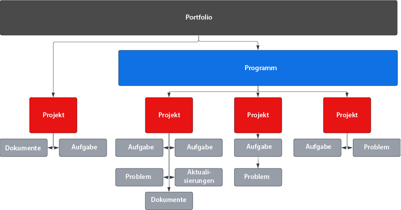
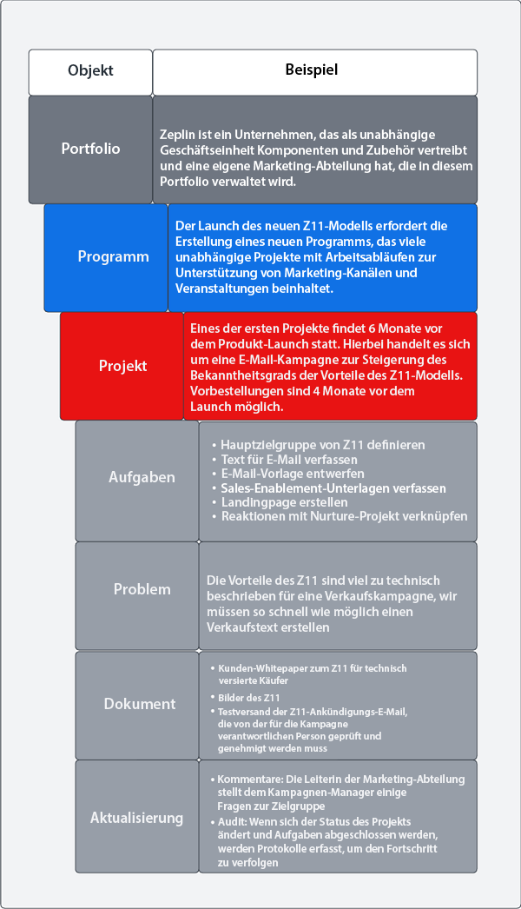
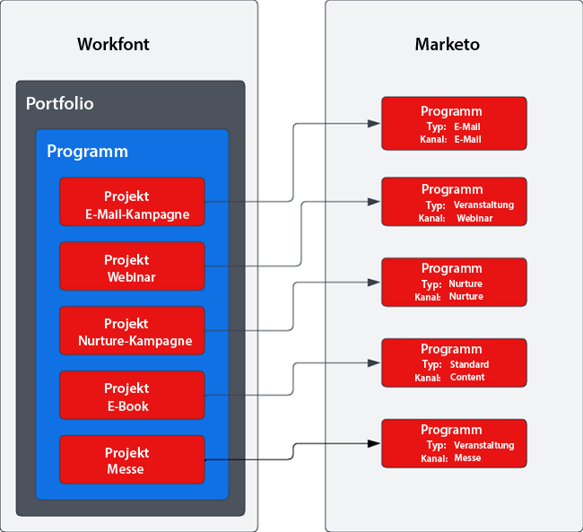

# Blueprints: Ablaufoptimierung bei der Durchführung von Kampagnen mit Marketo und Workfront {#overview}

## Verkürzung der Markteinführungszeiten durch optimierte Kampagnenlieferkette {#achieving-faster-time-to-market-with-optimized-campaign-supply-chain}

Laufend entstehen neue Kanäle und zusätzliche Personalisierungsmöglichkeiten für Nachrichten, sodass die Arbeitslast im Marketing immer stärker anwächst. Marketing-Teams benötigen deshalb Tools, um die Automatisierung voranzutreiben und sich auf die sich weltweit verändernden Marketing-Anforderungen einstellen zu können.

**„Der ROI war immer das eigentliche Ziel. Umsatz ist zwar erstrebenswert, aber nicht um jeden Preis – vor allem nicht in der heutigen Welt.“ - CMO, Unternehmensdienstleistungen**

Damit Unternehmen einen höheren ROI erzielen und gleichzeitig ihre Umsätze steigern können, müssen sie ihren Kampagnenerstellungsprozess effizienter gestalten, die Schnelligkeit bei der Umsetzung von Kampagnen optimieren und einen besseren Überblick über alle Marketing-Funktionen ermöglichen.

Wenn sich Ihr Unternehmen ähnliche wie die unten aufgelisteten Ziele gesetzt hat, bietet Ihnen dieser Artikel wissenswerte Informationen:

* Skalieren der Kampagnen mithilfe funktionsübergreifender Marketing-Teams
* Schnellere Time-to-Market durch optimierte Verfahren für Kampagnenanfragen
* Bereitstellen eines Aufzeichnungssystems, um die Transparenz für alle an einer Kampagne Beteiligten zu verbessern
* Prüfen und Freigeben von Kampagnen-Assets (Bilder, E-Mails)

Kampagnenentwicklungs-Teams benötigen Systeme, mit denen sie Marketing-Kampagnen effizient und effektiv planen und ausführen können. Ganz gleich, ob es sich um eine E-Mail-Kampagne, ein Webinar, eine Veranstaltung, Paid Media, eine Nurture-Kampagne oder Content Syndication handelt – Marketing-Teams benötigen eine zentrale Lösung zur Koordinierung aller Mitwirkenden sowie der Komponenten und Ausführungsschritte einer Kampagne.

Durch die Integration eines Multi-Channel-Marketing-Aktivierungssystems (Marketo Engage) in die Marketing-Planung und das Aufzeichnungssystem (Workfront) können Sie das Tempo bei der Auslieferung von Kampagnen steigern und den Beteiligten bessere Transparenz bieten.

Workfront Fusion hilft Marketing-Teams, manuelle Schritte und damit potenzielle Fehler bei der Umsetzung eines Marketing-Entwurfs in eine fertige Kampagne weitgehend zu eliminieren. Workfront Fusion bietet eine vordefinierte Integrationsschicht zwischen Workfront und Marketo Engage, durch die flexibel und effizient Workflows zwischen diesen Systemen erstellt werden können. [Hier](https://experienceleague.adobe.com/docs/workfront/using/adobe-workfront-fusion/fusion-apps-and-modules/marketo-modules.html?lang=de){target="_blank"} erfahren Sie mehr darüber, wie Sie die Integration einrichten und Workflows automatisieren können.

## Kampagnenplanung - Anwendungsfälle für Automatisierung {#campaign-planning-to-execution-automation-use-cases}

* Unterstützen Sie Marketing-Teams durch die automatisierte Erstellung von Kampagnen in Marketo Engage mithilfe von Anfragen in Workfront
* Geben Sie in Marketo Engage erstellte Entwürfe von E-Mails und Landingpages für Workfront frei, damit sie abteilungsübergreifend geprüft und validiert werden können.
* Geben Sie Kampagnenergebnisse in Marketo Engage für Workfront frei, um den Zugriff auf Kampagnenmetriken zu ermöglichen.

Unten finden Sie ein Workflow-Diagramm des Kampagnenentwicklungsprozesses im Fall einer Anfrage für eine Massen-E-Mail. Zusätzlich sehen Sie, wie mit Workfront Fusion, das zwischen Workfront und Marketo Engage geschaltet ist, die Workflow- und Prozessautomatisierung während des gesamten Kampagnenentwicklungszyklus verbessert wird.

{zoomable=&quot;yes&quot;}

Beachten Sie die verschiedenen Phasen des Kampagnenentwicklungsprozesses.

1. Annahme und Erstellung: Eine Anfrage zur Erstellung einer Kampagne wird gemacht und die Kampagnen-Assets werden programmgesteuert zusammengestellt.

1. Prüfung und Freigabe: Nachdem die Kampagne zusammengestellt wurde, prüfen die Verantwortlichen die Kampagnen-Assets wie etwa E-Mails und Landingpages und geben sie frei.

1. Berichte und Überwachung: Die Kampagnenergebnisse können für Workfront freigegeben werden, um die funktionsübergreifende Transparenz zu verbessern.

>[!NOTE]
>
>Im obigen Beispiel verwaltet und plant Workfront alle Arbeitsschritte während des gesamten Lebenszyklus des Marketo Engage-Programms. Workfront ist so flexibel, dass tatsächlich alle Aufgaben Ihres Marketing-Teams damit verwaltet werden können. Hierzu zählen auch Account-Based Marketing, Marketing-Content-Erstellung, Agenturverwaltung, Digital- und Social-Media-Kampagnenverwaltung und Vertriebsprogramme.

## Darstellung von Marketinginitiativen in Workfront {#understanding-how-marketing-initiatives-are-represented-in-workfront}

Mit Adobe Workfront können Unternehmen Arbeitsaufgaben verwalten und so Kampagnen effizienter durchführen. Workfront verfügt über eine Objekthierarchie, die einen Rahmen für die Planung, Ressourcenverwaltung und Zusammenarbeit zwischen Teams bereitstellt.

Dabei ist es wichtig zu verstehen, wie Workfront und Marketo Engage zusammenarbeiten, damit Sie Ihre Geschäftsprozesse diesen Objekten optimal zuordnen können.

{zoomable=&quot;yes&quot;}

### Portfolio-Hierarchie definiert {#portfolio-hierarchy-defined}

<table> 
  <tr> 
   <td><b>Objekt</b></td>
   <td><b>Definition</b></td>
  </tr>
  <tr> 
   <td>Portfolio</td>
   <td>Sie können in Workfront Projekte mithilfe von Portfolios und Programmen organisieren. Durch die Organisation von Projekten können Sie ähnliche Projekte miteinander vergleichen und erkennen, wo Ressourcen am besten eingesetzt werden sollten.  
   (Beispiel: Ein Portfolio wird für einen Geschäftsbereich eines Unternehmens erstellt, über den Dienstleistungen und/oder Produkte verkauft werden.)</td>
  </tr>
  <tr>
   <td>Programm</td>
   <td>Mithilfe von Workfront-Programmen können Projekte organisiert werden. Durch die Organisation von Projekten können Sie ähnliche Projekte miteinander vergleichen und erkennen, wo Ressourcen am besten eingesetzt werden sollten.  
   (Beispiel: eine Marketing-Strategie mit einem übergeordneten Ziel, z. B. Steigerung des Bekanntheitsgrads und Ankurbelung der Nachfrage nach einem neuen Produkt)</td>
  </tr>
  <tr>
   <td>Projekt</td>
   <td>Workfront-Projekte bestehen aus einer Reihe von Arbeitsschritten, die zur Erreichung eines bestimmten Ziels oder Ergebnisses oder zur Herstellung eines bestimmten Produkts usw. durchgeführt werden müssen.  
   (Beispiel: eine Marketing-Taktik wie eine Massen-E-Mail, eine Nurture-Kampagne, ein Webinar oder eine Präsenzveranstaltung. Ein einzelnes Projekt kann auch komplexer sein, wenn es mehrere Taktiken umfasst, z. B. eine E-Mail, eine Display-Anzeige, eine Landingpage und ein herunterladbares Whitepaper, die alle dasselbe Ziel haben.)</td>
  </tr>
  <tr>
   <td>Aufgabe</td>
   <td>Workfront-Aufgaben sind geplante Arbeitsschritte, die Teil eines Projekts oder einer Aktion sein können. Aufgaben werden einzelnen Personen oder ganzen Teams zugewiesen.  
   (Beispiel: Eine Aufgabe zum Erstellen eines Zielgruppensegments oder eines E-Mail-Entwurfs kann mit einem Projekt verknüpft sein, mit dem in Marketo Engage ein E-Mail-Programm entwickelt werden soll.)</td>
  </tr>
  <tr>
   <td>Problem</td>
   <td>Probleme sind ungeplante Arbeitsschritte in Workfront. Dabei kann es sich um Probleme handeln, die während eines Projekts auftreten, oder um Anfragen, die über eine Anfrage-Warteschlange gesendet werden.  
   (Beispiel: Ein Problem wird gemeldet, weil das E-Mail-Banner-Bild die falschen Abmessungen hat.)</td>
  </tr>
  <tr>
   <td>Dokument</td>
   <td>Bei Dokumenten kann es sich um herkömmliche Dokumente wie Textdokumente oder Präsentationen handeln. Auch Grafikdateien sind möglich. In Workfront können beim Überprüfen von Assets Kommentare und Anmerkungen zu Dokumenten und Bildern hinzugefügt werden, um die Zusammenarbeit zwischen den Teams zu verbessern.  
   (Beispiel: Ein Bild in der E-Mail-Kopfzeile muss überprüft werden.)</td>
  </tr>
  <tr>
   <td>Aktualisierung</td>
   <td>Enthält Kommentare und Überwachungsprotokolle, um die Arbeitsschritte zu verfolgen und die Zusammenarbeit in Workfront zu erleichtern.  
   (Beispiel: Überwachungsprotokoll einer neuen Version eines Bildes.)</td>
  </tr>
  </tbody>
</table>

## Workflow-Management für Marketinginitiativen {#marketing-initiative-work-management-example}

Sehen wir uns jetzt an, wie die Workfront-Portfolio-Hierarchie in einem realen Beispiel verwendet wird.

Das Unternehmen Zeplin bringt ein neues Modell seines kompakten Traktoranhängers mit der Bezeichnung Z11 heraus. Dieses neue Modell ist besser als das vorherige Z10-Modell, da es robuster und vielseitiger ist. Das Unternehmen muss somit eine Marketing-Strategie planen, entwickeln und ausführen, um die Nachfrage und Bekanntheit des neuen Modells in der Traktorsparte des Unternehmens zu steigern. Diese Marketing-Strategie muss verschiedene Marketing-Taktiken beinhalten, um den Bekanntheitsgrad sowohl unter neuen als auch bestehenden Kunden des Z10 zu erhöhen.

Die nachstehende Hierarchie zeigt, wie die Strategie, Taktiken, Aufgaben und Assets für diese Marketing-Kampagne Workfront zugeordnet werden.

{zoomable=&quot;yes&quot;}

## Zuordnen von Workfront zu Marketo {#mapping-workfront-to-marketo}

Da Workfront Ihr vorgelagertes System für die Marketing-Planung und Projektorganisation ist, ist es wichtig zu wissen, wie Informationen zwischen Marketo Engage und Workfront ausgetauscht werden können.

Damit diese Systeme bei der Entwicklung neuer Marketing-Aktionen zusammenarbeiten können, sollten Sie verstehen, wie die verschiedenen Datensatztypen in Workfront zu den Datensatztypen in Marketo Engage passen.

### Zuordnen von Workfront-Projekten zu Marketo Engage-Programmen {#mapping-workfront-projects-to-marketo-engage-programs}

Mithilfe von Workfront Fusion als Integrationsschicht können Sie Ihre Projekte in Workfront einem Programm in Marketo Engage zuordnen. Im obigen Beispiel möchte Zeplin beispielsweise den Bekanntheitsgrad des neuen Zeplin-Modells erhöhen. Das Unternehmen erstellt daher ein neues Programm in Workfront, das mehrere Marketing-Taktiken enthält, die als Projekte dargestellt werden. Eine der Taktiken besteht aus einer E-Mail zur Steigerung des Bekanntheitsgrads, die an bestehende Kunden des Z10-Modells gesendet wird, um sie über das neue Modell Z11 zu informieren. In Workfront wird ein Projekt für diese E-Mail-Taktik mit einer Reihe von damit verbundenen Aufgaben erstellt, um die Zielgruppe auszuwählen, die E-Mail-Bilder zusammenzustellen und die E-Mail in Marketo Engage zu entwerfen. Das Projekt in Workfront ist mit einem E-Mail-Programm in Marketo Engage verknüpft, sodass die Informationen zwischen diesen Systemen synchronisiert werden können.

Unten finden Sie ein Beispiel dafür, wie ein Programm mehrere Projekte umfassen kann und wie diese Workfront-Projekte Programmen in Marketo Engage zugeordnet werden können.

{zoomable=&quot;yes&quot;}

Möglicherweise möchten Sie eine umfangreiche Marketing-Aktion starten, für die mehrere Workfront-Projekte in einem Workfront-Programm zusammengefasst werden müssen, oder Sie haben eine einmalige Anfrage für ein Webinar oder eine E-Mail, für die nur ein einziges Workfront-Projekt erstellt werden muss. Unabhängig von Ihren Anforderungen ist Ihr Team bei der Nutzung von Workfront, Workfront Fusion und Marketo Engage so flexibel, dass es den gesamten Entwicklungsprozess Ihrer Kampagnen – von der Planung bis zur Ausführung – nahtlos verwalten kann.

### Zuordnen von Workfront-Aufgaben zu Marketo Engage-Assets {#mapping-workfront-tasks-to-marketo-engage-assets}

Bei der Planung Ihrer Kampagne in Workfront sollten Sie auch überlegen, welche Aufgaben in Workfront den Arbeitsschritten in Marketo Engage zugeordnet werden können und wie Sie Informationen in Workfront erfassen können, um den Kampagnenentwicklungsprozess konsistenter, effizienter und zielgerichteter zu gestalten.

Workfront-Projekte können als Vorlagen verwendet werden, sodass Ihre Arbeitsabläufe bei jeder Durchführung einer bestimmten Marketing-Taktik klar definiert sind. Wenn Sie beispielsweise eine E-Mail-Kampagne ausführen, müssen normalerweise für Ihr Unternehmen spezifische, standardmäßige Aufgaben ausgeführt werden. Zu diesen Aufgaben zählen möglicherweise ein Kick-off-Meeting mit allen Beteiligten, das Zusammenstellen von Kreativ-Assets, die Freigabe von Kreativelementen, die Auswahl der Zielgruppe, die Erstellung und Übersetzung der E-Mail, die Freigabe der E-Mail und die Übermittlung der Ergebnisse der E-Mail-Kampagne an alle Beteiligten.

Einige dieser Aufgaben können direkt den in Marketo Engage ausgeführten Arbeitsschritten zugeordnet werden. Beispielsweise kann die Aufgabe der E-Mail-Erstellung in Workfront so angepasst werden, dass Felder vorhanden sind, über die Informationen an Marketo Engage weitergeleitet werden, sodass die E-Mail automatisch zusammengestellt werden kann. Hierzu zählen Felder wie die für die Betreffzeile, den Text und die Bilder in der E-Mail.

## Nächste Schritte {#next-steps}

Nachdem Sie nun ein grundlegendes Verständnis davon haben, wie Sie mit Workfront und Marketo Engage Ihre Kampagnenerstellungsprozesse effizienter gestalten können, sehen Sie sich die folgenden Dokumente und Ressourcen an, um zu erfahren, wie Workflows und Prozesse zwischen Marketo Engage und Workfront mithilfe von Workfront Fusion automatisiert werden können.

### Erste Schritte mit der Integration von Workfront Fusion, Workfront und Marketo Engage {#getting-started-with-workfront-fusion}

* [Annahme und Erstellung](/help/blueprints/b2b/campaign-supply-chain/intake-and-create.md){target="_blank"} – Automatisierung der Kampagnenerstellung mit Marketo Engage und Workfront

* Prüfung und Freigabe (in Kürze verfügbar)

* Berichte und Überwachung (in Kürze verfügbar)

### Verwalten von Marketo Engage-Kampagnennamen und den zugehörigen URLs {#managing-marketo-engage-campaign-names}

Die Standardisierung Ihrer Benennungskonventionen für Kampagnen und URLs ist eine wichtige Voraussetzung für ein gelungenes Programm-Management in Marketo Engage und verbessert die Konsistenz des Kampagnenerstellungsprozesses. Wenn Sie Hilfe benötigen, empfehlen wir Ihnen die kostenlosen Open-Source-Tools von [Adobe Success Services](https://main--marketo-campaign-tools--dr-adobe.hlx.live/){target="_blank"}, die Sie bei der konsistenten Erstellung und Verwaltung von Marketo Engage-Kampagnen und den zugehörigen URLs unterstützen.

### Ressourcen {#resources}

* [Workfront Fusion for Marketo Engage](https://experienceleague.adobe.com/docs/workfront/using/adobe-workfront-fusion/fusion-apps-and-modules/marketo-modules.html?lang=de){target="_blank"}

* [Workfront Fusion for Workfront](https://experienceleague.adobe.com/docs/workfront/using/adobe-workfront-fusion/fusion-apps-and-modules/workfront-modules.html?lang=de){target="_blank"}
