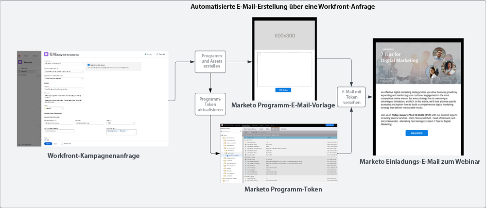
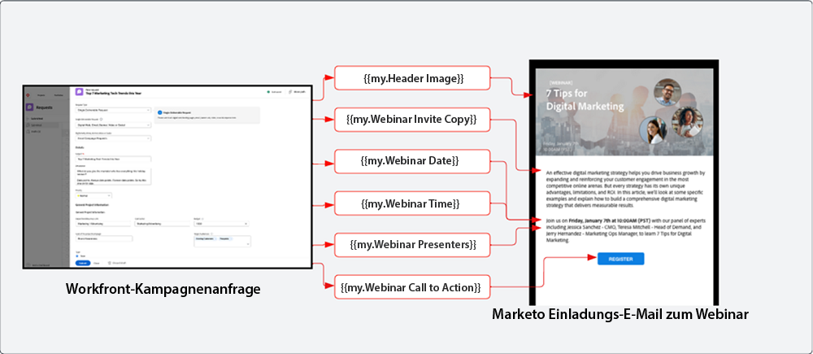

# Blueprint: Annahme und Erstellung {#intake-and-create}

Ein Übermaß an Anfragen an ein Marketing-Team nach neuen Kampagnen kann aus einem gut eingespielten Team frustrierte Fließbandarbeiter machen. Was oft folgt, sind Burnout und ein Mangel an Innovation.

Durch die Einrichtung eines Prozesses zum Einreichen von Kampagnenanfragen und die automatische Erstellung häufig angeforderter Marketing-Kampagnen können Sie das Tempo Ihrer Kampagnen beschleunigen, Fehler reduzieren, Anfragen an die zuständige Marketing-Fachkraft weiterleiten und Ressourcen sinnvoll einsetzen. Gleichzeitig kann sich Ihr Team besser auf strategische Aufgaben konzentrieren.

Durch die Verbindung von Workfront mit Marketo Engage kann mithilfe eines [Workfront-Anfrageformulars](https://experienceleague.adobe.com/docs/workfront/using/administration-and-setup/customize/custom-forms/create-or-edit-a-custom-form.html?lang=de){target="_blank"} ein Marketo Engage-Programm erstellt werden. Im Formular sind dabei nur wichtigsten Variablen einzugeben, wie Betreffzeile, E-Mail-Text, Bilder, Datumsangaben, Zeiten und Veranstaltungsdetails.

Erreicht wird diese Integration mithilfe von Workfront Fusion. Mit dieser Arbeitsautomatisierungsschicht können Sie Workflows zwischen Workfront und anderen Systemen automatisieren.

Der folgende Workflow stellt eine Webinar-Anfrage dar, die von der für die Kampagne verantwortlichen Person unter Verwendung eines Workfront-Anfrageformulars gestellt wird. Die in der Anfrage übermittelten Details lösen in Marketo Engage ein Programm und die Erstellung einer E-Mail für das Webinar aus. Zusätzlich werden Details aus dem Anfrageformular für die Inhaltserstellung der E-Mail übernommen.

{zoomable=&quot;yes&quot;}

>[!TIP]
>
>Weitere Informationen zu den verschiedenen Objekttypen in Workfront, die für die Organisation von Marketing-Kampagnen verwendet werden, und zur Zuordnung zu einem Marketo Engage-Programm finden Sie im Abschnitt [Marketo und Workfront im Überblick](/help/blueprints/b2b/campaign-supply-chain/overview.md){target="_blank"}.

## Vorbereiten Ihres Kampagnenerstellungsprozesses für die Automatisierung {#prepare-your-campaign-development-process-for-automation}

Die Workflow-Automatisierung erfolgt anhand eines definierten Prozesses, durch den sichergestellt wird, dass alle Teams und Beteiligten optimal von der Automatisierung profitieren.

**Welche Arten von Marketing-Anfragen erhalten Sie?**

Überlegen Sie, welche Arten von Marketing-Taktiken Sie ausführen werden, z. B. E-Mails, Nurture-Kampagnen, firmeneigene Webinare und Veranstaltungen. Veranstalten Sie auch Webinare für andere Unternehmen oder nutzen Sie Display-Anzeigen? Sie sollten alle möglichen Anfragen berücksichtigen, da für sie möglicherweise spezielle Eingabefelder im Anfrageformular erforderlich sind und in Marketo Engage unterschiedlichen Programmvorlagen zugeordnet werden, die dort dupliziert werden.

Außerdem müssen Sie überlegen, ob Sie Kampagnen in unterschiedlichen Regionen ausführen. In diesem Fall benötigen Sie ein einziges Projekt in Workfront, das mehrere Programme in Marketo Engage erstellt, wobei jedes Programm eine andere Sprache unterstützt.

Es ist wichtig, vorab zu wissen, welche Arten von Marketing-Anfragen Sie erhalten werden, damit die Anfragestellung automatisiert erfolgen kann.

**Welche Informationen sollten in der Kampagnenanfrage enthalten sein?**

Denken Sie an die wichtigsten Informationen, die in Ihrem Anfrageformular für jede der von Ihnen ausgeführten Taktiken erfasst werden müssen. Unten finden Sie einige Beispiele für Informationen, die Sie in einem Workfront-Formular erfassen können, um die Kampagnenerstellung zu automatisieren.

<table> 
  <tr> 
   <td><b>Marketing-Taktik</b></td>
   <td><b>Zu erfassende Informationen</b></td>
  </tr>
  <tr> 
   <td>Massen-E-Mail</td>
   <td>・ E-Mail-Betreff 
・ Geplantes Datum 
・ E-Mail-Text 
・ Call to Action 
・ Bild(er) – URLs von AEM Assets können zur Verwendung in Marketo direkt referenziert werden 
・ Kriterien für die Zielgruppenqualifikation</td>
  </tr>
  <tr>
   <td>Webinar/Veranstaltung</td>
   <td>・ Name der Veranstaltung 
・ Datum der Veranstaltung 
・ Uhrzeit der Veranstaltung 
・ Ort der Veranstaltung 
・ Beschreibung der Veranstaltung 
・ Webinar-Aufzeichnungsseite – PageURL OnDemand 
・ Namen der Redner 
・ Titel der Redner 
・ Bilder der Redner 
・ Benötigte E-Mails (Einladung, Bestätigung, Erinnerung, Follow-up) 
・ E-Mail-Kopfzeilen-Bild(er) 
・ Kriterien für die Zielgruppenqualifikation</td>
  </tr>
  <tr>
   <td>Nurture-Kampagne</td>
   <td>・ Anzahl der E-Mails 
・ E-Mail-Text 
・ E-Mail-Kopfzeile 
・ Call to Action 
・ Kriterien für die Zielgruppenqualifikation</td>
  </tr>
  </tbody>
</table>

>[!NOTE]
>
>Die programmgesteuerte Erstellung von Zielgruppen mithilfe einer Automatisierung ist aktuell in Marketo Engage nur eingeschränkt verfügbar, da Token in Smart-Listen nicht unterstützt werden. Das bedeutet, dass Zielgruppen von einem Team-Mitglied in Marketo Engage erstellt werden müssen. Alternativ können Sie, wenn Sie eine vordefinierte Zielgruppe haben, mit der Sie ständig kommunizieren, eine konfigurierte Smart-Liste zu Ihrer Programmvorlage hinzufügen, die während des Automatisierungsprozesses dupliziert wird.

### Einrichtung Ihres Center of Excellence {#establish-your-center-of-excellence}

Wenn Sie die Erstellung von Programmen automatisieren möchten, benötigen Sie ein Center of Excellence in Marketo Engage. Ein Center of Excellence beinhaltet vorlagenbasierte Programme und Assets, mit denen der Kampagnenerstellungsprozess beschleunigt und standardisiert werden kann. Sie können beispielsweise Programmvorlagen für unterschiedliche Kampagnenanfragen verwenden, etwa für E-Mail-Kampagnen, Nurture-Kampagnen, Präsenzveranstaltungen und Webinare. Zusätzlich könnten Sie mehrere E-Mail-Programmvorlagen für verschiedene Regionen oder Arten von E-Mail-Nachrichten verwenden.

Der Aufbau Ihres Center of Excellence mit Programmvorlagen in Marketo Engage ist einer der ersten Schritte hin zu einer programmgesteuerten Kampagnenausführung und die Basis zur Automatisierung von Kampagnenanfragen.

Sobald Sie über mehrere wiederverwendbare Programmvorlagen verfügen, können Sie Ihre Marketing-Aktionen unter Verwendung der in dieser Blueprint beschriebenen Automatisierung weiter skalieren und schneller Kampagnen erstellen.

In der [Marketo-Community](https://nation.marketo.com/t5/product-blogs/marketo-master-class-center-of-excellence-with-chelsea-kiko/ba-p/243221){target="_blank"} finden Sie Best Practices zur Einrichtung eines eigenen Center of Excellence.

### Verwenden von Token zum Ausfüllen von Inhalten {#use-tokens-to-populate-content}

In Marketo Engage können Inhalte mithilfe von Token in Kampagnen-Assets eingefügt werden. Nachdem Sie beispielsweise eine E-Mail-Vorlage in Ihrem Center of Excellence dupliziert haben, kann Workfront Fusion Details der Kampagnenanfrage in Workfront abrufen und an „My Tokens“ im Marketo Engage-Programm weiterleiten. Die Token-Werte können dann direkt an die E-Mail weitergegeben werden, um die E-Mail zu erstellen.

{zoomable=&quot;yes&quot;}

### Einfügen von Bildern aus AEM Assets {#populate-images-from-aem-assets}

Sie können die Erstellung von E-Mails und Landingpages weiter automatisieren, indem Sie Marketo Engage-Token in Kombination mit Links zu Assets in AEM Assets verwenden. Kampagnenanforderer können in ihrer Anfrage in AEM Assets veröffentlichte Bild-Links übermitteln. Workfront Fusion kann diese Links dann mithilfe von Marketo Engage-Token in die HTML einer E-Mail einbetten.

Beachten Sie, dass Sie Ihre Programme und Programmvorlagen in Marketo Engage erstellen müssen, damit Sie „My Tokens“ verwenden können und Fusion die Token-Werte mit den in Workfront übermittelten Informationen aktualisieren kann.

>[!NOTE]
>
>AEM Assets ist für diesen Workflow nicht unbedingt erforderlich, ermöglicht aber die reibungslose Verwaltung von Kampagnen-Assets während des gesamten Kampagnenerstellungsprozesses.

### Zusammenstellen einer Lookup-Bibliothek für alle Programmanfragetypen {#assemble-a-lookup-library-for-all-program-request-types}

Wenn Sie die Erstellung neuer Marketo Engage-Programme unter Verwendung von Workfront-Anfragen automatisieren, muss in Ihre Workfront Fusion-Automatisierung ein Schritt eingebaut sein, der dafür sorgt, dass Informationen aus der Workfront-Anfrage entnommen werden und nach den richtigen Programmvorlagen, die in Marketo Engage dupliziert werden sollen, gesucht wird.

Zu diesem Zweck können Sie einen Datensatz in Workfront Fusion importieren, der eine Liste aller Programmvorlagen in Ihrem Marketo Engage Center of Excellence enthält.

Einige grundlegende Informationen, die Ihre Lookup-Bibliothek für Programmvorlagen enthalten sollte:

<table> 
  <tr> 
   <td><b>Spalte</b></td>
   <td><b>Beschreibung</b></td>
  </tr>
  <tr> 
   <td>Kampagnentyp</td>
   <td>Beispiele sind E-Mail, Webinar, Nurture, Veranstaltung, Webinar für Drittanbieter, Listenimport. Der Kampagnentyp ist eine lesbare Beschreibung der Anfrage.</td>
  </tr>
  <tr> 
   <td>Workfront-Anfragetyp</td>
   <td>Dies ist der Anfragetyp, der im Workfront-Formular ausgewählt wird. Er kann mit dem Kampagnentyp identisch sein, z. B. E-Mail, Webinar, Nurture oder Veranstaltung. Diese Information wird verwendet, um die im Workfront-Formular ausgewählte Eingabe einer Programmvorlage in Marketo zuzuordnen.</td>
  </tr>
  <tr> 
   <td>Workfront-Formular-ID</td>
   <td>Die eindeutige ID des Workfront-Anfrageformulars, die verwendet wird, um die Schreibanfrage zu validieren, die der Marketo Engage-Programmvorlage zugeordnet wird.</td>
  </tr>
  <tr> 
   <td>Marketo-Programm-ID</td>
   <td>Dies ist die Kennung der Programmvorlage in Marketo Engage, die der aktuellen Anfrage zugeordnet ist. Wenn diese Informationen in Workfront Fusion verfügbar sind, erstellt Fusion die Anfrage an Marketo Engage und dupliziert das entsprechende Programm.</td>
  </tr>
  </tbody>
</table>

## Annahme und Erstellung – Automatisierungsfluss {#intake-and-create-automation-flow}

Hier finden ein Beispiel dafür, wie die Workflow-Logik in Fusion mithilfe von vorgefertigten [Workfront](https://experienceleague.adobe.com/docs/workfront/using/adobe-workfront-fusion/fusion-apps-and-modules/workfront-modules.html?lang=de){target="_blank"} and [Marketo Engage](https://experienceleague.adobe.com/docs/workfront/using/adobe-workfront-fusion/fusion-apps-and-modules/marketo-modules.html?lang=de){target="_blank"}-Modulen erstellt werden kann und dadurch eine schnellere Automatisierung ermöglicht.

Verwenden von Token zum Ausfüllen von Inhalten

## Ressourcen {#resources}

* [Adobe Marketo Engage-Module](https://experienceleague.adobe.com/docs/workfront/using/adobe-workfront-fusion/fusion-apps-and-modules/marketo-modules.html?lang=de){target="_blank"}

* [Adobe Workfront-Module](https://experienceleague.adobe.com/docs/workfront/using/adobe-workfront-fusion/fusion-apps-and-modules/workfront-modules.html?lang=de){target="_blank"}

* [Marketo und Workfront im Überblick](/help/blueprints/b2b/campaign-supply-chain/overview.md){target="_blank"}
