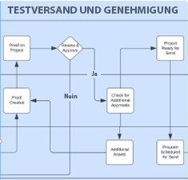
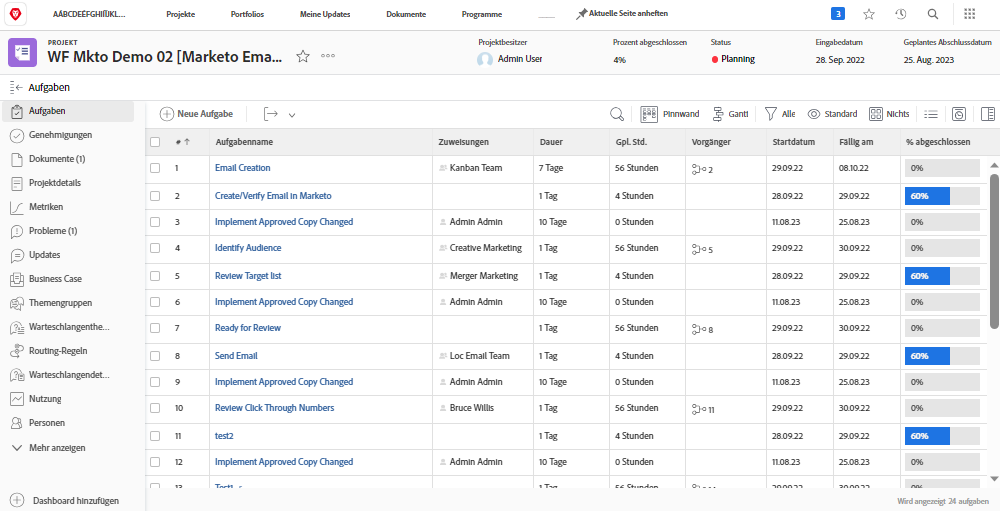
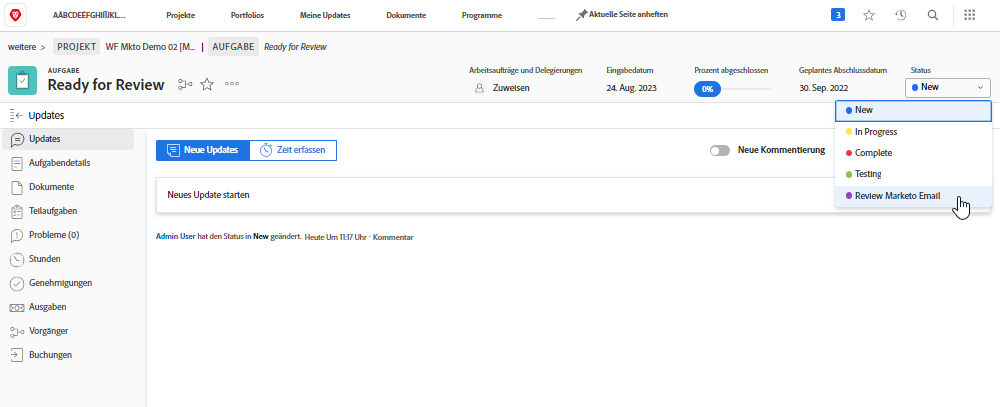
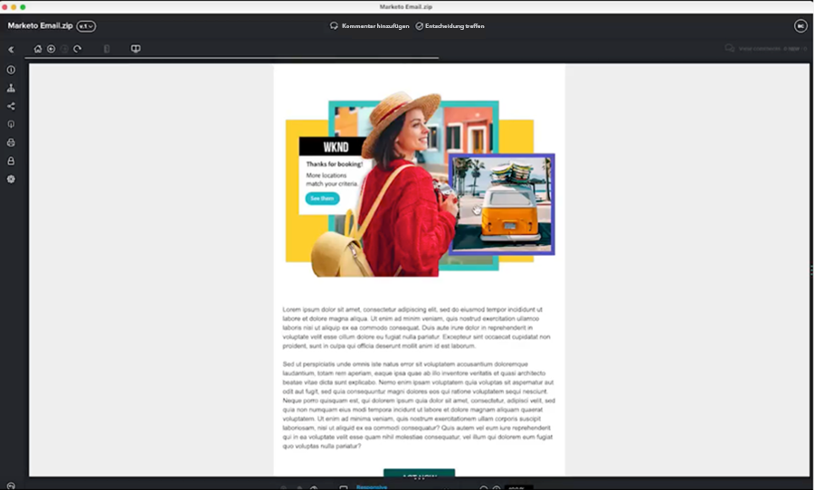

# Blueprint überprüfen und genehmigen {#review-and-approve-blueprint}

Die Sicherstellung, dass Marketing-Assets und -Kampagnen die Erwartungen und Standards eines Unternehmens erfüllen, geht über die Bereitstellung der richtigen Inhalte und Nachrichten an die richtige Zielgruppe hinaus. Unternehmen tragen auch die Verantwortung dafür, interne Politiken, Branchenvorschriften und sogar rechtliche Voraussetzungen bei der Einleitung neuer Marketinginitiativen einzuhalten. Durch die Integration von Überprüfungs- und Validierungsschritten in den Kampagnenentwicklungsprozess können Marketingteams sicherstellen, dass Inhalte und Nachrichten genau sind und den Branchenstandards entsprechen, insbesondere für Branchen wie Finanzen, Gesundheitswesen und Arzneimittel.

Mit Workfront und Marketo Engage haben Marketingteams die Möglichkeit, ein eng vernetztes Marketingsystem mit genauen und konformen Botschaften zu entwickeln.

## Entsperren von Testsendungen und erweiterten Genehmigungen für das Marketo Engage mit Workfront {#unlock-proofing-and-advanced-approvals}

Wenn wir über die Erstellung von Marketing-Kampagnen nachdenken, müssen wir berücksichtigen, dass mehrere Systeme die verschiedenen erforderlichen Schritte unterstützen, darunter Planung, Erstellung, Überprüfung, Feedback, Genehmigung und Ausführung. Mit Workfront und Marketo Engage verfügen Teams über alle nötigen Werkzeuge, um sie durch den durchgängigen Planungs- und Startprozess einer neuen Marketingkampagne zu führen. Darüber hinaus können Teams ihren Prüfungs- und Genehmigungsprozess weiter optimieren, um die Geschwindigkeit der Kampagnenentwicklung zu erhöhen und gleichzeitig sicherzustellen, dass Genauigkeit und Compliance den höchsten Standards entsprechen.

### Anwendungsfälle überprüfen und genehmigen, die mit Marketo Engage und Workfront entsperrt sind {#review-and-approve-use-cases-unlocked-with-marketo-engage-and-workfront}

* Beseitigen Sie unterschiedliches Feedback und erhöhen Sie die Zusammenarbeit an einem zentralisierten Ort, indem Sie die Anmerkungen und Kommentierungsfunktionen von Workfront auf Marketo Engage-Assets verwenden.

* Zentralisieren Sie Ihre Validierungen, indem Sie sie in Marketo Engage aus den Workfront-Genehmigungs-Workflows auslösen.

* Unterstützung und Optimierung komplexer Genehmigungs-Workflows für Marketing-Assets durch Nutzung der erweiterten Genehmigungsfunktionen von Workfront mit Marketo Engage-Assets.

* Demokratisieren Sie den Zugriff auf Marketing-Entwürfe, indem Sie Marketo-Assets programmgesteuert in Workfront abrufen, um sie von mehreren Stakeholdern überprüft zu werden.

* Verfolgen Sie Änderungen und erstellen Sie einen Papierpfad, indem Sie alle Prüfungs- und Testarbeiten für Marketo Engage-Assets in Workfront zentralisieren.

## Planen des Arbeitsablaufs für Testversand und Genehmigung {#planning-your-proof-and-approval-workflow}

Beachten Sie vor der Einrichtung der Testversand- und Validierungs-Integration zwischen Marketo Engage und Workfront die folgenden Aspekte:

* Welche Assets müssen überprüft und genehmigt werden?
* Wer muss der Genehmiger sein?
* Muss es mehrere Genehmiger geben, bevor ein Marketing-Asset live geschaltet werden kann?
* An welchem Punkt des Kampagnenentwicklungsprozesses werden Marketing-Assets zusammengestellt und können überprüft werden?

Wenn Sie diese Fragen beantworten, erhalten Sie eine Grundlinie dafür, wie Ihr Genehmigungsfluss aussehen wird und wie Sie mit der Konfiguration Ihrer Workfront-Instanz beginnen.

## Erstellen eines Workflows für die Überprüfung und Genehmigung zwischen Marketo Engage und Workfront {#building-a-proof-and-approval-workflow}

Zur Optimierung des Testversands und der Validierung zwischen Workfront und Marketo Engage können Sie die beiden Lösungen mithilfe von Workfront Fusion integrieren. Workfront Fusion bietet eine Workflow-Oberfläche zum Auslösen von Aktionen und Übergeben von Informationen zwischen Ihren Workfront- und Marketo Engage-Instanzen.

Beachten Sie dazu die folgenden Schritte als Teil des Prozesses für eine integrierte Überprüfung und Genehmigung.

1. Konfigurieren Sie Ihr Workfront-Projekt mit der Aufgabe &quot;Bereit für Überprüfung&quot;.
1. Trigger Ihrer Marketo Engage-E-Mail zur Synchronisierung mit Workfront mit einer Aufgabenstatusänderung.
1. Konvertieren Sie Ihre Marketo Engage-E-Mail-Datei in einen überprüfbaren Testversand in Workfront.
1. Verwenden Sie die Workfront-Prüfung, um über Kommentare und Anmerkungen zusammenzuarbeiten.
1. Genehmigen Sie die Workfront Testversand zum Trigger der Asset-Genehmigung in Marketo Engage und markieren Sie dann die Aufgabe als abgeschlossen.

### Konfigurieren eines Workfront-Projekts mit einer Aufgabe &quot;Bereit für Überprüfung&quot; {#configure-a-workfront-project-with-a-ready-for-review-task}

Verwendung [Projektvorlagen](https://experienceleague.adobe.com/docs/workfront/using/manage-work/projects/create-and-manage-project-templates/project-template-overview.html){target="_blank"} , um die meisten wiederholbaren Prozesse, Informationen und Einstellungen zu erfassen, die mit den Projekten in Ihrer Organisation verbunden sind. Sie können Aufgaben definieren, Themen in die Warteschlange stellen, benutzerdefinierte Formulare erstellen und Dokumente in Ihre Vorlage einfügen.

Schließen Sie in Ihre Projektvorlage in Workfront Aufgaben zur Überprüfung von Assets ein, die Teil Ihrer Marketing-Kampagne sind. Darüber hinaus können Sie einen Genehmigungsprozess hinzufügen, um einzelne Genehmigungen oder komplexere Genehmigungen auf mehreren Ebenen zu handhaben.

Wenn Sie eine neue E-Mail-Kampagne starten möchten, sollten Sie über eine Projektvorlage verfügen, die eine Aufgabe zur Überprüfung der E-Mail sowie einen Genehmigungsprozess enthält, um sicherzustellen, dass die E-Mail vom richtigen Verantwortlichen genehmigt wird, bevor sie gesendet werden kann.

{zoomable=&quot;yes&quot;}

### Trigger Ihrer Marketo Engage-E-Mail zur Synchronisierung mit Workfront mit der Änderung des Aufgabenstatus {#trigger-your-marketo-engage-email-to-sync-to-workfront}

Im Rahmen Ihres Überprüfungsprozesses möchten Sie E-Mails mit Ihrem Workfront-Projekt synchronisieren können, sobald sie für die Überprüfung durch Ihr Marketing-Team bereit sind. Dazu empfehlen wir, eine Aufgabe &quot;Bereit zum Überprüfen&quot;mit einer [Aufgabenstatus](https://experienceleague.adobe.com/docs/workfront/using/manage-work/projects/update-work-on-a-project/update-task-status.html){target="_blank"} gibt an, wann die E-Mail zur Überprüfung bereit ist. In unserem Beispiel haben wir unserer Aufgabe den Status Marketo-E-Mail überprüfen hinzugefügt, der ausgewählt werden kann, wenn der E-Mail-Entwurf zur Überprüfung durch Interessengruppen bereit ist.

Wenn dieser Status in Ihrem Workfront-Projekt vorhanden ist, können Sie Ihr Workfront Fusion-Szenario so konfigurieren, dass auf die Aufgabe &quot;Bereit zur Überprüfung&quot;, die auf &quot;Marketo-E-Mail überprüfen&quot;aktualisiert werden soll, gewartet wird. Nach der Aktualisierung kann Ihr Szenario die Marketo Engage-E-Mail als HTML-Datei abrufen, sie komprimieren und eine Kopie davon in den zu überprüfenden Workfront-Projektdokumenten speichern.

{zoomable=&quot;yes&quot;}

### Konvertieren Ihrer Marketo Engage-E-Mail in einen überprüfbaren Testversand in Workfront {#convert-your-marketo-engage-email-to-reviewable-proof-in-workfront}

Sobald Ihre Aufgabe Bereit für Überprüfung in den Status &quot;Marketo-E-Mail überprüfen&quot;verschoben und die Marketo Engage-E-Mail in Workfront gespeichert wurde, können Sie Ihr Workfront Fusion-Szenario so konfigurieren, dass die E-Mail in einen Workfront-Testversand konvertiert wird.

### Verwenden Sie die Workfront-Prüfung für die Zusammenarbeit mit Kommentaren und Anmerkungen {#use-workfront-proofing-to-collaborate}

[Workfront-Testversand](https://experienceleague.adobe.com/docs/workfront/using/review-and-approve-work/proofing/proofing-overview/proofing-basics.html){target="_blank"} -Funktionen ermöglichen es Ihrem Marketing-Team, ein neues Asset wie ein Bild oder eine E-Mail zu erstellen und über Kommentare und Anmerkungen zusammenzuarbeiten. Sobald ein Testversand verfügbar ist, können Entscheidungsträger das Asset über das Testwerkzeug genehmigen.

{zoomable=&quot;yes&quot;}

### Genehmigen Sie die Asset-Genehmigung für Workfront-Testversand und Trigger in Marketo Engage, markieren Sie die Aufgabe als abgeschlossen. {#approve-workfront-proof-and-trigger-asset-approval-in-marketo-engage}

Workfront Fusion kann erkennen, wann die E-Mail von Interessenträgern genehmigt wurde, und eine Anfrage an Marketo Engage senden, um die E-Mail in Marketo zu genehmigen.

Nachdem die E-Mail von den richtigen Team-Mitgliedern geprüft/validiert wurde, ist die E-Mail bereit, live auf Marketo Engage zu gehen!

## Vorlagen für Fusionsszenarios {#fusion-scenario-templates}

Um Ihre Entwicklung von Prüfungs- und Genehmigungsarbeitsabläufen in Ihrer eigenen Workfront- und Marketo Engage-Instanz zu optimieren, haben wir Fusionsvorlagen entwickelt, die Ihnen bei den ersten Schritten mit der Integration helfen. Sie können diese Vorlagen verwenden, indem Sie im Bereich Öffentliche Vorlagen von Fusion nach &quot;Marketo&quot;suchen und sie auf Ihre Instanz herunterladen.

### Prüfen eines E-Mail-Testversands Ihres Marketo Engage-E-Mail-Entwurfs in Workfront {#review-an-email-proof-of-your-marketo-engage-email-draft-in-workfront}

Das nachstehende Fusionsszenario führt Sie durch die erste Hälfte des Überprüfungs- und Genehmigungsflusses, in dem der E-Mail-Entwurf von Marketo Engage abgerufen und als Testversand in Workfront gespeichert werden kann. Nachdem sie als Testversand für die Workfront-Projektdokumente gespeichert wurde, kann sie von den Marketing-Stakeholdern geprüft, kommentiert und im Rahmen des Überprüfungsprozesses kommentiert werden.

{zoomable=&quot;yes&quot;}

### Genehmigen Sie eine E-Mail in Workfront, in der die Genehmigung des Assets unter Marketo Engage Trigger wird. {#approve-an-email-in-workfront-that-triggers-approval}

Das nachstehende Fusionsszenario kann verwendet werden, um festzustellen, wann ein Testversand in Workfront genehmigt wurde, und diese Genehmigung an Marketo Engage weiterzuleiten, um den E-Mail-Entwurf zu aktualisieren, damit er live ist und in einem Marketo Engage-Programm verwendet werden kann.

{zoomable=&quot;yes&quot;}

Gemeinsam können diese beiden Szenarien verwendet werden, um einen bidirektionalen Pfad zu erstellen, über den Marketing-Assets von der Marketo Engage in die umfassenden Prüfungs- und Genehmigungs-Workflows von Workfront gezogen und Genehmigungen von Workfront zurück an die Marketo Engage übertragen werden.
