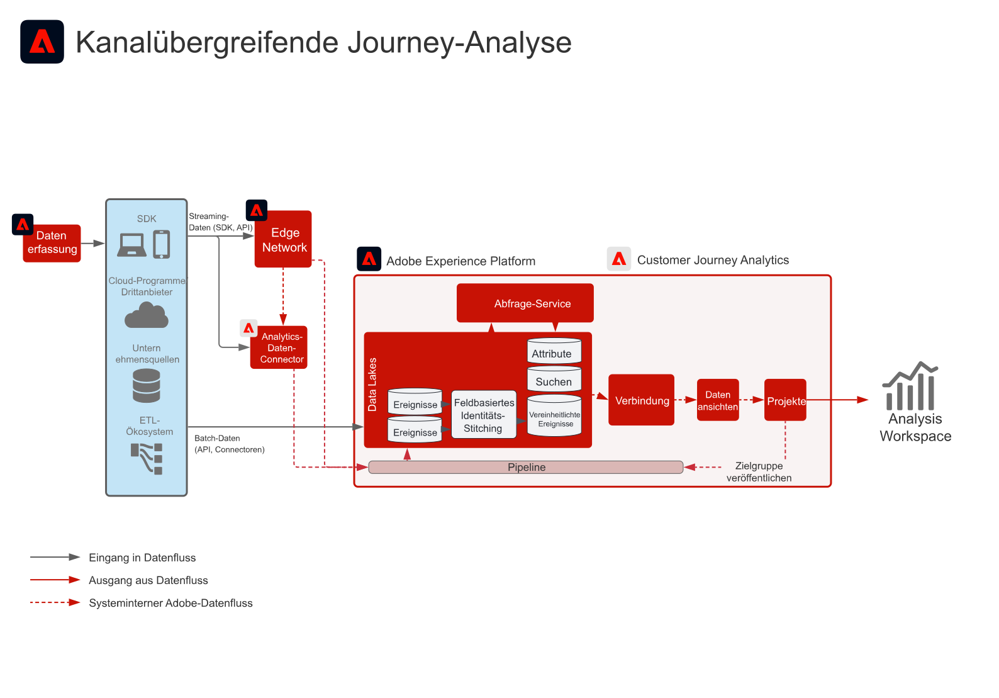

# B2B-Customer Journey Analytics-Blueprint

Customer Journey Analytics B2B edition ermöglicht Account-basiertes Reporting und Analysen für B2B-Organisationen. Im Gegensatz zur personenorientierten B2C-Analyse stellt dieser Blueprint das **Konto** in den Mittelpunkt des Datenmodells, damit Sie komplexe B2B-Kauf-Journey über mehrere Stakeholder, Einkaufsgruppen und Verkaufszyklen hinweg analysieren können. Verwenden Sie [!DNL Customer Journey Analytics], um Verhaltensdaten mit B2B-Dimensionen - Konten, Opportunities, Kampagnen und Marketing-Listen - zu vereinheitlichen und so Journey-basierte Einblicke und Zielgruppenerstellung zu ermöglichen.

## Programme

* Adobe [!DNL Customer Journey Analytics] (B2B edition)
* Adobe Experience Platform (für B2B- und Ereignisdaten)

## Anwendungsfälle

* **Account-Marketing optimieren** - Analysieren Sie die Marketing-Auswirkungen über Kampagnen, Kanäle und Inhalte auf Einkaufsgruppen innerhalb von Accounts, den Pipeline-Fortschritt und Upsell-/Crosssell-Möglichkeiten hinweg.
* **Wichtige Konten erweitern** - Identifizieren Sie hochwertige Touchpoints über Einkaufsgruppen hinweg in wichtigen Konten, um Marketing- und Verkaufsaktionen zu informieren, und berechnen Sie den Kundenlebenszeitwert auf Kontoebene.
* **Produktnutzen** - Messen Sie die Auswirkungen von Produktversionen und deren Nutzung auf die Kundenzufriedenheit auf Konto- und Benutzerebene, um Funktionen zu optimieren und die Entwicklung zu unterstützen.
* **Personenbasierte B2B-Analyse** - Kombinieren Sie Konto- und Opportunity-Kontext mit individuellem Benutzerverhalten für Lead-Scoring, Interaktion und Journey-Analyse.

## Voraussetzungen

* Berechtigung für [!DNL Customer Journey Analytics] B2B edition.
* B2B- und Verhaltensdaten in Adobe Experience Platform: B2B-Datensätze (Konten, Opportunities, Personen, Kampagnen, Marketing-Listen, B2B-Aktivitäten) und Ereignisdaten (Web, Mobile oder andere Kanäle), die in einer [CJA-Verbindung verfügbar sind](https://experienceleague.adobe.com/docs/analytics-platform/using/cja-connections/create-connection.html).
* [B2B-Benennung für CJA](https://experienceleague.adobe.com/docs/analytics-platform/using/cja-dataviews/b2b.html): B2B-spezifische Datenansichtseinstellungen (Konto-ID, Opportunity-ID und zugehörige Dimensionen), die für die Verbindung konfiguriert sind.

## Architektur

{zoomable="yes"}

Datenflüsse aus Experience Platform (B2B- und Ereignisdatensätze) in [!DNL Customer Journey Analytics] über eine CJA-Verbindung. B2B-Dimensionen werden in Datenansichten bereitgestellt, sodass Analysen und Zielgruppen auf Konto-, Opportunity- und Personenebene erstellt werden können.

## Leitlinien

* Informationen zu B2B edition-Produktbeschränkungen und -Berechtigungen finden Sie in der [Customer Journey Analytics B2B-Produktbeschreibung](https://helpx.adobe.com/legal/product-descriptions/customer-journey-analytics-b2b.html).
* Informationen zu den technischen Beschränkungen für Analytics Platform und CJA finden Sie unter [Analytics Platform-Leitplanken](https://experienceleague.adobe.com/en/docs/analytics-platform/using/technotes/guardrails).
* Informationen zu Datenaufnahme und Verbindungsbeschränkungen in CJA finden Sie unter [Schutzmaßnahmen bei der Datenaufnahme in Customer Journey Analytics](https://experienceleague.adobe.com/docs/experience-platform/sources/connectors/adobe-applications/analytics.html#what-is-the-expected-latency-for-analytics-data-on-platform%3F).
* Informationen zum Veröffentlichen von CJA-Zielgruppen in Real-time Customer Data Platform finden Sie unter [Leitplanken für die Freigabe von Customer Journey Analytics-Zielgruppen](https://experienceleague.adobe.com/docs/analytics-platform/using/cja-components/audiences/publish.html#latency).
* Informationen zu End-to-End-Latenzen und Platform-Leitplanken finden Sie im Dokument [Bereitstellungsleitplanken](../experience-platform/guardrails.md).

## Implementierungsschritte

1. **Nehmen Sie B2B- und Ereignisdaten in Experience Platform auf** - Binden Sie Konto-, Opportunity-, Personen-, Kampagnen- und Aktivitätsdaten sowie Verhaltensereignisse mithilfe von [Quellen](https://experienceleague.adobe.com/docs/experience-platform/sources/home.html?lang=de) (z. B. [!DNL Marketo Engage], CRM oder andere B2B-Connectoren) ein.
2. **Erstellen einer CJA-Verbindung** - [Hinzufügen der entsprechenden Experience Platform-Datensätze](https://experienceleague.adobe.com/docs/analytics-platform/using/cja-connections/create-connection.html) (B2B und Ereignis) zu einer Customer Journey Analytics-Verbindung.
3. **Konfigurieren von B2B in der Datenansicht** - Aktivieren von [B2B-Benennung und Schlüsseldimensionen](https://experienceleague.adobe.com/docs/analytics-platform/using/cja-dataviews/b2b.html) (Konto-ID, Opportunity-ID usw.) in den Datenansichten der Verbindung.
4. **Erstellen von Account-basierten Analysen und Zielgruppen** - Verwenden Sie [CJA B2B-Anwendungsfälle und -Berichte](https://experienceleague.adobe.com/docs/analytics-platform/using/cja-usecases/b2b.html?lang=de) um Berichte, Aufschlüsselungen und Zielgruppen auf Konto- und Opportunity-Ebene zu erstellen. Optional [Veröffentlichen von Zielgruppen in Real-Time CDP](https://experienceleague.adobe.com/docs/analytics-platform/using/cja-components/audiences/publish.html?lang=de) zur Aktivierung.

## Verwandte Dokumentation

### Customer Journey Analytics B2B edition

* [Customer Journey Analytics B2B edition](https://experienceleague.adobe.com/docs/analytics-platform/using/cja-overview/cja-b2b/cja-b2b-edition.html)
* [B2B-Anwendungsfälle](https://experienceleague.adobe.com/docs/analytics-platform/using/cja-usecases/b2b.html?lang=de)
* [Übersicht über B2B edition-Anwendungsfälle](https://experienceleague.adobe.com/docs/analytics-platform/using/cja-usecases/b2b/b2b-edition/use-cases-overview.html)
* [Ein Beispiel für ein B2B-Projekt auf Personenbasis](https://experienceleague.adobe.com/docs/analytics-platform/using/cja-usecases/b2b/example.html)

### Verbindungen und Datenansichten

* [Erstellen einer Verbindung](https://experienceleague.adobe.com/docs/analytics-platform/using/cja-connections/create-connection.html)
* [Einstellungen für B2B-Datenansichten](https://experienceleague.adobe.com/docs/analytics-platform/using/cja-dataviews/b2b.html)

### Zielgruppen und Leitplanken

* [Veröffentlichen von CJA-Zielgruppen in Real-Time CDP](https://experienceleague.adobe.com/docs/analytics-platform/using/cja-components/audiences/publish.html?lang=de)
* [Leitplanken für Experience Platform und Programme](../experience-platform/guardrails.md)
