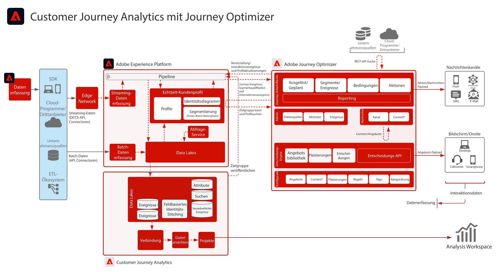

# Customer Journey Analytics mit Journey Optimizer-Blueprint

Daten von Journey Optimizer werden an den Data Lake von Experience Platform weitergegeben und stehen zur Aufnahme, Analyse und Berichterstellung in Customer Journey Analytics zur Verfügung. Der Versand, die Interaktion und die Effektivität einer Customer Journey können in Customer Journey Analytics analysiert und in einem Bericht zusammengefasst werden.

Darüber hinaus können die in Customer Journey Analytics erstellten Zielgruppen im Echtzeit-Kundenprofil von Experience Platform veröffentlicht werden und stehen in Journey Optimizer zur Ausführung einer Cuostmer Journey zur Verfügung.

## Implementierungsanleitung

In der folgenden Dokumentation finden Sie Anleitungen zur Implementierung und Konfiguration von Journey Optimizer-Daten in Customer Journey Analytics. [Dokumentation](https://experienceleague.adobe.com/docs/journey-optimizer/using/reporting/reports/sharing-overview.html?lang=de)

## Architektur für Customer Journey Analytics mit Journey Optimizer

{zoomable="yes"}
