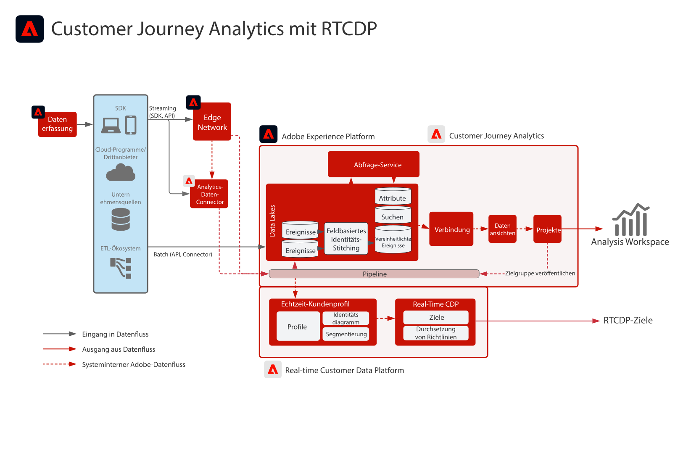

# Customer Journey Analytics mit Real-time Customer Data Platform

Erstellen und veröffentlichen Sie Zielgruppen, die in Customer Journey Analytics (CJA) identifiziert wurden, im Echtzeit-Kundenprofil in Adobe Experience Platform, um Zielgruppenbestimmung und Personalisierung durchzuführen. Ideal zur Erstellung von Zielgruppen mithilfe historischer Daten oder von präziseren Zielgruppen aus granularer Filterung und berechneten Feldern in Customer Journey Analytics.

## Handbuch zur Veröffentlichung von Customer Journey Analytics-Zielgruppen

In der folgenden Dokumentation finden Sie Anleitungen zur Implementierung und Konfiguration nach der Veröffentlichung von Zielgruppen von Customer Journey Analytics in Real-time Customer Data Platform. [Dokumentation](https://experienceleague.adobe.com/docs/analytics-platform/using/cja-components/audiences/publish.html?lang=de)

## Architektur für die Blueprints zu Customer Journey Analytics

## Leitliniendiagramm für die Blueprints zu Customer Journey Analytics

* Detaillierte Limits und End-to-End-Latenzen finden Sie im Abschnitt [Dokument mit Bereitstellungsgarantien](../experience-platform/deployment/guardrails.md)

## Häufig gestellte Fragen

* Wenn in der von CJA gesendeten RTCDP kein entsprechendes Profil existiert, wird dann ein neues Profil erstellt oder werden Zielgruppen nur von CJA für bereits vorhandene Profile aufgezeichnet? Ja, es wird ein neues Profil erstellt. Wenn Ihre RTCDP-Implementierung nur für bekannte Kunden bestimmt ist, sollten daher die CJA-Zielgruppenregeln so geschrieben werden, dass nur nach Profilen mit bekannten Identitäten gefiltert wird. Dadurch wird sichergestellt, dass die Anzahl der RTCDP-Profile nicht von anonymen Profilen erhöht wird, falls nicht gewünscht.

* Sendet CJA die Zielgruppendaten als Pipeline-Ereignisse oder als flache Datei, die auch an den Data Lake gesendet wird? CJA-Zielgruppen werden über die Pipeline an den RTCDP-Profildienst gestreamt, die Daten werden jedoch auch im Data Lake als Datensatz gespeichert.

* Welche Identitäten sendet CJA? CJA sendet jene Identitäten, die während der CJA-Konfiguration als &quot;Personen-ID&quot;konfiguriert wurden.

* Was wird als primäre Identität festgelegt? Welche Identität der Benutzer beim Einrichten von Customer Journey Analytics als primäre &quot;Person&quot;-ID ausgewählt hat.

* Verarbeitet der Identitätsdienst auch die CJA-Nachrichten? d. h. kann CJA einem Profilidentitätsdiagramm durch Zielgruppenfreigabe Identitäten hinzufügen? Nein, der Identitätsdienst verarbeitet die CJA-Nachrichten nicht.

## Verwandte Blog-Posts

* [[!DNL Blueprint for Multi-Channel Orchestration in Adobe Experience Platform]](https://medium.com/adobetech/blueprint-for-multi-channel-orchestration-in-adobe-experience-platform-c68317e94184)
* [[!DNL Leveraging External Data Platforms in Adobe Experience Platform Journey Orchestration]](https://medium.com/adobetech/leveraging-external-data-platforms-in-adobe-experience-platform-journey-orchestration-54fc6134fe17)
* [[!DNL Event-Based Triggering on Adobe Experience Platform Orchestration Service using Apache Airflow]](https://medium.com/adobetech/event-based-triggering-on-adobe-experience-platform-orchestration-service-using-apache-airflow-8607b28251f1)
* [[!DNL Adobe Campaign Classic Integration with Journey Orchestration]](https://medium.com/adobetech/adobe-campaign-classic-integration-with-journey-orchestration-ae577653281)
* [[!DNL Demonstrating the Power of Adobe’s New Journey Orchestration Service to Build Personalized Omnichannel Experiences in Real-Time]](https://medium.com/adobetech/demonstrating-the-power-of-adobes-new-journey-orchestration-service-to-build-personalized-aa60d88cd34)
* [[!DNL Journey Orchestration in an Omnichannel World]](https://medium.com/adobetech/journey-orchestration-in-an-omnichannel-world-3a2d32d556d9)
