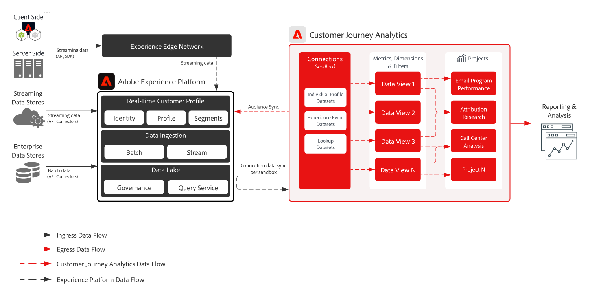

# Blueprint zu Customer Journey Analytics mit Real-time Customer Data Platform

Erstellen und veröffentlichen Sie Zielgruppen, die in Customer Journey Analytics (CJA) identifiziert wurden, im Echtzeit-Kundenprofil in Adobe Experience Platform, um Zielgruppenbestimmung und Personalisierung durchzuführen. Ideal zur Erstellung von Zielgruppen mithilfe historischer Daten oder von präziseren Zielgruppen aus granularer Filterung und berechneten Feldern in Customer Journey Analytics.

## Handbuch zur Veröffentlichung von Customer Journey Analytics-Zielgruppen

In der folgenden Dokumentation finden Sie Anleitungen zur Implementierung und Konfiguration nach der Veröffentlichung von Zielgruppen von Customer Journey Analytics in Real-time Customer Data Platform. [Dokumentation](https://experienceleague.adobe.com/docs/analytics-platform/using/cja-components/audiences/publish.html?lang=de)

## Architektur für die Blueprints zu Customer Journey Analytics

{zoomable="yes"}

## Leitliniendiagramm für die Blueprints zu Customer Journey Analytics

* Detaillierte Leitlinien und End-to-End-Latenzen finden Sie im Abschnitt [Leitlinien zur Implementierung](../experience-platform/guardrails.md)