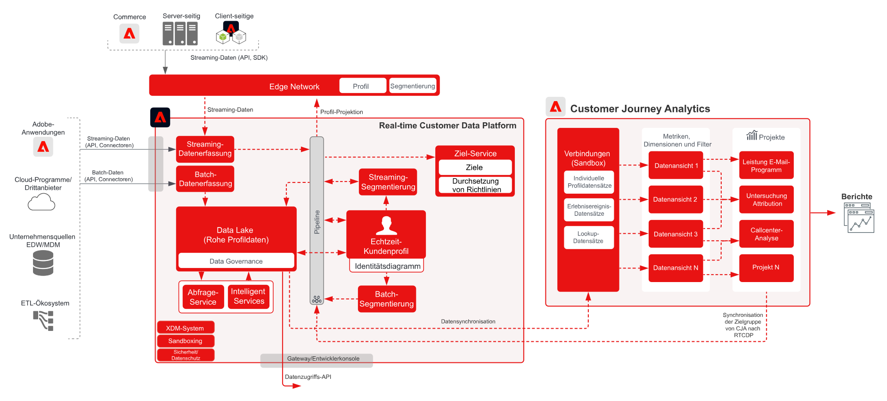

# Customer Journey Analytics mit Real-time Customer Data Platform

Erstellen und veröffentlichen Sie Zielgruppen, die in Customer Journey Analytics (CJA) identifiziert wurden, in Echtzeit-Kundenprofil in Adobe Experience Platform, um Kunden-Targeting und Personalisierung zu ermöglichen. Ideal für die Erstellung von Zielgruppen mit historischen Daten oder verfeinerten Zielgruppen aus granularer Filterung und berechneten Feldern in Customer Journey Analytics.

## Architektur für die Blueprints zu Customer Journey Analytics

## Leitliniendiagramm für die Blueprints zu Customer Journey Analytics

## Handbuch zur Veröffentlichung von Customer Journey Analytics-Zielgruppen

In der folgenden Dokumentation finden Sie Anleitungen zur Implementierung und Konfiguration der Veröffentlichung von Zielgruppen von Customer Journey Analytics nach Real-time Customer Data Platform. [Dokumentation](https://experienceleague.adobe.com/docs/analytics-platform/using/cja-components/audiences/publish.html)

## Verwandte Blog-Posts

* [[!DNL Blueprint for Multi-Channel Orchestration in Adobe Experience Platform]](https://medium.com/adobetech/blueprint-for-multi-channel-orchestration-in-adobe-experience-platform-c68317e94184)
* [[!DNL Leveraging External Data Platforms in Adobe Experience Platform Journey Orchestration]](https://medium.com/adobetech/leveraging-external-data-platforms-in-adobe-experience-platform-journey-orchestration-54fc6134fe17)
* [[!DNL Event-Based Triggering on Adobe Experience Platform Orchestration Service using Apache Airflow]](https://medium.com/adobetech/event-based-triggering-on-adobe-experience-platform-orchestration-service-using-apache-airflow-8607b28251f1)
* [[!DNL Adobe Campaign Classic Integration with Journey Orchestration]](https://medium.com/adobetech/adobe-campaign-classic-integration-with-journey-orchestration-ae577653281)
* [[!DNL Demonstrating the Power of Adobe’s New Journey Orchestration Service to Build Personalized Omnichannel Experiences in Real-Time]](https://medium.com/adobetech/demonstrating-the-power-of-adobes-new-journey-orchestration-service-to-build-personalized-aa60d88cd34)
* [[!DNL Journey Orchestration in an Omnichannel World]](https://medium.com/adobetech/journey-orchestration-in-an-omnichannel-world-3a2d32d556d9)
