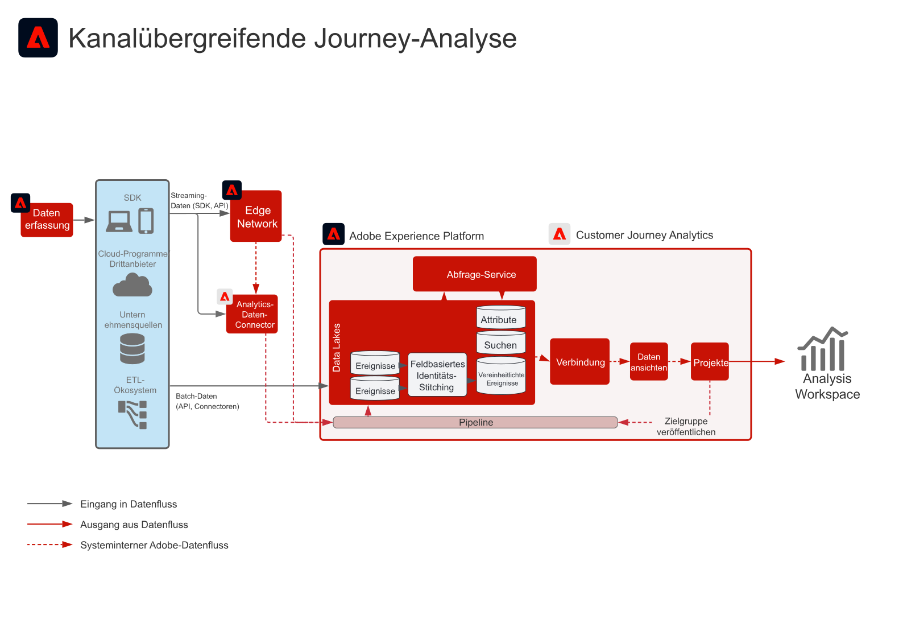

# Blueprint für Kanal-Journey-Analyse

Erhalt einer zentralen, konsolidierten Sicht auf Kundeninteraktionen auf verschiedenen Kanälen durch Zusammenführung von Daten aus verschiedenen Web-, Mobile- und Offline-Präsenzen.

## Anwendungsfälle

* Analyse von Kundeninteraktionen auf Desktop- und Mobilgeräten, um das Kundenverhalten zu verstehen und Erkenntnisse zu gewinnen, mit denen das digitale Kundenerlebnis optimiert werden kann.
* Analyse von Kundeninteraktionen über sämtliche Kanäle, einschließlich digitaler und Offline-Kanäle, wie Interaktionen mit dem Support und Käufen in Ladengeschäften, um die Customer Journey besser zu verstehen und zu optimieren. 

## Programme

* Adobe Experience Platform
* Customer Journey Analytics
* Adobe Analytics (optional)

## Integrationsmuster

* Adobe Experience Platform → Customer Journey Analytics
* Adobe Analytics → Adobe Experience Platform → Customer Journey Analytics

## Architektur

## Implementierungsschritte

1. Konfigurieren Sie Datensätze und Schemas.
1. Nehmen Sie Daten in Platform auf.
Die Daten müssen in Platform aufgenommen werden, bevor sie in Customer Journey Analytics verarbeitet werden können
1. Gemeinsame Analyse von Datensätzen aus unterschiedlichen Kanälen, um sicherzustellen, dass sie über dieselbe Namespace-ID verfügen oder mit der Funktion für feldbasiertes Stitching in Customer Journey Analytics einen neuen Schlüssel erhalten. 

   >[!NOTE]
   >
   >Customer Journey Analytics verwendet derzeit weder das Experience Platform-Profil noch Identity Service für das Stitching.

1. Führen Sie eine beliebige benutzerdefinierte Datenvorbereitung durch oder wenden Sie das feldbasierte Identitäts-Stitching auf die Daten an, um sicherzustellen, dass ein gemeinsamer Schlüssel in den Zeitreihen-Datensätzen in Customer Journey Analytics aufgenommen wird.
1. Weisen Sie Suchdaten eine primäre ID zu, die mit einem Feld in den Ereignisdaten verbunden werden kann. Zählt bei der Lizenzierung als Zeilen.
1. Setzen Sie die für Profildaten dieselbe primäre ID wie für die Ereignisdaten.
1. Konfigurieren Sie ein Datenverbindung, um Daten aus Experience Platform in Customer Journey Analytics aufzunehmen. Nachdem die Daten im Data Lake angekommen sind, werden sie innerhalb von 90 Minuten in Customer Journey Analytics verarbeitet.
1. Konfigurieren Sie eine Datenansicht für die Verbindung, um die spezifischen Dimensionen und Metriken auszuwählen, die in der Ansicht angezeigt werden sollen. Die Einstellungen für Attribution und Zuordnung werden auch in der Datenansicht konfiguriert. Diese Einstellungen werden zum Zeitpunkt der Berichterstellung berechnet.
1. Erstellen Sie ein Projekt, um Dashboards und Berichte in Analysis Workspace zu konfigurieren.

## Überlegungen bei der Implementierung

### Überlegungen beim Identitäts-Stitching

* Die Zeitreihendaten, die zusammengeführt werden sollen, müssen für jeden Datensatz dieselbe Namespace-ID haben.
* Der Zusammenführungsprozess für getrennte Datensätze erfordert einen gemeinsamen, datensatzübergreifenden primären Personen-/Einheitsschlüssel.
* Sekundäre schlüsselbasierte Zusammenführungen werden derzeit nicht unterstützt.
* Der feldbasierte ID-Stitching-Prozess erlaubt die erneute ID-Schlüsselvergabe in Zeilen, die auf aufeinanderfolgenden, vorübergehenden ID-Einträgen basieren, wie eine Authentifizierungs-ID. Dies erlaubt es, ungleiche Einträge zu einer ID zusammenzuführen, sodass eine Analyse auf Personen- statt Geräte- oder Cookie-Ebene möglich ist.
* Das Stitching erfolgt einmal pro Woche mit einer Wiederholung nach dem Zusammenfügen.

## Häufig gestellte Fragen

* Welche Downstream-Auswirkungen haben Datenmodelle in Customer Journey Analytics?

   Objekte und Attribute desselben XDM-Felds werden in Customer Journey Analytics zu einer Dimension zusammengeführt. Um mehrere Attribute aus unterschiedlichen Datensätzen in derselben Customer Journey Analytics-Dimension zusammenzuführen, sollten die Datensätze das gleiche XDM-Feld oder Schema referenzieren.

## Verwandte Dokumentation

* [Produktbeschreibung zu Customer Journey Analytics](https://helpx.adobe.com/de/legal/product-descriptions/customer-journey-analytics.html)
* [Dokumentation zu Customer Journey Analytics](https://experienceleague.adobe.com/docs/customer-journey-analytics.html?lang=de)
* [Tutorials zu Customer Journey Analytics](https://experienceleague.adobe.com/docs/customer-journey-analytics-learn/tutorials/overview.html?lang=de)
