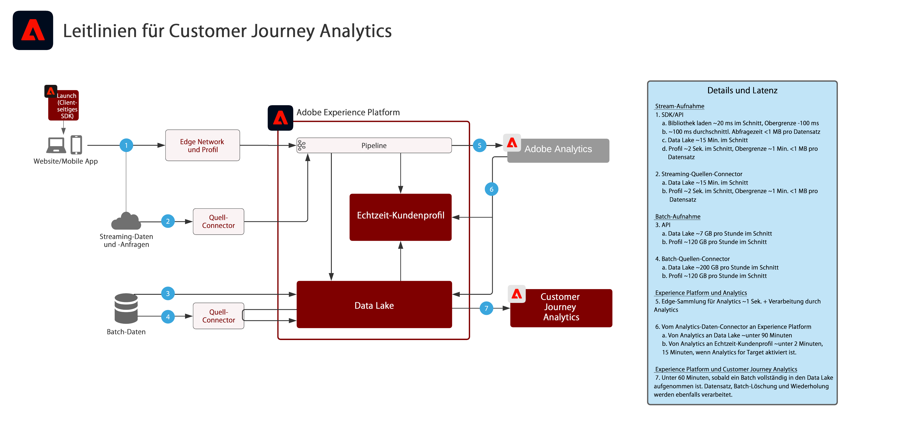

# Customer Journey Analytics

„Customer Journey Analytics“ zeigt, wie Marken Kundendaten und -verhalten aus unterschiedlichen Interaktionskanälen und -quellen zusammenführen können, um eine Journey-basierte Ansicht aller Kundeninteraktionen zu erstellen. Berichte und Analysen können im Programm-Service Customer Journey Analytics erstellt werden, um Kundeninteraktionen und Verhaltensmuster zu evaluieren und Erkenntnisse daraus zu gewinnen.

Gängige Analysen umfassen:

* Obere/untere Konversionspfade
* Kanalinteraktion und Konversion
* Am häufigsten angezeigter Content
* Beste Kategorien und Produkte
* Kampagnen, die zu Konversion und mehr Interaktion führten
* Analyse der Tool-Nutzung zur Optimierung von Self-Service-Erlebnissen

| Blueprint | Beschreibung | Experience Cloud-Programme |
|---|---|---|
| **[Kanalübergreifende Journey-Analyse](digital-behavioral-data-consolidation.md)** | <ul><li>Erhalten Sie eine zentrale, konsolidierte Sicht auf Kundeninteraktionen auf verschiedenen Kanälen durch Zusammenführung von Daten aus verschiedenen Web-, Mobile- und Offline-Präsenzen.</li></ul> | <ul><li>Adobe Experience Platform</li><li>Customer Journey Analytics</li><li>Adobe Analytics (optional)</li></ul> |
| **[Analyse der Anrufabwendung während der Journey](call-deflect.md)** | <ul><li>Ermitteln Sie, welche Verhaltensweisen am wahrscheinlichsten mit einem Anruf enden, indem Sie Callcenter-Daten mit Web-, Mobile- und anderen Interaktionsdaten zusammenführen.</li><li>Diese Erkenntnisse können verwendet werden, um das Kundenerlebnis zu verbessern und die Anzahl mitarbeitergestützter Interaktionen durch den Einsatz von Self-Service-Content und -Tools zu reduzieren.  </li></ul> | <ul><li>Adobe Experience Platform</li><li>Customer Journey Analytics</li> |

## Leitlinien für die Blueprints zu Customer Journey Analytics

### Leitliniendiagramm

## Verwandte Blog-Posts

* [[!DNL Blueprint for Multi-Channel Orchestration in Adobe Experience Platform]](https://medium.com/adobetech/blueprint-for-multi-channel-orchestration-in-adobe-experience-platform-c68317e94184)
* [[!DNL Leveraging External Data Platforms in Adobe Experience Platform Journey Orchestration]](https://medium.com/adobetech/leveraging-external-data-platforms-in-adobe-experience-platform-journey-orchestration-54fc6134fe17)
* [[!DNL Event-Based Triggering on Adobe Experience Platform Orchestration Service using Apache Airflow]](https://medium.com/adobetech/event-based-triggering-on-adobe-experience-platform-orchestration-service-using-apache-airflow-8607b28251f1)
* [[!DNL Adobe Campaign Classic Integration with Journey Orchestration]](https://medium.com/adobetech/adobe-campaign-classic-integration-with-journey-orchestration-ae577653281)
* [[!DNL Demonstrating the Power of Adobe’s New Journey Orchestration Service to Build Personalized Omnichannel Experiences in Real-Time]](https://medium.com/adobetech/demonstrating-the-power-of-adobes-new-journey-orchestration-service-to-build-personalized-aa60d88cd34)
* [[!DNL Journey Orchestration in an Omnichannel World]](https://medium.com/adobetech/journey-orchestration-in-an-omnichannel-world-3a2d32d556d9)
