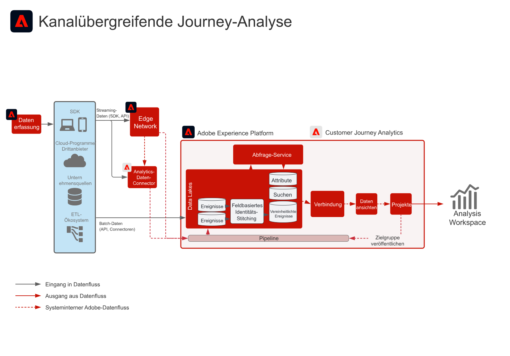

# Customer Journey Analytics Blueprints

„Customer Journey Analytics“ zeigt, wie Marken Kundendaten und -verhalten aus unterschiedlichen Interaktionskanälen und -quellen zusammenführen können, um eine Journey-basierte Ansicht aller Kundeninteraktionen zu erstellen. Berichte und Analysen können im Programm-Service Customer Journey Analytics erstellt werden, um Kundeninteraktionen und Verhaltensmuster zu evaluieren und Erkenntnisse daraus zu gewinnen.

## Anwendungsfälle für Customer Journey Analytics

Häufige Anwendungsfälle sind:

* Erstellen und Veröffentlichen von Zielgruppen in Real-time Customer Data Platform
* Obere/untere Konversionspfade
* Kanalinteraktion und Konversion
* Am häufigsten angezeigter Content
* Beste Kategorien und Produkte
* Kampagnen, die zu Konversion und mehr Interaktion führten
* Analyse der Tool-Nutzung zur Optimierung von Self-Service-Erlebnissen

Eine vollständige Liste der Anwendungsfälle zusammen mit der Dokumentation finden Sie [hier](https://experienceleague.adobe.com/docs/analytics-platform/using/cja-usecases/cja-usecases.html?lang=de).

## Architektur für Customer Journey Analytics

{zoomable="yes"}