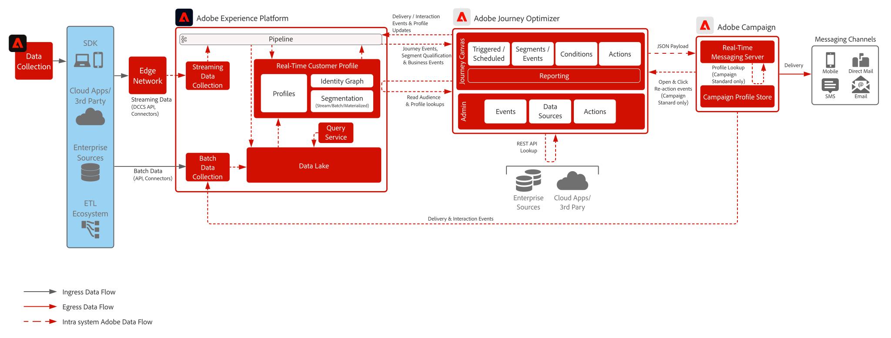

# Blueprint: Journey Optimizer mit Adobe Campaign v7

Zeigt, wie Adobe Journey Optimizer mit Adobe Campaign verwendet werden kann, um nativ mithilfe des Echtzeit-Messaging-Servers in Campaign Nachrichten zu versenden.

 

## Architektur

>[!IMPORTANT]
>Die Verwendung sowohl von Journey Optimizer als auch von Campaign zum unabhängigen Versand von Nachrichten ist möglich, allerdings müssen dabei einige technische Überlegungen angestellt werden. Wenn Sie diesen Ansatz verfolgen möchten, besprechen Sie ihn mit Ihrem Pre-Sales Enterprise Architect, um sicherzustellen, dass Sie die Voraussetzungen für die Implementierung verstehen.

 

## Voraussetzungen

### Adobe Experience Platform

* Schemas und Datensätze müssen im System konfiguriert werden, bevor Sie Journey Optimizer-Datenquellen konfigurieren können.
* Fügen Sie für Schemas, die auf der Klasse „Erlebnisereignis“ basieren, die Feldgruppe „Orchestrierungsereignis-ID“ hinzu, wenn ein Ereignis ausgelöst werden soll, das kein regelbasiertes Ereignis ist.
* Fügen Sie für Schemas, die auf der Klasse „Individuelles Profil“ basieren, die Feldgruppe „Profil-Testdetails“ hinzu, um die Testprofile für die Verwendung mit Journey Optimizer laden zu können.
* Journey Optimizer und Campaign werden in derselben IMS-Organisation bereitgestellt.

### Campaign v7

* Ausführungsinstanz des Echtzeit-Messaging-Service (d. h. Message Center) muss von Adobe Managed Cloud Services gehostet werden.
* Sämtliches Nachrichten-Authoring erfolgt direkt in der Campaign-Instanz.

 

## Leitlinien

[Produkt-Link zu Journey Optimizer-Leitlinien](https://experienceleague.adobe.com/de/docs/journey-optimizer/using/get-started/guardrails)

[Leitplanken und Leitlinien für End-to-End-Latenzen](https://experienceleague.adobe.com/docs/blueprints-learn/architecture/architecture-overview/guardrails.html)

## Implementierungsschritte

### Adobe Experience Platform

#### Schema/Datensätze

1. [Konfigurieren Sie das individuelle Profil, das Erlebnisereignis und Schemas mit mehreren Einheiten](https://experienceleague.adobe.com/?recommended=ExperiencePlatform-D-1-2021.1.xdm&lang=de) in Experience Platform basierend auf den von der Kundin oder dem Kunden angegebenen Daten.
1. Erstellen Sie Schemas auf Basis der Klasse „Erlebnisereignis“ für Adobe Campaign-Tabellen broadLog, trackingLog und nicht zustellbare Adressen (optional).
1. [Erstellen Sie Datensätze](https://experienceleague.adobe.com/docs/platform-learn/tutorials/data-ingestion/create-datasets-and-ingest-data.html?lang=de) in Experience Platform für die aufzunehmenden Daten.
1. [Fügen Sie dem Datensatz in Experience Platform Datennutzungskennzeichnungen hinzu](https://experienceleague.adobe.com/docs/platform-learn/tutorials/data-governance/classify-data-using-governance-labels.html?lang=de), um ordnungsgemäße Governance zu gewährleisten.
1. [Erstellen Sie Richtlinien](https://experienceleague.adobe.com/docs/platform-learn/tutorials/data-governance/create-data-usage-policies.html?lang=de), um die Governance an den Zielen umzusetzen.

#### Profil/Identität

1. [Erstellen Sie sämtliche kundenspezifischen Namespaces](https://experienceleague.adobe.com/docs/platform-learn/tutorials/identities/label-ingest-and-verify-identity-data.html?lang=de).
1. [Fügen Sie Identitäten zu Schemas hinzu](https://experienceleague.adobe.com/docs/platform-learn/tutorials/identities/label-ingest-and-verify-identity-data.html?lang=de).
1. [Aktivieren Sie die Schemas und Datensätze für Profile](https://experienceleague.adobe.com/docs/platform-learn/tutorials/profiles/bring-data-into-the-real-time-customer-profile.html?lang=de).
1. [Richten Sie Zusammenführungsrichtlinien](https://experienceleague.adobe.com/docs/platform-learn/tutorials/profiles/create-merge-policies.html?lang=de) für unterschiedliche Ansichten des [!UICONTROL Echtzeit-Kundenprofils] ein (optional).
1. Erstellen Sie Segmente für die Journey-Nutzung.

#### Quellen/Ziele

1. [Nehmen Sie Daten mit Streaming-APIs und Quell-Connectoren in Experience Platform auf.](https://experienceleague.adobe.com/?recommended=ExperiencePlatform-D-1-2020.1.dataingestion&lang=de)

### Journey Optimizer

1. Konfigurieren Sie die Experience Platform-Datenquelle und bestimmen Sie, welche Felder als Teil des Profils zwischengespeichert werden sollen. Streaming-Daten, die zum Auslösen einer Customer Journey verwendet werden, müssen zunächst in Journey Optimizer konfiguriert werden, damit eine Orchestrierungs-ID erstellt wird. Die Orchestrierungs-ID wird dann an den Entwickler weitergegeben, der sie bei der Aufnahme nutzen kann
1. Konfigurieren Sie externe Datenquellen
1. Konfigurieren Sie benutzerdefinierte Aktionen für die Campaign-Instanz

### Campaign v7

* Messaging-Vorlagen müssen mit geeignetem Personalisierungskontext konfiguriert werden
* Für Campaign v7: Export-Workflows müssen so konfiguriert werden, dass die Transaktionsnachrichten-Protokolle zurück nach Experience Platform exportiert werden. Es wird empfohlen, sie höchstens alle vier Stunden auszuführen.

### Mobilgeräte-Push-Konfiguration (optional)

1. Implementieren Sie das Experience Platform Mobile SDK zum Sammeln von Push-Tokens und Login-Informationen zum Abgleich mit Kundenprofilen
1. Nutzen Sie Adobe Tags und erstellen Sie eine Mobile-Präsenz mit der folgenden Erweiterung:
   * Adobe Journey Optimizer | Adobe Campaign Classic | Adobe Campaign Standard
   * Adobe Experience Platform [!DNL Edge Network]
   * Identität für [!DNL Edge Network]
   * Mobile Core
1. Stellen Sie sicher, dass Sie über einen dedizierten Daten-Stream für Mobile-App-Implementierungen verfügen, der sich von dem für Web-Implementierungen unterscheidet
1. Weitere Informationen finden Sie im [Mobile-Handbuch für Adobe Journey Optimizer](https://developer.adobe.com/client-sdks/edge/adobe-journey-optimizer/push-notification/)

   >[!IMPORTANT]
   >Mobile-Token müssen sowohl in Journey Optimizer als auch in Campaign erfasst werden, wenn Echtzeit-Kommunikation über Journey Optimizer gesendet werden soll und Push-Benachrichtigungen im Batch über Campaign übermittelt werden sollen. Campaign v8 erfordert die exklusive Verwendung des Campaign SDK für das Erfassen von Push-Tokens.

 

## Verwandte Dokumentation

* [Dokumentation zu Journey Optimizer](https://experienceleague.adobe.com/docs/journey-optimizer/using/ajo-home.html?lang=de)
* [Produktbeschreibung zu Journey Optimizer](https://helpx.adobe.com/de/legal/product-descriptions/adobe-journey-optimizer.html)
* [Dokumentation zu Campaign v7](https://experienceleague.adobe.com/docs/campaign-classic.html?lang=de)
