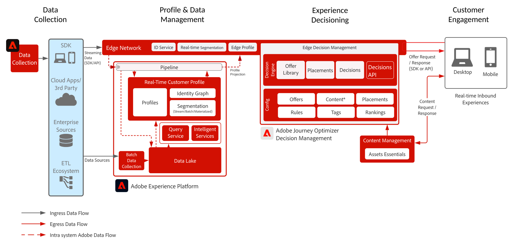

# Journey Optimizer - [!DNL Decision Management] zur Edge Blueprint

>[!TIP]
>Diese Blueprint ist auch als Anwendungsfallmuster [&#x200B; Personalization &#x200B;](/help/blueprints/use-case-patterns/personalization/offer-decisioning.md).

[!DNL Decision Management] ist ein Service, der im Rahmen von [!DNL Journey Optimizer] bereitgestellt wird. In dieser Blueprint werden die Anwendungsfälle und technischen Funktionen des Programms vorgestellt und die verschiedenen Komponenten der Architektur von und Überlegungen zu Entscheidungs-Management eingehend erläutert.

>[!MORELIKETHIS]
>
>Weitere Informationen zu [!DNL Decision Management] finden Sie in der [Blueprint-Übersicht](decision-management-overview.md) oder in der [Produktdokumentation](https://experienceleague.adobe.com/docs/journey-optimizer/using/offer-decisioniong/get-started-decision/starting-offer-decisioning.html?lang=de).

[!DNL Decision Management] kann auf zwei Arten bereitgestellt werden. Der erste erfolgt über den [!DNL Experience Platform] Hub, der eine zentrale Rechenzentrumsarchitektur darstellt. Im „Hub“-Ansatz werden Angebote in zweiter Latenz ausgeführt, personalisiert und bereitgestellt. Die Hub-Architektur eignet sich daher am besten für Kundenerlebnisse, die keine Latenz unterhalb einer Sekunde erfordern. Beispiele sind Angebotsentscheidungen, die für Terminals oder durch Agenten unterstützte Erlebnisse wie in Callcentern oder in persönlichen Interaktionen bereitgestellt werden.

Der zweite Ansatz erfolgt über die Experience Platform-[!DNL Edge Network], die eine global verteilte, geografisch verteilte Infrastruktur ist, um schnelle Erlebnisse in Unter- und Millisekunden bereitzustellen. Das Endanwendererlebnis, das von der Edge-Infrastruktur ausgeführt wird, die dem geografischen Standort des Verbrauchers am nächsten ist, um die Latenz zu minimieren. [!DNL Decision Management] auf der Edge wurde entwickelt, um Echtzeit-Kundenerlebnisse zu bieten. Dazu gehören Erlebnisse wie über Web oder Mobile eingehende Personalisierungsanfragen.

In dieser Blueprint werden die Besonderheiten des Entscheidungs-Managements im Edge behandelt.

Weitere Informationen zum Entscheidungs-Management auf dem Hub finden Sie in der Blueprint [Entscheidungs-Management auf dem Hub](decision-management-hub.md).

## Anwendungsfälle für das Entscheidungs-Management im Edge

* Streaming-Anwendungsfälle, bei denen die Profilkontextlatenz strikt unter einer Latenz von 15 Minuten liegt und die Ausführung des Entscheidungs-Managements in Subsekunden erfolgt.
* Online-Personalisierung über eingehende Web- oder mobile Erlebnisse.
* Kanalübergreifende Journey-Ausführung - Konsistenz in Web, Mobile, E-Mail und auf anderen Interaktionskanälen über Adobe Journey Optimizer.

## Architektur

## Integrationsmuster

| Integration | Beschreibung |
| :-- | :--- |
| [Entscheidungs-Management mit Adobe Target](https://experienceleague.adobe.com/docs/target/using/integrate/ajo/offer-decision.html?lang=de) | Entscheidungs-Management kann mit Adobe Target integriert werden, sodass Angebote getestet und als Target-Erlebnisse bereitgestellt werden können. |

## Leitlinien

* Weitere Informationen zu Journey Optimizer finden Sie in den [Leitlinien zu Journey Optimizer](https://experienceleague.adobe.com/docs/journey-optimizer/using/get-started/limitations.html?lang=de).

* Die Leitlinien für Entscheidungs-Management beziehen sich auf die folgende [Produktbeschreibung für Entscheidungs-Management](https://helpx.adobe.com/de/legal/product-descriptions/offer-decisioning-app-service.html).

[Leitplanken und Leitlinien für End-to-End-Latenzen](https://experienceleague.adobe.com/docs/blueprints-learn/architecture/architecture-overview/guardrails.html)

## Verwandte Dokumentation

* [Adobe Experience Platform](https://experienceleague.adobe.com/docs/experience-platform.html?lang=de)
* [Adobe Journey Optimizer](https://experienceleague.adobe.com/docs/journey-optimizer.html?lang=de)
* [Entscheidungs-Management in Adobe Journey Optimizer](https://experienceleague.adobe.com/docs/journey-optimizer/using/offer-decisioniong/get-started-decision/starting-offer-decisioning.html?lang=de)
* [Adobe Journey Optimizer-Produktbeschreibung](https://helpx.adobe.com/de/legal/product-descriptions/adobe-journey-optimizer.html)
* [Adobe-Produktbeschreibung für das Entscheidungs-Management](https://helpx.adobe.com/de/legal/product-descriptions/offer-decisioning-app-service.html)
