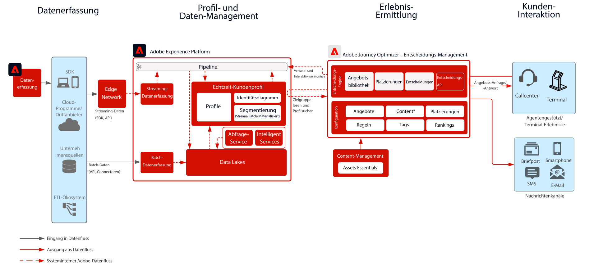

# Journey Optimizer - Entscheidungsmanagement am Hub

Weitere Informationen zur Entscheidungsverwaltung finden Sie in der Produktdokumentation [HIER](https://experienceleague.adobe.com/docs/journey-optimizer/using/offer-decisioniong/get-started-decision/starting-offer-decisioning.html?lang=de) und die Übersicht über die Entscheidungsverwaltung [HIER](https://experienceleague.adobe.com/docs/blueprints-learn/architecture/customer-journeys/journey-optimizer/offer-decisioning/decision-management-overview.html)

Adobe Decisioning Management ist ein Service, der im Rahmen von Adobe Journey Optimizer bereitgestellt wird. In diesem Blueprint werden die Anwendungsfälle und technischen Funktionen der Anwendung beschrieben und die verschiedenen architektonischen Komponenten und Überlegungen, aus denen sich die Entscheidungsverwaltung zusammensetzt, werden eingehend erläutert.

Journey Optimizer wird verwendet, um Ihren Kunden zur richtigen Zeit über alle Touchpoints hinweg das beste Angebot und Erlebnis bereitzustellen. Die Entscheidungsverwaltung erleichtert die Personalisierung mit einer zentralen Bibliothek von Marketing-Angeboten und einer Entscheidungs-Engine, die Regeln und Einschränkungen auf von Adobe Experience Platform erstellte umfangreiche Echtzeitprofile anwendet, damit Sie Ihren Kunden zum richtigen Zeitpunkt das richtige Angebot unterbreiten können.

Entscheidungs-Management kann auf zwei Arten bereitgestellt werden. Einerseits über den Adobe Experience Platform-Hub, eine zentrale Rechenzentrums-Architektur. Im „Hub“-Ansatz werden Angebote mit >500 ms Latenz ausgeführt, personalisiert und bereitgestellt. Die Hub-Architektur eignet sich daher am besten für Kundenerlebnisse, die keine Latenz unterhalb einer Sekunde erfordern. Beispiele sind Angebotsentscheidungen, die für Terminals oder durch Agenten unterstützte Erlebnisse wie in Callcentern oder in persönlichen Interaktionen bereitgestellt werden. In E-Mails und ausgehende Kampagnen eingefügt Angebote werden ebenfalls vom Hub-Ansatz unterstützt.

Der zweite Ansatz erfolgt über das Experience Edge Network, eine global verteilte, geografische Infrastruktur, die schnelle Erlebnisse in weniger als einer Sekunde bzw. Millisekunden bereitstellt. Das Endverbrauchererlebnis wird von der Edge-Infrastruktur ausgeführt, die dem geografischen Standort der Verbraucher am nächsten ist, um Latenzzeiten zu minimieren. Das Entscheidungs-Management im Edge ist für Echtzeit-Kundenerlebnisse konzipiert, wie über Web oder Mobile eingehende Personalisierungsanfragen.

In dieser Blueprint werden die Besonderheiten des Entscheidungs-Managements auf dem Hub behandelt.

Weitere Informationen zum Entscheidungs-Management im Edge finden Sie in der Blueprint [Entscheidungs-Management im Edge](https://experienceleague.adobe.com/docs/blueprints-learn/architecture/customer-journeys/journey-optimizer/offer-decisioning/decision-management-edge.html).

## Anwendungsfälle für die Entscheidungsverwaltung auf dem Hub

* Personalisierte Angebote für Terminals und Erlebnisse im Laden.
* Personalisierte Angebote über von Agenten unterstützte Erlebnisse wie Callcenter oder Vertriebsinteraktionen.
* Angebote in E-Mail, SMS, Mobile-Push-Benachrichtigungen oder anderen ausgehenden Interaktionen.
* Bereitstellung von Angeboten für externe ESP- und Messaging-Systeme zur Bereitstellung.
* Kanalübergreifende Journey-Ausführung - Konsistenz in Web, Mobile, E-Mail und auf anderen Interaktionskanälen über Adobe Journey Optimizer.

 

## Architektur

 

## Voraussetzungen

Adobe Experience Platform

* Schemas und Datensätze müssen im System konfiguriert werden, bevor Sie Journey Optimizer-Datenquellen konfigurieren können.
* Fügen Sie für Schemas, die auf der Klasse „Erlebnisereignis“ basieren, die Feldgruppe „Orchestrierungsereignis-ID“ hinzu, wenn ein Ereignis ausgelöst werden soll, das kein regelbasiertes Ereignis ist.
* Fügen Sie für Schemas, die auf der Klasse „Individuelles Profil“ basieren, die Feldgruppe „Profil-Testdetails“ hinzu, um die Testprofile für die Verwendung mit Journey Optimizer laden zu können

 

## Leitlinien

* Weitere Informationen zu Journey Optimizer finden Sie in den [Leitlinien zu Journey Optimizer](https://experienceleague.adobe.com/docs/journey-optimizer/using/get-started/limitations.html?lang=de).
* Limits für die Entscheidungsverwaltung beziehen sich auf Folgendes [Entscheidungsmanagement - Produktbeschreibung](https://helpx.adobe.com/de/legal/product-descriptions/offer-decisioning-app-service.html).
* Anforderungen pro Sekunde = 2000.
* Latenz der Reaktion &lt; 500 ms.
* Zugriff auf das gesamte Echtzeit-Kundenprofil, einschließlich Zielgruppenmitgliedschaften, Attributen und Erlebnisereignissen.

### Leitlinien für die Datenaufnahme

 

### Leitlinien für die Aktivierung

 

## Implementierungsmuster

* Implementiert in E-Mails, SMS und ausgehenden Kanälen über eine direkte Integration mit [Adobe Journey Optimizer](https://experienceleague.adobe.com/docs/journey-optimizer/using/offer-decisioniong/get-started-decision/offers-e2e.html?lang=de).
* Für die Server-API-basierte Implementierung der Entscheidungsverwaltung nutzen Sie die [Decisioning API](https://experienceleague.adobe.com/docs/journey-optimizer/using/offer-decisioniong/api-reference/offer-delivery/decisioning-vs-edge-apis.html?lang=de).
* Verwenden Sie für die Implementierung Batch-basierter Entscheidung, um Angebote stapelweise für ein Nachrichtenversand-Programm bereitzustellen, die [Batch Decisioning-API](https://experienceleague.adobe.com/docs/journey-optimizer/using/offer-decisioniong/api-reference/offer-delivery/batch-decisioning-api.html?lang=de).
* Verwenden Sie für Edge-basierte Echtzeit-Erlebnisse das Web/Mobile SDK oder die Edge Decisioning-API, wie im Abschnitt [Entscheidungsverwaltung im Edge-Blueprint](https://experienceleague.adobe.com/docs/blueprints-learn/architecture/customer-journeys/journey-optimizer/offer-decisioning/decision-management-edge.html).
 

## Implementierungsschritte

### Adobe Experience Platform

#### Schema/Datensätze

1. [Konfigurieren Sie das individuelle Profil, das Erlebnisereignis und Schemas mit mehreren Einheiten](https://experienceleague.adobe.com/?recommended=ExperiencePlatform-D-1-2021.1.xdm) in Experience Platform basierend auf den vom Kunden angegebenen Daten.
1. [Erstellen Sie Datensätze](https://experienceleague.adobe.com/docs/platform-learn/tutorials/data-ingestion/create-datasets-and-ingest-data.html?lang=de) in Experience Platform für die aufzunehmenden Daten.
1. [Fügen Sie dem Datensatz in Experience Platform Datennutzungskennzeichnungen hinzu](https://experienceleague.adobe.com/docs/platform-learn/tutorials/data-governance/classify-data-using-governance-labels.html?lang=de), um ordnungsgemäße Governance zu gewährleisten.
1. [Erstellen Sie Richtlinien](https://experienceleague.adobe.com/docs/platform-learn/tutorials/data-governance/create-data-usage-policies.html?lang=de), um die Governance an den Zielen umzusetzen.

#### Profil/Identität

1. [Erstellen Sie sämtliche kundenspezifischen Namespaces](https://experienceleague.adobe.com/docs/platform-learn/tutorials/identities/label-ingest-and-verify-identity-data.html?lang=de).
1. [Fügen Sie Identitäten zu Schemas hinzu](https://experienceleague.adobe.com/docs/platform-learn/tutorials/identities/label-ingest-and-verify-identity-data.html).
1. [Aktivieren Sie die Schemas und Datensätze für Profile](https://experienceleague.adobe.com/docs/platform-learn/tutorials/profiles/bring-data-into-the-real-time-customer-profile.html?lang=de).
1. [Richten Sie Zusammenführungsrichtlinien](https://experienceleague.adobe.com/docs/platform-learn/tutorials/profiles/create-merge-policies.html?lang=de) für unterschiedliche Ansichten des [!UICONTROL Echtzeit-Kundenprofils] ein (optional).
1. Erstellen Sie Segmente für die Journey-Nutzung.

#### Quellen/Ziele

1. [Nehmen Sie Daten mit Streaming-APIs und Quellen-Connectoren in Experience Platform auf.](https://experienceleague.adobe.com/?recommended=ExperiencePlatform-D-1-2020.1.dataingestion&amp;lang=de)

## Verwandte Dokumentation

* [Adobe Experience Platform](https://experienceleague.adobe.com/docs/experience-platform.html?lang=de)
* [Adobe Journey Optimizer](https://experienceleague.adobe.com/docs/journey-optimizer.html?lang=de)
* [Entscheidungs-Management in Adobe Journey Optimizer](https://experienceleague.adobe.com/docs/journey-optimizer/using/offer-decisioniong/get-started-decision/starting-offer-decisioning.html)
* [Produktbeschreibung zu Adobe Journey Optimizer](https://helpx.adobe.com/de/legal/product-descriptions/adobe-journey-optimizer.html)
* [Produktbeschreibung für die Entscheidungsverwaltung durch Adoben](https://helpx.adobe.com/legal/product-descriptions/offer-decisioning-app-service.html)
