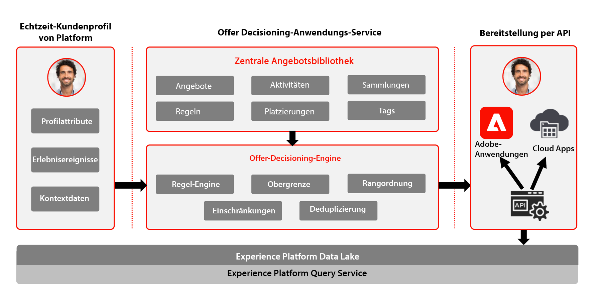

# Journey Optimizer – Blueprints zu Entscheidungs-Management

Weitere Informationen zum Entscheidungs-Management finden Sie in der [Produktdokumentation](https://experienceleague.adobe.com/docs/journey-optimizer/using/offer-decisioniong/get-started-decision/starting-offer-decisioning.html?lang=de)

Das Entscheidungs-Management von Adobe ist ein Service, der im Rahmen von Adobe Journey Optimizer bereitgestellt wird. In dieser Blueprint werden die Anwendungsfälle und technischen Funktionen des Programms vorgestellt und die verschiedenen Komponenten der Architektur von und Überlegungen zu Entscheidungs-Management eingehend erläutert.

Journey Optimizer wird verwendet, um Ihren Kunden zur richtigen Zeit auf allen Touchpoints das beste Angebot und Erlebnis bereitzustellen. Entscheidungs-Management ermöglicht die Personalisierung durch eine zentrale Bibliothek von Marketing-Angeboten und eine Entscheidungs-Engine, die Regeln und Einschränkungen auf umfangreiche Echtzeitprofile anwendet, die auf Adobe Experience Platform erstellt wurden. Dadurch können Sie Ihren Kunden zum richtigen Zeitpunkt das richtige Angebot unterbreiten.

Die Entscheidungs-Management-Funktion besteht aus zwei Hauptkomponenten:

* Die zentrale Angebotsbibliothek ist die Schnittstelle, über die Sie die verschiedenen Elemente, aus denen sich Ihre Angebote zusammensetzen, erstellen und verwalten sowie deren Regeln und Einschränkungen definieren.
* Die Offer Decisioning-Engine nutzt Adobe Experience Platform-Daten und Echtzeit-Kundenprofile zusammen mit der Angebotsbibliothek, um die richtigen Momente, Kunden und Kanäle für die Bereitstellung von Angeboten auszuwählen.

Das Entscheidungs-Management kann auf zwei Arten bereitgestellt werden: im Edge oder über den Hub. Jede dieser Methoden verfügt über einen spezifischen Satz von Schnittstellen und Protokollen zum Betrieb des Service, die in den entsprechenden unten genannten Blueprints beschrieben werden. Weitere Informationen finden Sie auch in der [Dokumentation zum Entscheidungs-Management](https://experienceleague.adobe.com/docs/journey-optimizer/using/offer-decisioniong/api-reference/offer-delivery-api/decisioning-vs-edge-apis.html?lang=de).

## Entscheidungs-Management am Hub

Einerseits über den Adobe Experience Platform-Hub, eine zentrale Rechenzentrums-Architektur. Im „Hub“-Ansatz werden Angebote mit >500 ms Latenz ausgeführt, personalisiert und bereitgestellt. Die Hub-Architektur eignet sich daher am besten für Kundenerlebnisse, die keine Latenz unterhalb einer Sekunde erfordern. Beispiele sind Angebotsentscheidungen, die für Terminals oder durch Agenten unterstützte Erlebnisse wie in Callcentern oder in persönlichen Interaktionen bereitgestellt werden. Angebote, die in E-Mails, SMS-Nachrichten, Push-Benachrichtigungen und andere ausgehende Kampagnen eingefügt werden, werden ebenfalls vom Hub-Ansatz unterstützt. Weitere Informationen zum Entscheidungs-Management auf dem Hub finden Sie in der Blueprint [Entscheidungs-Management auf dem Hub](https://experienceleague.adobe.com/docs/blueprints-learn/architecture/customer-journeys/journey-optimizer/decision-management/decision-management-hub.html?lang=de).

* Die Angebotseignung kann auf das gesamte Echtzeit-Kundenprofil einschließlich aller Attribute und Erlebnisereignisse angewendet werden.

### Anwendungsfälle für das Entscheidungs-Management auf dem Hub

* Personalisierte Angebote für Terminals und Erlebnisse im Laden.
* Personalisierte Angebote über von Agenten unterstützte Erlebnisse wie Callcenter oder Vertriebsinteraktionen.
* In E-Mails, SMS oder anderen ausgehenden Interaktionen enthaltene Angebote.
* Kanalübergreifende Journey-Ausführung - Konsistenz in Web, Mobile, E-Mail und auf anderen Interaktionskanälen über Adobe Journey Optimizer.

### Technische Überlegungen zu Entscheidungs-Management auf dem Hub

* Anfragen pro Sekunde = 2.000.
* Latenz der Reaktion &lt; 500 ms.
* Zugriff auf das gesamte Echtzeit-Kundenprofil, einschließlich Zielgruppenzugehörigkeit, Attributen und Erlebnisereignissen.

## Entscheidungs-Management im Edge   

Der zweite Ansatz erfolgt über das Erlebnis [!DNL Edge Network], eine global verteilte, geografisch verteilte Infrastruktur, die schnelle Erlebnisse zwischen einer Sekunde und einer Millisekunde bereitstellt. Das Endverbrauchererlebnis wird von der Edge-Infrastruktur ausgeführt, die dem geografischen Standort der Verbraucher am nächsten ist, um Latenzzeiten zu minimieren. Das Entscheidungs-Management im Edge ist für Echtzeit-Kundenerlebnisse konzipiert, wie über Web oder Mobile eingehende Personalisierungsanfragen. Weitere Informationen zum Entscheidungs-Management im Edge finden Sie in der Blueprint [Entscheidungs-Management im Edge](https://experienceleague.adobe.com/docs/blueprints-learn/architecture/customer-journeys/journey-optimizer/decision-management/decision-management-edge.html?lang=de).

### Anwendungsfälle für das Entscheidungs-Management im Edge

* Online-Personalisierung über eingehende Web- oder mobile Erlebnisse.
* Kanalübergreifende Journey-Ausführung - Konsistenz in Web, Mobile, E-Mail und auf anderen Interaktionskanälen über Adobe Journey Optimizer.

### Technische Überlegungen zu Entscheidungs-Management im Edge Network

* Anfragen pro Sekunde = 5.000.
* Latenz der Reaktion &lt; 250 ms.
* Zugriff auf das Edge-Echtzeitprofil. Im Profil sind nur von Edge projizierte Zielgruppen und Profilattribute verfügbar.
* Wenn in erstmaligen Erlebnissen eine Personalisierung erforderlich ist, ist der Hub ideal, da das vollständige Profil verfügbar ist. Das Edge-Profil muss für das erste Edge-Erlebnis vom Hub synchronisiert werden. Daher umfasst das allererste Erlebnis vom Edge keine zuvor in den Hub hochgeladenen Profildaten.

## Verwandte Dokumentation

* [Adobe Experience Platform](https://experienceleague.adobe.com/docs/experience-platform.html?lang=de)
* [Adobe Journey Optimizer](https://experienceleague.adobe.com/docs/journey-optimizer.html?lang=de)
* [Entscheidungs-Management in Adobe Journey Optimizer](https://experienceleague.adobe.com/docs/journey-optimizer/using/offer-decisioniong/get-started-decision/starting-offer-decisioning.html?lang=de)
* [Produktbeschreibung zu Adobe Journey Optimizer](https://helpx.adobe.com/de/legal/product-descriptions/adobe-journey-optimizer.html)
* [Produktbeschreibung für das Entscheidungs-Management von Adobe](https://helpx.adobe.com/de/legal/product-descriptions/offer-decisioning-app-service.html)
