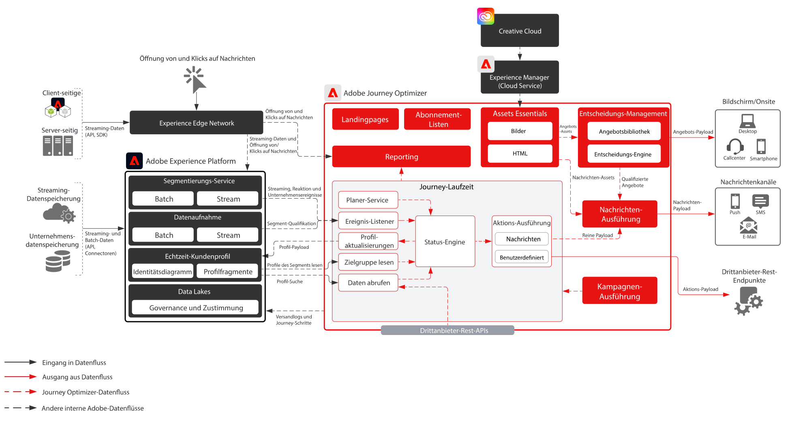
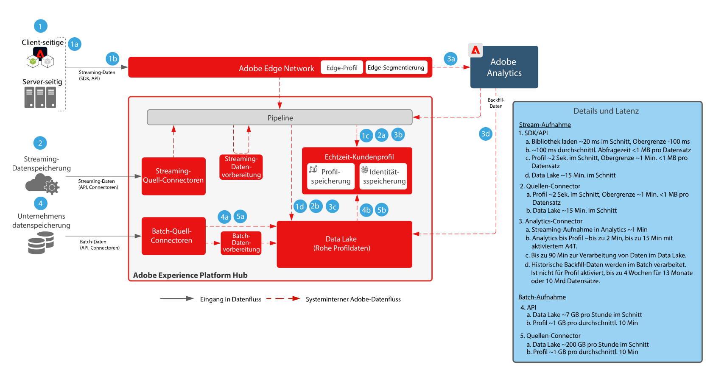
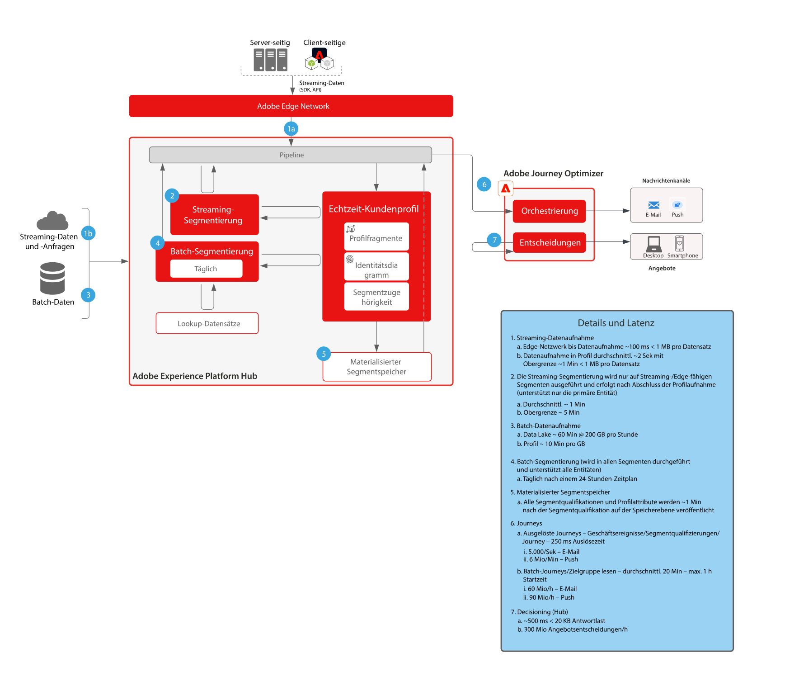

# Journey Optimizer

Adobe Journey Optimizer ist ein speziell entwickeltes System, mit dem Marketing-Teams in Echtzeit auf Kundenverhalten reagieren und diese dort ansprechen können, wo sie sich gerade befinden. Daten-Management-Funktionen wurden nach Adobe Experience Platform verschoben, sodass sich Marketing-Teams auf ihre Kernkompetenz konzentrieren können: die Erstellung herausragender Customer Journeys und personalisierter Kommunikation.  In dieser Blueprint werden die technischen Funktionen des Programms vorgestellt und die verschiedenen Komponenten der Architektur von Adobe Journey Optimizer eingehend erläutert.

 

## Anwendungsfälle

* Trigger-basierte Nachrichten
* Begrüßung und Registrierungsbestätigungen
* Abgebrochene Warenkörbe und Anmeldeformulare
* Standortbasierte Nachrichten
* Erlebnisse im Stadion
* Erlebnisse in Touristik und Gastgewerbe vor der Ankunft und während des Aufenthalts

 

## Architektur

 

## Blueprint-Szenarios

| Szenario | Beschreibung | Funktionen |
| :-- | :--- | :--- |
| [Drittanbieter-Messaging](3rd-party-messaging.md) | Zeigt, wie Adobe Journey Optimizer mit Drittanbieter-Messaging-Systemen genutzt werden kann, um personalisierte Kommunikation zu orchestrieren und zu senden. | Stellen Sie in Echtzeit personalisierte 1:1-Kommunikationen für Kunden bereit, während diese mit Ihrer Marke oder Ihrem Unternehmen interagieren.  Überlegungen: <ul><li>Drittanbietersystem muss Inhaber-Token für die Authentifizierung unterstützen</li><li>Keine Unterstützung für statische IPs aufgrund der Mehrmandanten-Architektur</li><li>Beachten Sie Einschränkungen der Architektur bei Drittanbietersystemen hinsichtlich API-Aufrufen pro Sekunde. Unter Umständen muss der Kunde zusätzliches Volumen vom Drittanbieter erwerben, um das aus Journey Optimizer eingehende Volumen zu unterstützen.</li><li>Entscheidungs-Management wird in Nachrichten oder Payloads nicht unterstützt</li></ul> |

 

## Integrationsmuster

| Integration | Beschreibung | Funktionen |
| :-- | :--- | :--- |
| [Journey Optimizer mit Adobe Campaign](ajo-and-campaign.md) | Zeigt, wie Sie Adobe Journey Optimizer verwenden können, um 1:1-Erlebnisse mit dem Echtzeit-Kundenprofil zu orchestrieren, und dabei das native Transaktionsnachrichtensystem von Adobe Campaign verwenden, um die Nachrichten zu versenden. | Nutzen Sie das Echtzeit-Kundenprofil und die Möglichkeiten von Journey Optimizer, um Erlebnisse im richtigen Moment zu orchestrieren, und nutzen Sie gleichzeitig die nativen Echtzeit-Messaging-Funktionen von Adobe Campaign, um die Kommunikation auf der letzten Meile durchzuführen.  Überlegungen: <ul><li>Campaign muss v7, Build >21.1 oder v8 sein</li><li>Messaging-Durchsatz</li><ul><li>Campaign v7 - bis zu 50.000 pro Stunde</li><li>Campaign v8 - bis zu 1 Mio. pro Stunde</li><li>Campaign Standard - bis zu 50.000 pro Stunde</li></ul><li>Es wird kein Throttling durchgeführt, Anwendungsfälle erfordern also eine technische Überprüfung durch einen Enterprise Architect</li><li>Keine Unterstützung für die Verwendung von Entscheidungs-Management in von Campaign versendeten Nachrichten</li></ul> |

 

## Voraussetzungen

Adobe Experience Platform

* Schemas und Datensätze müssen im System konfiguriert werden, bevor Sie Journey Optimizer-Datenquellen konfigurieren können.
* Fügen Sie für Schemas, die auf der Klasse „Erlebnisereignis“ basieren, die Feldgruppe „Orchestrierungsereignis-ID“ hinzu, wenn ein Ereignis ausgelöst werden soll, das kein regelbasiertes Ereignis ist.
* Fügen Sie für Schemas, die auf der Klasse „Individuelles Profil“ basieren, die Feldgruppe „Profil-Testdetails“ hinzu, um die Testprofile für die Verwendung mit Journey Optimizer laden zu können.

E-Mail

* Eine Subdomain muss verfügbar sein, die für den Versand von Nachrichten verwendet werden kann
* Die Subdomain kann entweder komplett an Adobe delegiert werden (empfohlen) oder CNAMEs können zum Verweis an Adobe-spezifische DNS-Server (benutzerdefiniert) verwendet werden
* Für jede Subdomain ist ein Google-TXT-Datensatz erforderlich, um gute Zustellbarkeit sicherzustellen

Mobilgeräte-Push

* Der Kunde muss über einen Mobile-Entwickler verfügen, der die Mobile App erstellen kann
* Adobe Experience Platform Mobile SDK

 

## Leitlinien

[Produkt-Link zu Journey Optimizer-Leitlinien](https://experienceleague.adobe.com/docs/journeys/using/starting-with-journeys/limitations.html?lang=de)

Achten Sie auf folgende, nicht im Link oben aufgeführte Punkte:

* Batch-Segmente: Stellen Sie sicher, dass Sie das tägliche Volumen an qualifizierten Nutzern verstehen und dass das Zielsystem den maximalen Durchsatz pro Journey und für sämtliche Journeys bewältigen kann
* Streaming-Segmente: Stellen Sie sicher, dass der erste Strom von Profilqualifikationen neben täglichen Streaming-Volumen pro Journey und für sämtliche Journeys bewältigt werden kann
* Native Unterstützung für Entscheidungs-Management nur in Nachrichten (keine benutzerdefinierten Aktionen)
* Unterstützte Nachrichtentypen:
   * E-Mail
   * Push (FCM/APNS)
   * Benutzerdefinierte Aktionen (über Rest-API)
* Ausgehende Integrationen mit Drittanbietersystemen
   * Keine Unterstützung für einzelne statische IPs, da wir eine Mehrmandanten-Infrastruktur verwenden (alle Daten-Center-IPs müssen aufgelistet sein)
   * Nur die POST- und die PUT-Methode werden für benutzerdefinierte Aktionen unterstützt
   * Authentifizierung über Benutzer/Passwort oder Autorisierungs-Token
* Keine Möglichkeit, einzelne Komponenten von Adobe Experience Platform oder Journey Optimizer zu packen und zwischen verschiedenen Sandboxes zu verschieben. Muss in neuen Umgebungen erneut implementiert werden

### Leitlinien für die Datenaufnahme

 

### Leitlinien für die Aktivierung

 

## Implementierungsschritte

### Adobe Experience Platform

#### Schema/Datensätze

1. [Konfigurieren Sie das individuelle Profil, das Erlebnisereignis und Schemas mit mehreren Einheiten](https://experienceleague.adobe.com/?recommended=ExperiencePlatform-D-1-2021.1.xdm&amp;lang=de) in Experience Platform basierend auf den vom Kunden angegebenen Daten.
1. [Erstellen Sie Datensätze](https://experienceleague.adobe.com/docs/platform-learn/tutorials/data-ingestion/create-datasets-and-ingest-data.html?lang=de) in Experience Platform für die aufzunehmenden Daten.
1. [Fügen Sie dem Datensatz in Experience Platform Datennutzungskennzeichnungen hinzu](https://experienceleague.adobe.com/docs/platform-learn/tutorials/data-governance/classify-data-using-governance-labels.html?lang=de), um ordnungsgemäße Governance zu gewährleisten.
1. [Erstellen Sie Richtlinien](https://experienceleague.adobe.com/docs/platform-learn/tutorials/data-governance/create-data-usage-policies.html?lang=de), um die Governance an den Zielen umzusetzen.

#### Profil/Identität

1. [Erstellen Sie sämtliche kundenspezifischen Namespaces](https://experienceleague.adobe.com/docs/platform-learn/tutorials/identities/label-ingest-and-verify-identity-data.html?lang=de).
1. [Fügen Sie Identitäten zu Schemas hinzu](https://experienceleague.adobe.com/docs/platform-learn/tutorials/identities/label-ingest-and-verify-identity-data.html?lang=de).
1. [Aktivieren Sie die Schemas und Datensätze für Profile](https://experienceleague.adobe.com/docs/platform-learn/tutorials/profiles/bring-data-into-the-real-time-customer-profile.html?lang=de).
1. [Richten Sie Zusammenführungsrichtlinien](https://experienceleague.adobe.com/docs/platform-learn/tutorials/profiles/create-merge-policies.html?lang=de) für unterschiedliche Ansichten des [!UICONTROL Echtzeit-Kundenprofils] ein (optional).
1. Erstellen Sie Segmente für die Journey-Nutzung.

#### Quellen/Ziele

1. [Nehmen Sie Daten mit Streaming-APIs und Quellen-Connectoren in Experience Platform auf.](https://experienceleague.adobe.com/?recommended=ExperiencePlatform-D-1-2020.1.dataingestion&amp;lang=de)

### Journey Optimizer

1. Konfigurieren Sie die Experience Platform-Datenquelle und bestimmen Sie, welche Felder als Teil des Profils zwischengespeichert werden sollen. Streaming-Daten, die zum Auslösen einer Customer Journey verwendet werden, müssen zunächst in Journey Optimizer konfiguriert werden, damit eine Orchestrierungs-ID erstellt wird. Die Orchestrierungs-ID wird dann an den Entwickler weitergegeben, der sie bei der Aufnahme nutzen kann
1. Konfigurieren Sie externe Datenquellen.
1. Konfigurieren Sie benutzerdefinierte Aktionen.

### Mobilgeräte-Push-Konfiguration

1. Implementieren Sie das Experience Platform Mobile SDK zum Sammeln von Push-Tokens und Login-Informationen zum Abgleich mit Kundenprofilen
1. Nutzen Sie Adobe Tags und erstellen Sie eine Mobile-Präsenz mit der folgenden Erweiterung:
1. Adobe Journey Optimizer
1. Adobe Experience Platform Edge Network
1. Identität      für Edge Network
1. Mobile Core
1. Stellen Sie sicher, dass Sie über einen dedizierten Daten-Stream für Mobile-App-Implementierungen verfügen, der sich von dem für Web-Implementierungen unterscheidet
1. Weitere Informationen finden Sie im [Mobile-Handbuch für Adobe Journey Optimizer](https://aep-sdks.gitbook.io/docs/using-mobile-extensions/adobe-journey-optimizer)

## Verwandte Dokumentation

* [Dokumentation zu Experience Platform ](https://experienceleague.adobe.com/docs/experience-platform.html?lang=de)
* [Dokumentation zu Experience Platform Tags ](https://experienceleague.adobe.com/docs/experience-platform/tags/home.html?lang=de)
* [Dokumentation zu Experience Platform Mobile SDK](https://experienceleague.adobe.com/docs/mobile.html?lang=de)
* [Dokumentation zu Journey Optimizer](https://experienceleague.adobe.com/docs/journey-optimizer/using/ajo-home.html?lang=de)
* [Produktbeschreibung zu Journey Optimizer](https://helpx.adobe.com/de/legal/product-descriptions/adobe-journey-optimizer.html)
