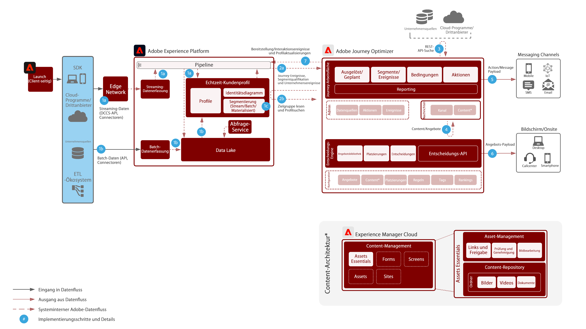

# Journey Optimizer

Adobe Journey Optimizer ist ein speziell entwickeltes System, mit dem Marketing-Teams in Echtzeit auf Kundenverhalten reagieren und diese dort ansprechen können, wo sie sich gerade befinden. Daten-Management-Funktionen wurden nach Adobe Experience Platform verschoben, sodass sich Marketing-Teams auf ihre Kernkompetenz konzentrieren können: die Erstellung herausragender Customer Journeys und personalisierter Kommunikation.  In dieser Blueprint werden die technischen Funktionen des Programms vorgestellt und die verschiedenen Komponenten der Architektur von Adobe Journey Optimizer eingehend erläutert.

## Anwendungsfälle

* Trigger-basierte Nachrichten
* Registrierungsbestätigungen
* Abgebrochene Warenkörbe und Anmeldeformulare
* Standortbasierte Nachrichten

## Architektur

## Integrationsmuster

* Adobe Experience Platform -> Journey Optimizer

## Voraussetzungen

1. Der Kunde muss über eine gültige IMS Org für Experience Cloud verfügen
1. Mobilgeräte-Push

* Der Kunde muss über einen Mobile-Entwickler verfügen, der die Mobile App erstellen kann
* Adobe Experience Platform Mobile SDK
* Datenerfassung
   * Eigenschaft für mobile Tags
      * Erweiterungen:
         * Adobe Journey Optimizer-Erweiterung
         * Adobe Experience Platform Edge Network
         * Identität
         * Mobile Core
         * Profil
   * Mobile-App-Konfigurationen
   * Daten-Streams
      * Aktiviert für Experience Platform
      * Ereignis-Datensatz – wird zur Erfassung des allgemeinen Verhaltens von Mobilgeräten verwendet
      * Profildatensatz - AJO Push Profile DataSet (keine Alternative möglich)

## Leitlinien

* Weitere Informationen zu Limits für Journey Optimizer finden Sie unter Link [LINK](https://experienceleague.adobe.com/docs/journeys/using/starting-with-journeys/limitations.html?lang=en)
* Batch-Segmente: Stellen Sie sicher, dass Sie das tägliche Volumen an qualifizierten Nutzern verstehen und dass das Zielsystem den maximalen Durchsatz pro Journey und für sämtliche Journeys bewältigen kann
* Streaming-Segmente: Stellen Sie sicher, dass der erste Strom von Profilqualifikationen neben täglichen Streaming-Volumen pro Journey und für sämtliche Journeys bewältigt werden kann
* Profilaktualisierungsaktivität: Das Echtzeit-Kundenprofil kann nativ aus der Journey heraus aktualisiert werden.  Bei der Verarbeitung der Aktualisierung in den Profilspeicher kann eine Verzögerung von bis zu einer Minute auftreten.
* Unternehmensereignisse: Eine auf Lesesegmenten basierende Journey kann basierend auf einem externen Aufruf des JO-Systems ausgelöst werden.
* Native Unterstützung für Offer Decisioning nur in Nachrichten. Zukünftige Unterstützung über native Aktionen
* Unterstützte Kanäle:
   * E-Mail
   * Push (FCM/APNS)
   * REST-API-Endpunkte
* Verarbeitet 5.000 Ereignisse pro Sekunde mit horizontaler Skalierung (Begrenzung durch Wallet)
* A/B-Tests anhand von zwei Sendungen und Ergebnisermittlung mit QS oder CJA
* Litmus-Integration: Sie müssen über ein Litmus-Konto verfügen, um die Integration nutzen zu können

## Implementierungsschritte

### Adobe Experience Platform

#### Schema/Datensätze

1. [Konfigurieren Sie das individuelle Profil, das Erlebnisereignis und Schemas mit mehreren Einheiten](https://experienceleague.adobe.com/?recommended=ExperiencePlatform-D-1-2021.1.xdm) in Experience Platform basierend auf den vom Kunden angegebenen Daten.
1. Erstellen Sie Adobe Campaign-Schemas für broadLog, trackingLog, nicht zustellbare Adressen und Profileinstellungen (optional).
1. [Erstellen Sie Datensätze](https://experienceleague.adobe.com/docs/platform-learn/tutorials/data-ingestion/create-datasets-and-ingest-data.html?lang=de) in Experience Platform für die aufzunehmenden Daten.
1. [Fügen Sie dem Datensatz in Experience Platform Datennutzungskennzeichnungen hinzu](https://experienceleague.adobe.com/docs/platform-learn/tutorials/data-governance/classify-data-using-governance-labels.html?lang=de), um ordnungsgemäße Governance zu gewährleisten.
1. [Erstellen Sie Richtlinien](https://experienceleague.adobe.com/docs/platform-learn/tutorials/data-governance/create-data-usage-policies.html?lang=de), um die Governance an den Zielen umzusetzen.

#### Profil/Identität

1. [Erstellen Sie sämtliche kundenspezifischen Namespaces](https://experienceleague.adobe.com/docs/platform-learn/tutorials/identities/label-ingest-and-verify-identity-data.html?lang=de).
1. [Fügen Sie Identitäten zu Schemas hinzu](https://experienceleague.adobe.com/docs/platform-learn/tutorials/identities/label-ingest-and-verify-identity-data.html).
1. [Aktivieren Sie die Schemas und Datensätze für Profile](https://experienceleague.adobe.com/docs/platform-learn/tutorials/profiles/bring-data-into-the-real-time-customer-profile.html?lang=de).
1. [Richten Sie Zusammenführungsrichtlinien](https://experienceleague.adobe.com/docs/platform-learn/tutorials/profiles/create-merge-policies.html?lang=de) für unterschiedliche Ansichten des [!UICONTROL Echtzeit-Kundenprofils] ein (optional).
1. Erstellen Sie Segmente für die Kampagnennutzung.

#### Quellen/Ziele

1. [Nehmen Sie Daten in Experience Platform mithilfe von Streaming-APIs und Quell-Connectoren](https://experienceleague.adobe.com/?recommended=ExperiencePlatform-D-1-2020.1.dataingestion&amp;lang=de) auf.1. Konfigurieren Sie das [!DNL Azure]-Blob-Speicherziel für die Verwendung mit Adobe Campaign.

#### Bereitstellung für Mobile App

1. Implementieren Sie das Adobe Campaign-SDK für Adobe Campaign Classic oder das Experience Platform-SDK für Adobe Campaign Standard. Wenn Experience Platform Launch vorhanden ist, wird empfohlen, die Erweiterung für Adobe Campaign Classic oder Adobe Campaign Standard mit dem Experience Platform-SDK zu verwenden.

### Journey Orchestration

1. Streaming-Daten, die zur Initiierung einer Customer Journey genutzt werden, müssen zunächst in Journey Optimizer konfiguriert werden, um eine Orchestrierungs-ID zu erhalten. Die Orchestrierungs-ID wird dann an den Entwickler weitergegeben, der sie bei der Aufnahme nutzen kann.
1. Konfigurieren Sie externe Datenquellen.
1. Konfigurieren Sie benutzerdefinierte Aktionen.

## Verwandte Dokumentation

* [Dokumentation zu Adobe Experience Platform](https://experienceleague.adobe.com/docs/experience-platform.html?lang=de)
* [Dokumentation zu Journey Optimizer](https://experienceleague.adobe.com/docs/journey-optimizer/using/ajo-home.html?lang=en)
* [Dokumentation zu Experience Platform Launch](https://experienceleague.adobe.com/docs/launch.html?lang=de)
* [Dokumentation zu Experience Platform Mobile SDK](https://experienceleague.adobe.com/docs/mobile.html?lang=de)
