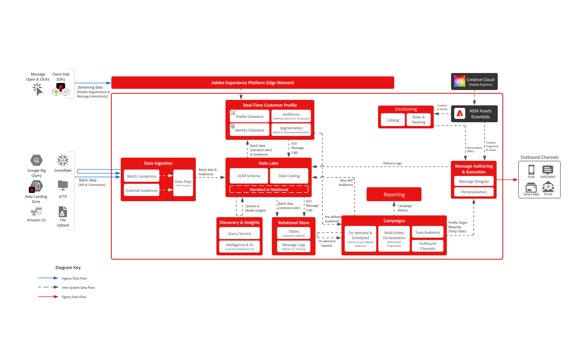

# [!DNL Journey Optimizer] - Blueprint zur Kampagnenorchestrierung

>[!TIP]
>Diese Blueprint ist auch als Anwendungsfallmuster [&#x200B; Kampagnenverwaltung &#x200B;](/help/blueprints/use-case-patterns/campaign-management-orchestration/batch-outbound-message-activation.md) Orchestrierung verfügbar.

Mit AJO Campaign Orchestration können Marketing-Experten geplante, zielgruppenbasierte, mehrstufige Kommunikationen über ausgehende Kanäle wie E-Mail, SMS, Push und Briefpost entwerfen und ausführen. Im Gegensatz zu AJO Journey, die auf individuelles Kundenverhalten mit Echtzeitdaten aus dem Echtzeit-Kundenprofil reagieren, sind Kampagnen koordinierte Marketing-Maßnahmen, die Zielgruppen in geplanten Intervallen ansprechen. Gemeinsam bieten Kampagnen und Journey einander ergänzende Ansätze. Kampagnen fördern die Strategien der Markeninteraktion, während Journey personalisierte, responsive Erlebnisse bereitstellen.

 

## Architektur

 

### Architektur der Nachrichtenausführung

 

### Relationaler Speicher - Latenz bei der Datenaufnahme

 

## Überlegungen zur Architektur für Journeys

- **Datenarchitektur**: AJO Campaign Orchestration verwendet eine darunter liegende relationale Datenbank zur Zielgruppenerstellung und -orchestrierung
- **Audience Portal-Integration**: Native Integration mit dem Audience Portal im Echtzeit-Kundenprofil, um sowohl aus vorhandenen Zielgruppen zu lesen als auch neue Zielgruppen beim Erstellen von Kampagnen in zu speichern
- **On-Demand-Zielgruppenerstellung**: Erstellen, Auswerten und Ausführen einer Zielgruppe sofort für dringende Marketing-Anwendungsfälle
- **Echtzeit-Kundenprofil-Integration:** Quelle der Wahrheit für den Einverständnis- und Kommunikationsverlauf; unterstützt „schmales Profil“-Design für die Personalisierung
- **Versand von Nachrichten mehrerer Entitäten:** Möglichkeit, mehrere Nachrichten pro Profil in einem Versand zu senden (z. B. eine Nachricht pro Reservierung an die E-Mail-Adresse des Kunden zu senden)
- **Segmentierung mehrerer Entitäten** Beginnen Sie mit der Erstellung einer Zielgruppe aus einer beliebigen Entität im relationalen Speicher (d. h. Produkt, Inventar, Plan usw.)

 

## Leitlinien

[Produkt-Link für orchestrierte Kampagnen](https://experienceleague.adobe.com/de/docs/journey-optimizer/using/campaigns/orchestrated-campaigns/guardrails)

[Leitplanken und Leitlinien für End-to-End-Latenzen](https://experienceleague.adobe.com/docs/blueprints-learn/architecture/architecture-overview/deployment/guardrails)

 

## Verwandte Dokumentation

- [Orchestrierte Kampagnen [!DNL Journey Optimizer]](https://experienceleague.adobe.com/en/docs/journey-optimizer/using/campaigns/orchestrated-campaigns/orchestrated-campaigns-landing-page.html)
- [[!DNL Experience Platform] Dokumentation](https://experienceleague.adobe.com/docs/experience-platform.html?lang=de)
- [Dokumentation zu [!DNL Experience Platform] Tags](https://experienceleague.adobe.com/docs/experience-platform/tags/home.html?lang=de)
- [[!DNL Experience Platform Mobile SDK] Dokumentation](https://experienceleague.adobe.com/docs/mobile.html?lang=de)
- [[!DNL Journey Optimizer] Dokumentation](https://experienceleague.adobe.com/docs/journey-optimizer/using/ajo-home.html?lang=de)
- [[!DNL Journey Optimizer] Produktbeschreibung](https://helpx.adobe.com/de/legal/product-descriptions/adobe-journey-optimizer.html)
