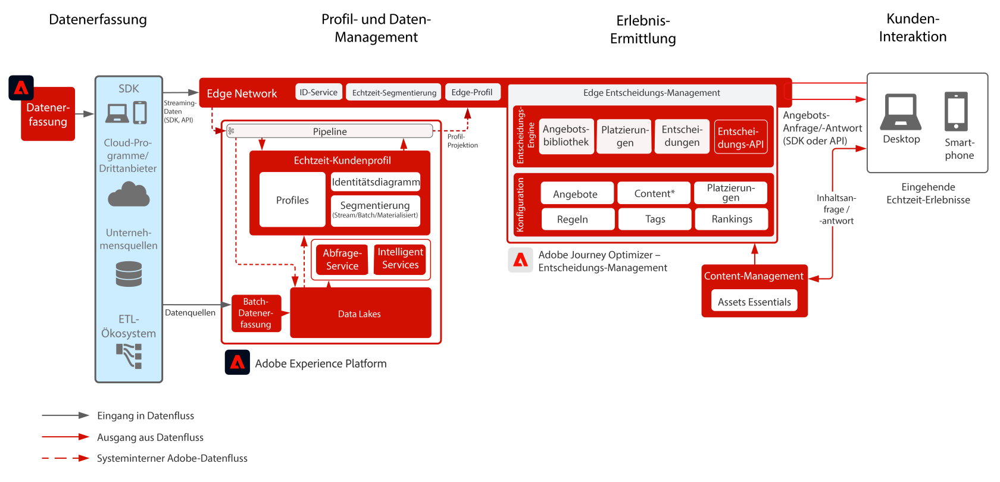

# Journey Optimizer - Offer decisioning am Rand

Adobe Decisioning Management ist ein Dienst, der im Rahmen von Adobe Journey Optimizer bereitgestellt wird. In diesem Blueprint werden die Anwendungsfälle und technischen Funktionen der Anwendung erläutert und ein tiefer Einblick in die verschiedenen architektonischen Komponenten und Überlegungen, aus denen Offer decisioning besteht, geboten.

Die Entscheidungsverwaltung kann auf zwei Arten bereitgestellt werden. Der erste erfolgt über den Adobe Experience Platform Hub, eine zentrale Rechenzentrumarchitektur. Im &quot;Hub&quot;-Ansatz werden Angebote in zweiter Latenz ausgeführt, personalisiert und bereitgestellt. Die Hub-Architektur eignet sich daher am besten für Kundenerlebnisse, die keine Latenz unterhalb der Sekunde erfordern. Beispiele sind Angebotsentscheidungen, die für Kiosks oder durch Agenten unterstützte Erlebnisse wie in Callcentern oder in persönlichen Interaktionen bereitgestellt werden.

Der zweite Ansatz erfolgt über das Experience Edge Network, eine global verteilte, geografisch verteilte Infrastruktur, die schnelle Erlebnisse auf einer Untersekunde und einer Millisekunde bereitstellt. Das Endverbrauchererlebnis, das von der Edge-Infrastruktur ausgeführt wird, die dem geografischen Standort der Verbraucher am nächsten ist, um Latenzzeiten zu minimieren. Die Entscheidungsverwaltung an Edge ist für Echtzeit-Kundenerlebnisse konzipiert. Dazu gehören Erlebnisse wie eingehende Web- oder mobile Personalisierungsanfragen.

In diesem Blueprint werden die Besonderheiten des Entscheidungsmanagements an der Edge behandelt.

Weitere Informationen zur Entscheidungsverwaltung finden Sie in der Produktdokumentation [HIER](https://experienceleague.adobe.com/docs/journey-optimizer/using/offer-decisioniong/get-started-decision/starting-offer-decisioning.html)

## Anwendungsfälle

* Online-Personalisierung über Web oder Mobile.
* Eingehende offer decisioning und Angebotsvorschläge.
* Kanalübergreifende Journey-Ausführung - Bietet über Adobe Journey Optimizer Konsistenz über Web-, Mobile-, E-Mail- und andere Interaktionskanäle hinweg.

 

## Architektur

 

## Integrationsmuster

| Integration | Beschreibung |
| :-- | :--- |
| [offer decisioning mit Adobe Target](https://experienceleague.adobe.com/docs/target/using/integrate/ajo/offer-decision.html) | offer decisioning kann in Adobe Target integriert werden, sodass Angebote getestet und als Target-Erlebnisse bereitgestellt werden können. |

## Voraussetzungen

Adobe Experience Platform

* Schemas und Datensätze müssen im System konfiguriert werden, bevor Sie Journey Optimizer-Datenquellen konfigurieren können.
* Fügen Sie für Schemas, die auf der Klasse „Erlebnisereignis“ basieren, die Feldgruppe „Orchestrierungsereignis-ID“ hinzu, wenn ein Ereignis ausgelöst werden soll, das kein regelbasiertes Ereignis ist.
* Fügen Sie für Schemas, die auf der Klasse „Individuelles Profil“ basieren, die Feldgruppe „Profil-Testdetails“ hinzu, um die Testprofile für die Verwendung mit Journey Optimizer laden zu können

 

## Leitlinien

[Produkt-Link zu Journey Optimizer-Leitlinien](https://experienceleague.adobe.com/docs/journey-optimizer/using/get-started/limitations.html)

### Leitlinien für die Datenaufnahme

 

### Leitlinien für die Aktivierung

 

## Implementierungsmuster

* Verwenden Sie das Web- oder Mobile-SDK für die Bereitstellung auf Websites und mobilen Anwendungen, um Offer decisioning zu implementieren, in der das SDK bereitgestellt wurde.
   * [WebSDK](https://experienceleague.adobe.com/docs/journey-optimizer/using/offer-decisioniong/api-reference/offer-delivery/web-sdk.html)
   * [MobileSDK](https://aep-sdks.gitbook.io/docs/)

Oder

* Verwenden Sie für eine serverbasierte API-Server-basierte Implementierung die Edge Network Server-API für die direkte Server-zu-Server-Implementierung der Offer decisioning. [Link](https://experienceleague.adobe.com/docs/journey-optimizer/using/offer-decisioniong/api-reference/offer-delivery/deliver-offers.html)

 

## Implementierungsschritte

### Adobe Experience Platform

#### Schema/Datensätze

1. [Konfigurieren Sie das individuelle Profil, das Erlebnisereignis und Schemas mit mehreren Einheiten](https://experienceleague.adobe.com/?recommended=ExperiencePlatform-D-1-2021.1.xdm) in Experience Platform basierend auf den vom Kunden angegebenen Daten.
1. [Erstellen Sie Datensätze](https://experienceleague.adobe.com/docs/platform-learn/tutorials/data-ingestion/create-datasets-and-ingest-data.html?lang=de) in Experience Platform für die aufzunehmenden Daten.
1. [Fügen Sie dem Datensatz in Experience Platform Datennutzungskennzeichnungen hinzu](https://experienceleague.adobe.com/docs/platform-learn/tutorials/data-governance/classify-data-using-governance-labels.html?lang=de), um ordnungsgemäße Governance zu gewährleisten.
1. [Erstellen Sie Richtlinien](https://experienceleague.adobe.com/docs/platform-learn/tutorials/data-governance/create-data-usage-policies.html?lang=de), um die Governance an den Zielen umzusetzen.

#### Profil/Identität

1. [Erstellen Sie sämtliche kundenspezifischen Namespaces](https://experienceleague.adobe.com/docs/platform-learn/tutorials/identities/label-ingest-and-verify-identity-data.html?lang=de).
1. [Fügen Sie Identitäten zu Schemas hinzu](https://experienceleague.adobe.com/docs/platform-learn/tutorials/identities/label-ingest-and-verify-identity-data.html).
1. [Aktivieren Sie die Schemas und Datensätze für Profile](https://experienceleague.adobe.com/docs/platform-learn/tutorials/profiles/bring-data-into-the-real-time-customer-profile.html?lang=de).
1. [Richten Sie Zusammenführungsrichtlinien](https://experienceleague.adobe.com/docs/platform-learn/tutorials/profiles/create-merge-policies.html?lang=de) für unterschiedliche Ansichten des [!UICONTROL Echtzeit-Kundenprofils] ein (optional).
1. Erstellen Sie Segmente für die Journey-Nutzung.

#### Quellen/Ziele

1. [Nehmen Sie Daten mit Streaming-APIs und Quellen-Connectoren in Experience Platform auf.](https://experienceleague.adobe.com/?recommended=ExperiencePlatform-D-1-2020.1.dataingestion&amp;lang=de)

## Verwandte Dokumentation

* [Adobe Experience Platform](https://experienceleague.adobe.com/docs/experience-platform.html)
* [Adobe Journey Optimizer](https://experienceleague.adobe.com/docs/journey-optimizer.html)
* [Entscheidungsverwaltung in Adobe Journey Optimizer](https://experienceleague.adobe.com/docs/journey-optimizer/using/offer-decisioniong/get-started-decision/starting-offer-decisioning.html)
* [Adobe Journey Optimizer-Produktbeschreibung](https://helpx.adobe.com/de/legal/product-descriptions/adobe-journey-optimizer.html)
* [Adobe Offer decisioning Produktbeschreibung](https://helpx.adobe.com/legal/product-descriptions/offer-decisioning-app-service.html)
