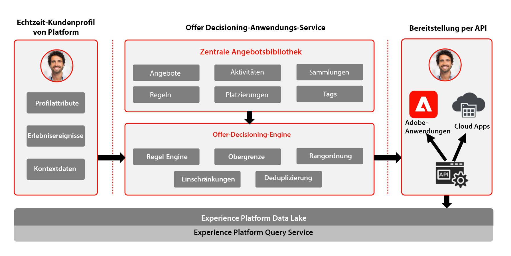

# Journey Optimizer - Übersicht über Offer decisioning

Weitere Informationen zur Entscheidungsverwaltung finden Sie in der Produktdokumentation [HIER](https://experienceleague.adobe.com/docs/journey-optimizer/using/offer-decisioniong/get-started-decision/starting-offer-decisioning.html)

Adobe Decisioning Management ist ein Dienst, der im Rahmen von Adobe Journey Optimizer bereitgestellt wird. In diesem Blueprint werden die Anwendungsfälle und technischen Funktionen der Anwendung erläutert und ein tiefer Einblick in die verschiedenen architektonischen Komponenten und Überlegungen, aus denen Offer decisioning besteht, geboten.

Journey Optimizer wird verwendet, um Ihren Kunden zur richtigen Zeit über alle Touchpoints hinweg das beste Angebot und Erlebnis bereitzustellen. offer decisioning erleichtert die Personalisierung mit einer zentralen Bibliothek von Marketing-Angeboten und einer Entscheidungs-Engine, die Regeln und Einschränkungen auf von Adobe Experience Platform erstellte umfangreiche Echtzeitprofile anwendet, damit Sie Ihren Kunden zum richtigen Zeitpunkt das richtige Angebot unterbreiten können.

Die Entscheidungsverwaltungsfunktion besteht aus zwei Hauptkomponenten:

* Die zentrale Angebotsbibliothek , auf der Sie die verschiedenen Elemente erstellen und verwalten können, aus denen Ihre Angebote bestehen, und deren Regeln und Begrenzungen definieren.
* Die Offer Decisioning-Engine nutzt Adobe Experience Platform-Daten und Echtzeit-Kundenprofile zusammen mit der Angebotsbibliothek, um die richtigen Zeitpunkte, Kunden und Kanäle für die Bereitstellung von Angeboten auszuwählen.

Die Entscheidungsverwaltung kann auf zwei Arten bereitgestellt werden.

## Entscheidungsverwaltung am Hub

Die erste erfolgt über den Adobe Experience Platform-Hub, eine zentrale Rechenzentrumsarchitektur. Im &quot;Hub&quot;-Ansatz werden Angebote in einer Latenz von mehr als 500 ms ausgeführt, personalisiert und bereitgestellt. Die Hub-Architektur eignet sich daher am besten für Kundenerlebnisse, die keine Latenz unterhalb der Sekunde erfordern. Beispiele sind Angebotsentscheidungen, die für Kiosks oder durch Agenten unterstützte Erlebnisse wie in Callcentern oder in persönlichen Interaktionen bereitgestellt werden. Angebote, die in E-Mails, SMS-Nachrichten, Push-Benachrichtigungen und andere ausgehende Kampagnen eingefügt werden, basieren ebenfalls auf dem Hub-Ansatz. Weitere Informationen zur Entscheidungsverwaltung auf dem Hub finden Sie im Abschnitt [Entscheidungsverwaltung am Hub](https://experienceleague.adobe.com/docs/blueprints-learn/architecture/customer-journeys/journey-optimizer/offer-decisioning/offers-hub.html?lang=en) Blueprint.

### Anwendungsfälle für die Entscheidungsverwaltung auf dem Hub

* Personalisierte Angebote auf Kiosks und in Store-Erlebnissen
* Personalisierte Angebote über agentengestützte Erlebnisse wie Callcenter oder Verkaufsinteraktionen.
* Angebote in E-Mail, SMS oder anderen ausgehenden Interaktionen.
* Kanalübergreifende Journey-Ausführung - Bietet über Adobe Journey Optimizer Konsistenz über Web-, Mobile-, E-Mail- und andere Interaktionskanäle hinweg.

## Entscheidungsverwaltung am Rand

Der zweite Ansatz erfolgt über das Experience Edge Network, eine global verteilte, geografisch verteilte Infrastruktur, die schnelle Erlebnisse auf einer Untersekunde und einer Millisekunde bereitstellt. Das Endverbrauchererlebnis, das von der Edge-Infrastruktur ausgeführt wird, die dem geografischen Standort der Verbraucher am nächsten ist, um Latenzzeiten zu minimieren. Die Entscheidungsverwaltung in Edge dient der Bereitstellung von Echtzeit-Kundenerlebnissen wie Web- oder mobilen eingehenden Personalisierungsanfragen. Weitere Informationen zur Entscheidungsverwaltung an Edge finden Sie im Abschnitt [Entscheidungsverwaltung am Rand](https://experienceleague.adobe.com/docs/blueprints-learn/architecture/customer-journeys/journey-optimizer/offer-decisioning/offers-edge.html?lang=en) Blueprint.

### Anwendungsfälle für die Entscheidungsverwaltung am Rand

* Online-Personalisierung über eingehende Web- oder mobile Erlebnisse.
* Kanalübergreifende Journey-Ausführung - Bietet über Adobe Journey Optimizer Konsistenz über Web-, Mobile-, E-Mail- und andere Interaktionskanäle hinweg.

## Verwandte Dokumentation

* [Adobe Experience Platform](https://experienceleague.adobe.com/docs/experience-platform.html)
* [Adobe Journey Optimizer](https://experienceleague.adobe.com/docs/journey-optimizer.html)
* [Entscheidungsverwaltung in Adobe Journey Optimizer](https://experienceleague.adobe.com/docs/journey-optimizer/using/offer-decisioniong/get-started-decision/starting-offer-decisioning.html)
* [Adobe Journey Optimizer-Produktbeschreibung](https://helpx.adobe.com/de/legal/product-descriptions/adobe-journey-optimizer.html)
* [Adobe Offer decisioning Produktbeschreibung](https://helpx.adobe.com/legal/product-descriptions/offer-decisioning-app-service.html)