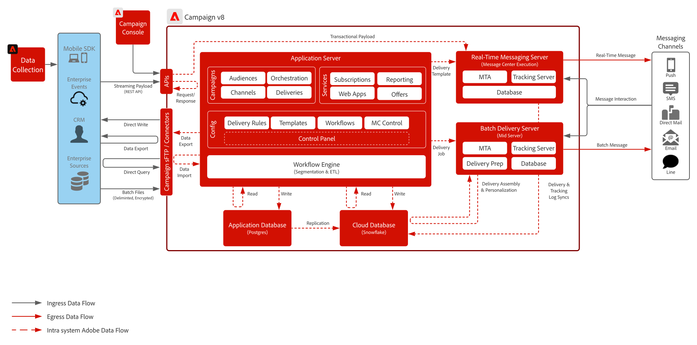

# Journey

Customer Journeys bietet Marken die Möglichkeit, über Kanäle wie E-Mail, SMS und Mobile-Nachrichten proaktiv mit Kunden zu interagieren und zu kommunizieren. Die Orchestrierungs-Tools können mit anderen Interaktionskanälen für Web- und Mobile-Personalisierung integriert werden (z. B. mit Inbound-Kanälen), indem der Zielgruppenstatus für die anderen kanalspezifischen Entscheidungs-Engines freigegeben wird. Bei der Auswahl der Programme und Implementierungslösungen für Customer Journeys sollten diverse Faktoren berücsichtigt werden, die sich jedoch in zwei unterschiedlichen Ansätzen zusammenfassen lassen: Reaktion auf einen interagierenden Kunden (ausgelöst) ODER Reaktion auf eine Gruppe interagierender Kunden (geplant).

Es gibt heute zwei Optionen für die Adobe, aus denen Kunden wählen können, wenn sie eine Kunden-Journey-Lösung wünschen:

<ul><li>Adobe Campaign Managed Cloud Services</li><li>Adobe Journey Optimizer</li></ul>

| Blueprint | Beschreibung | Architektur |
|---|---|---|
| **[Journey Optimizer](journey-optimizer.md)** | Nativ auf der Grundlage des Echtzeit-Kundenprofils der Experience Platformen aufgebaut, sodass Marketing-Teams in Echtzeit auf sich ändernde Kundenverhaltensweisen reagieren und sie dort treffen können, wo sie sich zu einem beliebigen Zeitpunkt in einem beliebigen Kanal befinden |  |
| **[Adobe Campaign v8](campaign-v8.md)** | Kampagnenwerkzeug der nächsten Generation, das für hochkomplexe Datenmanagement- und Kampagnenprozesse optimiert ist. Ermöglicht es Kunden, die Kommunikation von Erkundungs- und Marketingkampagnen zu kombinieren |  |
| **[Adobe Campaign v7](campaign-v7.md)** | Herkömmliches Kampagnenwerkzeug, das für massenbasierte Marketing-Kampagnen über verschiedene Kanäle wie E-Mail, SMS und Briefpost hinweg entwickelt wurde. Ermöglicht es Kunden, die verschiedenen Kundenkommunikationen an einem zentralen Ort zu koordinieren und zu verwalten |  |
