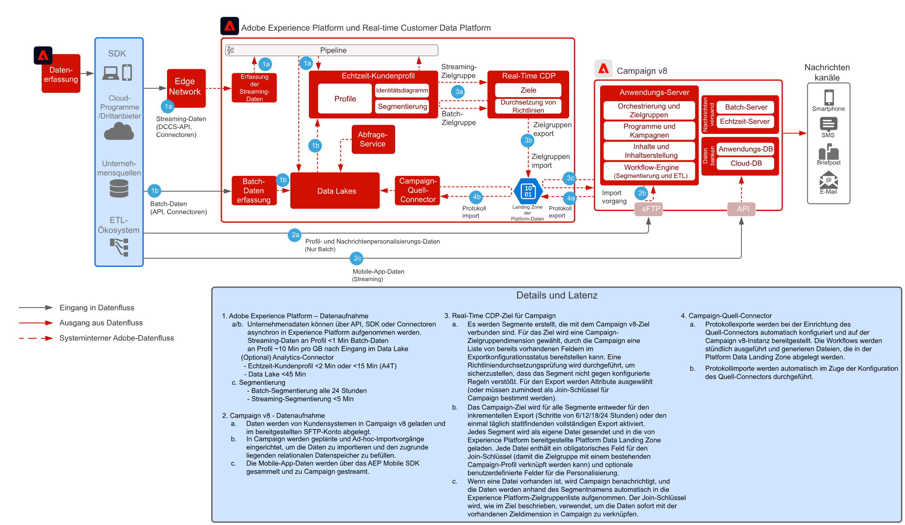

# Muster für die Integration von Real-Time CDP mit Adobe Campaign v8

Zeigt, wie Adobe Experience Platform und das Echtzeit-Kundenprofil sowie das zentralisierte Segmentierungs-Tool mit Adobe Campaign genutzt werden können, um personalisierte Konversationen bereitzustellen

 

## Programme

* Adobe Experience Platform Real-Time CDP
* Adobe Campaign v8

 

## Architektur

 

## Voraussetzungen

* Der Kunde muss über eine gültige IMS Org für Experience Cloud verfügen
* Es wird empfohlen, bei Verwendung einer einzigen Anmelde-URL Adobe Experience Platform und Campaign in derselben IMS-Organisation bereitzustellen
* Der Kunde muss über die v8-Instanz von Campaign verfügen
* Der Kunde muss über eine Berechtigung und den Zugriff auf die Quellen und Ziele von Real-Time Customer Data Platform verfügen.
* Adobe Campaign-Produktkontext muss vorhanden sein

 

## Implementierungsschritte

Weitere Informationen zum Konfigurieren des Quell-Connectors von Campaign v8 für Adobe Experience Platform und des Ziel-Connectors von Real-time Customer Data Platform für Campaign v8 finden Sie in der folgenden Dokumentation.
[Campaign- und AEP-Connectoren](https://experienceleague.adobe.com/docs/campaign/campaign-v8/connect/ac-aep.html?lang=de)

## Leitlinien

### Adobe Campaign

* Weitere Informationen finden Sie in der Dokumentation zum Quell-Connector von Campaign – [Campaign-Quell-Connector](https://experienceleague.adobe.com/docs/experience-platform/sources/ui-tutorials/create/adobe-applications/campaign.html?lang=de)
* Unterstützt nur die Bereitstellung einzelner Organisationseinheiten von Adobe Campaign

### Segmentfreigabe in Experience Platform Real-time Customer Data Platform

* Siehe den Ziel-Connector von Real-time Customer Data Platform für Campaign – [Verbindung von Real-time Customer Data Platform mit Campaign](https://experienceleague.adobe.com/docs/experience-platform/destinations/catalog/email-marketing/adobe-campaign-managed-services.html?lang=de)
* Begrenzung auf 50 Segmente empfohlen
* Beachten Sie, dass die Bestimmung der Segmentzugehörigkeit in AEP sowohl für Batch-Vorgänge (1 pro Tag) als auch für Streaming (~5 Minuten) verzögert ist und auf dem Segmentevaluierungs-Zeitplan basiert.
* Die Aktivierungslatenz beträgt mindestens 3 Stunden
* Nur Vereinigungsschema-Attribute sind für die Aktivierung verfügbar (keine Unterstützung von Array/Karten/Erlebnisereignisse)
* Begrenzung auf 20 Attribute pro Segment empfohlen
* Eine Datei pro Segment von allen Profilen mit „realisierter“ Segmentzugehörigkeit ODER, wenn Segmentzugehörigkeit als Attribut in der Datei hinzugefügt wird, sowohl „realisierte“ als auch „verlassene“ Profile
* Schrittweise und vollständige Segment-Exporte werden unterstützt
* Datei-Verschlüsselung wird nicht unterstützt
* Siehe Leitlinien für die Profil- und Datenaufnahme für AEP – [Link](https://experienceleague.adobe.com/docs/experience-platform/profile/guardrails.html?lang=de)
