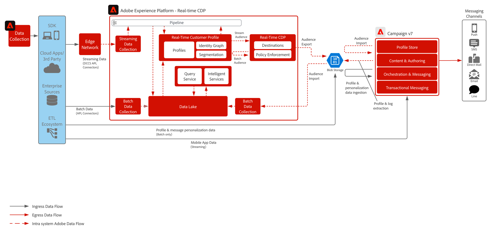

# Muster für die Integration von Real-Time CDP mit Adobe Campaign

Zeigt, wie Adobe Experience Platform und das Echtzeit-Kundenprofil sowie das zentralisierte Segmentierungs-Tool mit Adobe Campaign genutzt werden können, um personalisierte Konversationen bereitzustellen

 

## Programme

* Adobe Experience Platform Real-Time CDP
* Adobe Campaign v7 oder Campaign Standard

 

## Architektur

 

## Voraussetzungen

* Es wird empfohlen, Experience Platform und Campaign in derselben IMS-Organisation bereitzustellen und die Adobe Admin Console für den Benutzerzugriff zu verwenden. Dies stellt auch sicher, dass Kunden den Lösungsschalter innerhalb der Marketing-UI verwenden können

 

## Leitlinien

### Adobe Campaign

* Unterstützt nur die Bereitstellung einzelner Organisationseinheiten von Adobe Campaign
* Adobe Campaign ist die zentrale Datenquelle für alle aktiven Profile. Das heißt, die Profile müssen in Adobe Campaign vorhanden sein und neue Profile dürfen nicht basierend auf Experience Platform-Segmenten erstellt werden.
* Der Export von Workflows aus Campaign sollte höchstens alle vier Stunden erfolgen
* XDM-Schema und Datensätze für broadLog, trackingLogs und nicht zustellbare Adressen in Adobe Campaign sind nicht vorkonfiguriert und müssen entworfen und erstellt werden

### Segmentfreigabe in Experience Platform CDP

* Begrenzung auf 20 Segmente empfohlen
* Die Aktivierung ist auf einmal pro 24 Stunden begrenzt
* Nur Vereinigungsschema-Attribute sind für die Aktivierung verfügbar (keine Unterstützung von Array/Karten/Erlebnisereignisse)
* Begrenzung auf 20 Attribute pro Segment empfohlen
* Eine Datei pro Segment von allen Profilen mit „realisierter“ Segmentzugehörigkeit ODER, wenn Segmentzugehörigkeit als Attribut in der Datei hinzugefügt wird, sowohl „realisierte“ als auch „verlassene“ Profile
* Schrittweise und vollständige Segment-Exporte werden unterstützt
* Datei-Verschlüsselung wird nicht unterstützt

 

## Implementierungsschritte

### Adobe Experience Platform

#### Schema/Datensätze

1. [Konfigurieren Sie das individuelle Profil, das Erlebnisereignis und Schemas mit mehreren Einheiten](https://experienceleague.adobe.com/?recommended=ExperiencePlatform-D-1-2021.1.xdm&amp;lang=de) in Experience Platform basierend auf den von der Kundin oder dem Kunden angegebenen Daten.
1. Erstellen Sie Adobe Campaign-Schemas für broadLog, trackingLog, nicht zustellbare Adressen und Profileinstellungen (optional).
1. [Erstellen Sie Datensätze](https://experienceleague.adobe.com/docs/platform-learn/tutorials/data-ingestion/create-datasets-and-ingest-data.html?lang=de) in Experience Platform für die aufzunehmenden Daten.
1. [Fügen Sie dem Datensatz in Experience Platform Datennutzungskennzeichnungen hinzu](https://experienceleague.adobe.com/docs/platform-learn/tutorials/data-governance/classify-data-using-governance-labels.html?lang=de), um ordnungsgemäße Governance zu gewährleisten.
1. [Erstellen Sie Richtlinien](https://experienceleague.adobe.com/docs/platform-learn/tutorials/data-governance/create-data-usage-policies.html?lang=de), um die Governance an den Zielen umzusetzen.

#### Profil/Identität

1. [Erstellen Sie sämtliche kundenspezifischen Namespaces](https://experienceleague.adobe.com/docs/platform-learn/tutorials/identities/label-ingest-and-verify-identity-data.html?lang=de).
1. [Fügen Sie Identitäten zu Schemas hinzu](https://experienceleague.adobe.com/docs/platform-learn/tutorials/identities/label-ingest-and-verify-identity-data.html?lang=de).
1. [Aktivieren Sie die Schemas und Datensätze für Profile](https://experienceleague.adobe.com/docs/platform-learn/tutorials/profiles/bring-data-into-the-real-time-customer-profile.html?lang=de).
1. [Richten Sie Zusammenführungsrichtlinien](https://experienceleague.adobe.com/docs/platform-learn/tutorials/profiles/create-merge-policies.html?lang=de) für unterschiedliche Ansichten des [!UICONTROL Echtzeit-Kundenprofils] ein (optional).
1. Erstellen Sie Segmente für die Verwendung mit Adobe Campaign.

#### Quellen/Ziele

1. [Quellen und Ziele von Experience Platform und Campaign Standard](https://experienceleague.adobe.com/docs/campaign-standard/using/integrating-with-adobe-cloud/adobe-experience-platform/aep-sources-destinations/get-started-sources-destinations.html?lang=de)
1. [Quellen und Ziele von Experience Platform und Campaign v7](https://experienceleague.adobe.com/docs/campaign-classic/using/integrating-with-adobe-experience-cloud/aep-sources-destinations/get-started-sources-destinations.html?lang=de)
1. [Nehmen Sie Daten mit Streaming-APIs und Quell-Connectoren in Experience Platform auf.](https://experienceleague.adobe.com/?recommended=ExperiencePlatform-D-1-2020.1.dataingestion&amp;lang=de)
1. Konfigurieren Sie das [!DNL Azure]-Blob-Speicherziel für die Verwendung mit Adobe Campaign.

#### Adobe Campaign

1. Konfigurieren Sie Schemas für das Profil, Suchdaten und relevante Personalisierungsdaten für die Bereitstellung.

>[!IMPORTANT]
>
>Hierfür müssen Sie mit dem Datenmodell in Experience Platform für Profil- und Ereignisdaten vertraut sein, damit Sie wissen, welche Daten in Adobe Campaign erforderlich sind.

#### Workflows für den Import

1. Laden und erfassen Sie vereinfachte Profildaten auf dem Adobe Campaign-sFTP.
1. Laden und erfassen Sie Personalisierungsdaten für Orchestrierung und Messaging auf dem Adobe Campaign-sFTP.
1. Nehmen Sie Experience Platform-Segmenten aus dem [!DNL Azure]-Blob über Workflows auf.

#### Workflows für den Export

1. Senden Sie Adobe Campaign-Protokolle alle vier Stunden über Workflows an Experience Platform (broadLog, trackingLog, nicht zustellbare Adressen).
1. Senden Sie Profileinstellungen über Consulting-Workflows alle vier Stunden an Experience Platform (optional).

### Mobilgeräte-Push-Konfiguration

* Zwei unterstützte Ansätze für die Integration mit Mobilgeräten für Push-Benachrichtigungen:
   * Experience Platform Mobile SDK
   * Campaign Mobile SDK
* Vorgehensweise für Experience Platform Mobile SDK:
   * Nutzung von Adobe Tags und der Campaign Classic-Erweiterung zum Einrichten der Integration mit dem Experience Platform Mobile SDK
   * Erfahrung im Umgang mit Adobe Tags und Datenerfassung nötig
   * Erfahrung bei der Mobile-Entwicklung mit Push-Benachrichtigungen sowohl für Android als auch iOS erforderlich zur Implementierung des SDK, Integration mit FCM (Android) und APNS (iOS), um Push-Token zu erhalten, Konfiguration der Mobile App zum Erhalt von und Umgang mit Push-Benachrichtigungen
* Campaign Mobile SDK
   * Nähere Informationen finden Sie in der [Dokumentation zu Campaign SDK] (Campaign Mobile SDK
Nähere Informationen finden Sie in der Implementierungsdokumentation hier)

   >[!IMPORTANT]
   >Wenn Sie das Campaign SDK implementieren und mit anderen Experience Cloud-Programmen arbeiten, muss zur Datenerfassung das Experience Platform Mobile SDK verwendet werden. Dadurch werden duplizierte Client-seitige Aufrufe auf dem Gerät erstellt.

## Verwandte Dokumentation

* [Dokumentation zu Adobe Experience Platform](https://experienceleague.adobe.com/docs/experience-platform.html?lang=de)
* [Dokumentation zu Campaign Classic](https://experienceleague.adobe.com/docs/campaign-classic.html?lang=de)
* [Dokumentation zu Campaign Standard](https://experienceleague.adobe.com/docs/campaign-standard.html?lang=de)
* [Dokumentation zu Experience Platform Launch](https://experienceleague.adobe.com/docs/launch.html?lang=de)
* [Dokumentation zu Experience Platform Mobile SDK](https://experienceleague.adobe.com/docs/mobile.html?lang=de)
