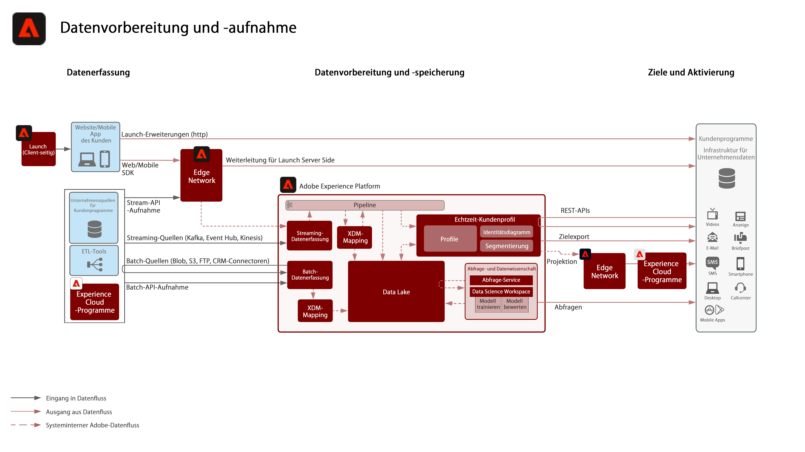
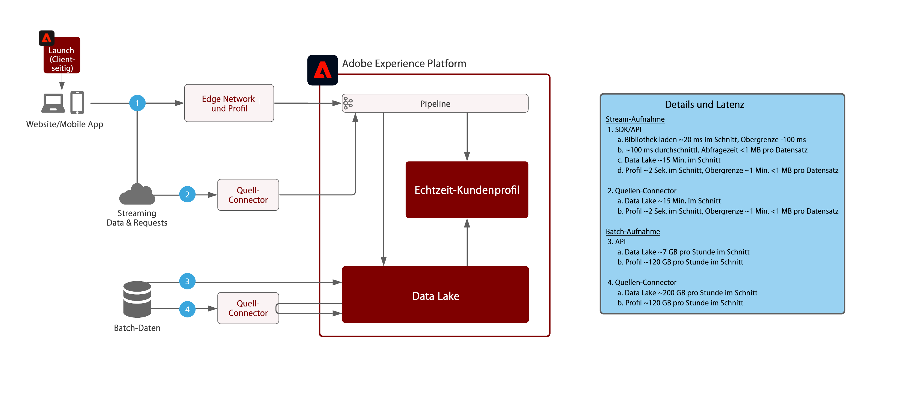

# Blueprint: Datenvorbereitung und -aufnahme

In der Blueprint „Datenvorbereitung und -aufnahme“ werden die Methoden erläutert, mit denen Daten in Adobe Experience Platform aufgenommen und vorbereitet werden können.

Die Datenvorbereitung umfasst die Zuordnung der Quelldaten zum Experience Data Model-Schema (XDM). Sie umfasst auch die Durchführung von Datentransformationen, einschließlich Datenformatierung, Feldaufteilung/-verknüpfung/-umwandlung und die Zusammenführung von Datensätzen sowie die Vergabe neuer Schlüssel. Die Datenvorbereitung hilft bei der Vereinheitlichung von Kundendaten für gesammelte/gefilterte Analysen, einschließlich Berichten oder der Vorbereitung von Daten für die Erstellung von Kundenprofilen, Datenwissenschaft und Aktivierung.

## Architektur

## Leitlinien für die Datenaufnahme

Das folgende Diagramm zeigt die durchschnittlichen Performance-Bereiche sowie die Latenz bei der Datenaufnahme in Adobe Experience Platform.

## Methoden der Datenaufnahme

| Aufnahmemethoden | Beschreibung |
|------------------------------|-----------------------------------------------------------------------------------------------------------------------------------------------------------------------------------------------------------------------------------------------------------------------------------------------------------------------------------------------------------------------------------------------------------------------------------------|
| Web/Mobile SDK | Latenz:<ul><li>Echtzeit - Datensammlung auf derselben Seite für Edge Network</li><li>Streaming-Aufnahme in Profil ~1 Minute</li><li>Streaming-Aufnahme in Data Lake (Mikro-Batch ~15 Minuten)</ul>Dokumentation: <ul><li>[Web SDK](https://experienceleague.adobe.com/docs/web-sdk.html?lang=de)</li><li>[Mobile SDK](https://experienceleague.adobe.com/docs/mobile.html?lang=de)</li></ul> |
| Streaming-Quellen | Latenz:<ul><li>Echtzeit - Datensammlung auf derselben Seite für Edge Network</li><li>Streaming-Aufnahme in Profil ~1 Minute</li><li>Streaming-Aufnahme in Data Lake (Mikro-Batch ~15 Minuten)</li></ul>[Dokumentation](https://experienceleague.adobe.com/docs/experience-platform/sources/home.html?lang=de#connectors) |
| Streaming-API | Latenz:<ul><li>Echtzeit - Datensammlung auf derselben Seite für Edge Network</li><li>Streaming-Aufnahme in Profil ~1 Minute</li><li>Streaming-Aufnahme in Data Lake (Mikro-Batch ~15 Minuten)</li><li>7 GB/Stunde</li></ul>[Dokumentation](https://experienceleague.adobe.com/docs/experience-platform/ingestion/streaming/overview.html?lang=de#what-can-you-do-with-streaming-ingestion%3F) |
| ETL-Tools | Verwenden von ETL-Tools für die Anpassung und Transformation von Unternehmensdaten vor der Aufnahme in Experience Platform.  Latenz:<ul><li>Zeitrahmen abhängig vom externen Zeitplan des ETL-Tools, dann gelten Standardleitlinien für die Aufnahme basierend auf der Aufnahmemethode.</li></ul> |
| Batch-Quellen | Geplanter Abruf aus Quellen Latenz: ~ 200 GB/Stunde  [Dokumentation](https://experienceleague.adobe.com/docs/experience-platform/sources/home.html?lang=de#connectors) [Video-Tutorials](https://experienceleague.adobe.com/docs/platform-learn/tutorials/sources/overview.html?lang=de) |
| Batch-API | Latenz:<ul><li>Batch-Aufnahme in Profil abhängig von Größe und Traffic-Volumen ~45 Minuten</li><li>Batch-Aufnahme in Data Lake abhängig von Größe und Traffic-Volumen</li></ul>[Dokumentation](https://experienceleague.adobe.com/docs/experience-platform/ingestion/batch/overview.html?lang=de#batch) |
| Adobe-Programm-Connectoren | Automatische Aufnahme von Daten, die aus Adobe Experience Cloud-Programmen stammen<ul><li>Adobe Analytics: [Dokumentation](https://experienceleague.adobe.com/docs/experience-platform/sources/connectors/adobe-applications/analytics.html?lang=de#connectors) und [Video-Tutorial](https://experienceleague.adobe.com/docs/platform-learn/tutorials/sources/ingest-data-from-adobe-analytics.html?lang=de)</li><li>Audience Manager: [Dokumentation](https://experienceleague.adobe.com/docs/experience-platform/sources/connectors/adobe-applications/audience-manager.html?lang=de#connectors) und [Video-Tutorial](https://experienceleague.adobe.com/docs/platform-learn/tutorials/sources/ingest-data-from-aam.html?lang=de)</li></ul> |

## Methoden der Datenvorbereitung

| Methoden der Datenvorbereitung | Beschreibung |
|------------------------------------------------------------|------------------------------------------------------------------------------------------------------------------------------------------------------------------------------------------------------------------------------------------------------------------------------------------------|
| [!UICONTROL Data Science Workspace] – Datenvorbereitung | Modellgestützte Transformation, skriptbasierte Transformation. [Dokumentation](https://experienceleague.adobe.com/docs/experience-platform/data-science-workspace/home.html?lang=de) |
| Externes ETL-Tool ([!DNL Snaplogic], [!DNL Mulesoft], [!DNL Informatica] usw.) | Durchführung komplexer Transformationen in den ETL-Tools und Verwendung von Standard-Experience Platform-[!UICONTROL Fluss-Service]-APIs oder Quell-Connectoren, um die resultierenden Daten aufzunehmen. |
| [!UICONTROL Abfrage-Service] – Datenvorbereitung | Verbinden, Teilen, Zusammenführen, Transformieren, Abfragen und Filtern von Daten und Erstellung eines neuen Datensatzes. Verwendung von „Create Table as Select“ (CTAS) [-Dokumentation](https://experienceleague.adobe.com/docs/experience-platform/query/home.html?lang=de#sql) |
| XDM-Mapper- und Datenvorbereitungsfunktionen (Streaming und Batch) | Zuordnung von Quellattributen im CSV- oder JSON-Format während der Experience Platform-Aufnahme zu XDM-Attributen. Berechnung von Funktionen bei der Aufnahme von Daten, d. h. Datenformatierung, Teilung, Verknüpfung usw. [Dokumentation](https://experienceleague.adobe.com/docs/experience-platform/data-prep/home.html?lang=de) |

## Verwandte Blog-Posts

* [[!DNL Leveraging External Data Platforms in Adobe Experience Platform Journey Orchestration]](https://medium.com/adobetech/leveraging-external-data-platforms-in-adobe-experience-platform-journey-orchestration-54fc6134fe17?source=your_stories_page-------------------------------------)
* [[!DNL High Throughput Ingestion with Iceberg]](https://medium.com/adobetech/high-throughput-ingestion-with-iceberg-ccf7877a413f?source=your_stories_page-------------------------------------)
* [[!DNL Query Service Tricks in Adobe Experience Platform (Writing Queries and Storing Derived Datasets)]](https://medium.com/adobetech/query-service-tricks-in-adobe-experience-platform-writing-queries-and-storing-derived-datasets-eaee0d6d683e?source=your_stories_page-------------------------------------)
* [[!DNL Digging into Adobe Experience Platform’s Experience Data Model to More Fully Understand the Power of Real-time Customer Profile]](https://medium.com/adobetech/digging-into-adobe-experience-platforms-experience-data-model-to-more-fully-understand-the-power-3e109271e04f?source=your_stories_page-------------------------------------)
* [[!DNL An Introductory Look at Exploratory Data Analysis on Adobe Experience Platform]](https://medium.com/adobetech/an-introductory-look-at-exploratory-data-analysis-on-adobe-experience-platform-1bfce7501d9a?source=your_stories_page-------------------------------------)
* [[!DNL Modeling XDM Data for Data Science at Scale on Adobe Experience Platform]](https://medium.com/adobetech/modeling-xdm-data-for-data-science-at-scale-on-adobe-experience-platform-222bb2a6dbf7?source=your_stories_page-------------------------------------)
