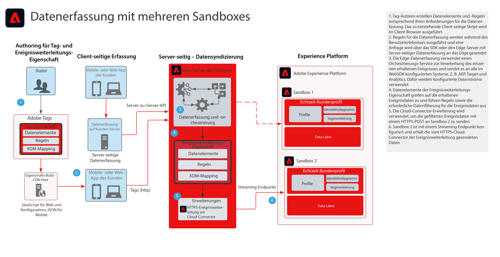

# Entwurf der Datenerfassung für die Ereignisweiterleitung für mehrere Sandboxes

Die Blueprint „Datenerfassung bei Ereignisweiterleitung für mehrere Sandboxes“ zeigt, wie mit den Adobe Experience Platform Web- und Mobile-SDKs erfasste Daten so konfiguriert werden können, dass sie ein einzelnes Ereignis erfassen und an mehrere AEP-Sandboxes weiterleiten. Diese Blueprint ist ein spezielles Anwendungsbeispiel, das die Ereignisweiterleitungsfunktion von Adobe Tags verwendet.

Zusätzlich zur Replikation des Ereignisses können Sie mithilfe der Ereignisweiterleitungsfunktionen die ursprünglich erfassten Daten ergänzen, filtern oder bearbeiten, die Anforderungen für andere Sandboxes erfüllen. Beispielsweise muss Sandbox A alle Ereignisdatenelemente empfangen und Sandbox B soll nur Nicht-PII-Daten empfangen.

Die Ereignisweiterleitung verwendet eine separate Tag-Eigenschaft, die die für Ihre Datenanforderungen erforderlichen Datenelemente, Regeln und Erweiterungen enthält. Bei einem eingehenden Ereignis kann Ihre Ereignisweiterleitungs-Eigenschaft die Daten erfassen und bei Bedarf vor der Weiterleitung verwalten.

Ihre Ziel-Sandbox benötigt einen konfigurierten HTTP-Streaming-Endpunkt, der von der HTTPS-Erweiterung für die Ereignisweiterleitung verwendet wird.

## Anwendungsbeispiele

* Globales Daten-Reporting: Bei der Verwendung mehrerer Sandboxes zum Isolieren von Betriebsumgebungen und der Notwendigkeit, die Datenerfassung in einer Sandbox zu konsolidieren, um das Sandbox-übergreifende Reporting zu vereinfachen. Mit der Ereignisweiterleitung an eine Reporting-Sandbox kann jede Sandbox-Betriebsumgebung in Echtzeit erfasste Daten an eine Reporting-Sandbox senden
* Verwalten Sie die Datenerfassung Sandbox-übergreifend basierend auf unterschiedlichen Datenregeln für die einzelnen Sandbox-Betriebsumgebungen. Betriebsumgebungen, bei denen sensible Daten gefiltert werden müssen, z. B. im Gesundheitswesen und Finanzsektor

## Programme

* Adobe Experience Platform – Datenerfassung

## Architektur

1. Tag-Autoren definieren sowohl eine Tag-Eigenschaft als auch eine Ereignisweiterleitungseigenschaft. Hier definieren Autoren die Datenelemente, Regeln und Aktionen, die die Datenerfassung verwalten. Beachten Sie, dass Tag-Eigenschaftscode auf dem Client ausgeführt und von einem CDN-Host verteilt wird. Der Eigenschafts-Code der Ereignisweiterleitung wird auf dem Adobe Edge-Server ausgeführt.

1. Auf dem Client erfasste Daten werden an das Edge-Netzwerk gesendet. Kunden haben auch die Möglichkeit, Daten zunächst zur Server-seitigen Erfassung an ihren eigenen Server zu senden.  Das Web SDK kann eine Server-zu-Server-Erfassungsfunktion bereitstellen. Dies erfordert jedoch ein anderes Programmiermodell zur Implementierung. Weitere Informationen finden Sie in der Dokumentation **Edge Network Server-API – Übersicht** unten

1. Platform Edge Network empfängt Datenerfassungs-Payloads und koordiniert den Datenfluss zu den erforderlichen Systemen wie Target und Analytics.

1. Datenelemente der Ereignisweiterleitungs-Eigenschaft werden verwendet, um auf Ereignisdaten zuzugreifen, die in die Payload eingehen. Regeln können auch verwendet werden, um die Ereignisdaten vor der Weiterleitung nach Bedarf anzupassen. Beispielsweise können die Daten in das für die Streaming-Datenaufnahme erforderliche XDM formatiert werden

1. Die Ereignisweiterleitung bietet die HTTPS-Erweiterung, die die Möglichkeit bietet, Ihre Ereignisdaten an einen HTTPS-Endpunkt weiterzuleiten.

1. Sandbox 2 wird mit einem Streaming-Endpunkt konfiguriert, der das weitergeleitete Ereignis erhält.

## Verwandte Dokumentation

* [Dokumentation zur Ereignisweiterleitung](https://experienceleague.adobe.com/docs/experience-platform/tags/event-forwarding/overview.html?lang=de)
* [Videos zur Ereignisweiterleitung](https://experienceleague.adobe.com/docs/launch-learn/tutorials/server-side/overview.html?lang=de)
* [Lektion zur Ereignisweiterleitung](https://experienceleague.adobe.com/docs/platform-learn/implement-web-sdk/event-forwarding/setup-event-forwarding.html?lang=de) des Web SDK-Tutorials
* [Übersicht über das Experience Platform Web SDK](https://experienceleague.adobe.com/docs/experience-platform/edge/home.html?lang=de)
* [Edge Network Server-API – Übersicht](https://experienceleague.adobe.com/docs/experience-platform/edge-network-server-api/overview.html?lang=de)

## Verwandte Blogbeiträge

* [[!DNL Boosting Website Performance with Adobe Experience Platform Web SDK and Edge Network]](https://medium.com/adobetech/boosting-website-performance-with-adobe-experience-platform-web-sdk-and-edge-network-329fcf70fdf9)
* [[!DNL Solving Implementation Pain Points with Adobe Experience Platform Web SDK and Edge Network]](https://medium.com/adobetech/solving-implementation-pain-points-with-adobe-experience-platform-web-sdk-and-edge-network-880b635e6819)
* [[!DNL Adobe Experience Platform Web SDK for Audience Management]](https://medium.com/adobetech/adobe-experience-platform-web-sdk-for-audience-management-751fa6d063bc)
* [[!DNL Adobe Experience Platform Web SDK — Adobe Target]](https://medium.com/adobetech/adobe-experience-platform-web-sdk-adobe-target-9b9f621d271)
* [[!DNL Adobe Experience Platform Web SDK Migration Scenarios for Adobe Analytics]](https://medium.com/adobetech/adobe-experience-platform-web-sdk-migration-scenarios-for-adobe-analytics-91c255ec82b0)
* [[!DNL Unify Your Adobe Experience Platform Services with Adobe Experience Platform Web SDK]](https://medium.com/adobetech/unify-your-adobe-experience-platform-services-with-adobe-experience-platform-web-sdk-75cf6851a9fc)
* [[!DNL Accelerate Your Mobile Application Development with Adobe Experience Platform Mobile SDK and Launch]](https://medium.com/adobetech/accelerate-your-mobile-application-development-with-adobe-experience-platform-mobile-sdk-and-launch-ed023536d611)
* [[!DNL Simplifying Customer Workflows with Adobe Experience Platform Web SDK]](https://medium.com/adobetech/simplifying-customer-workflows-with-adobe-experience-platform-web-sdk-4e54fe134f4a)
