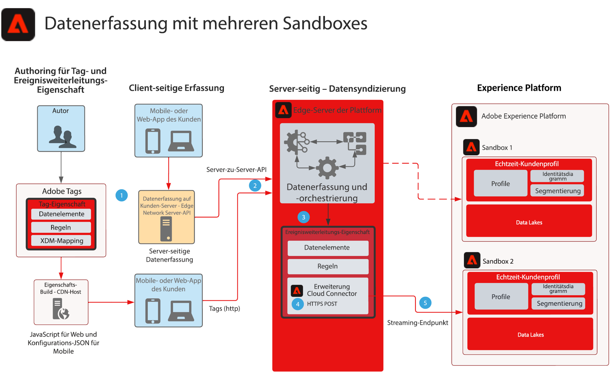

# Blueprint: Datenerfassung bei Ereignisweiterleitung für mehrere Sandboxes

Dieser Blueprint zeigt, wie mit Experience Platform Web- und Mobile-SDKs erfasste Daten so konfiguriert werden können, dass sie ein einzelnes Ereignis erfassen und an mehrere AEP-Sandboxes weiterleiten. Dieser Blueprint ist ein spezifisches Anwendungsbeispiel für die Multi-Sandbox-Datenerfassung, bei dem dieses Ziel mithilfe der Ereignisweiterleitung erreicht wird.

Zusätzlich zur Replikation des Ereignisses mit Funktionen zur Ereignisweiterleitung können Sie die ursprünglich erfassten Daten, die Anforderungen für andere Sandboxes erfüllen, hinzufügen, filtern oder bearbeiten.

Die Ereignisweiterleitung verwendet eine separate Eigenschaft, die die für Ihre Datenanforderungen erforderlichen Datenelemente, Regeln und Erweiterungen enthält. Bei einem eingehenden Ereignis kann Ihre Ereignisweiterleitungs-Eigenschaft die Daten erfassen und nach Bedarf vor der Weiterleitung verwalten.

Ihre Ziel-Sandbox erfordert einen konfigurierten HTTP-Streaming-Endpunkt, der von der Adobe Cloud Connector-Erweiterung verwendet wird.

## Anwendungsfälle

* Globales Daten-Reporting: Bei der Verwendung mehrerer Sandboxes zum Isolieren von Betriebsumgebungen und der Notwendigkeit, die Datenerfassung in einer Sandbox zu konsolidieren, um das Sandbox-übergreifende Reporting zu vereinfachen. Durch die Weiterleitung eines Experience Edge-Ereignisses durch die Ereignisweiterleitung an eine Reporting-Sandbox kann jede Sandbox-Betriebsumgebung Daten senden, da diese in Echtzeit an eine Reporting-Sandbox erfasst werden.
* Verwalten Sie die Datenerfassung Sandbox-übergreifend basierend auf unterschiedlichen Datenregeln für die einzelnen Sandbox-Betriebsumgebungen.

## Programme

* Adobe Experience Platform – Datenerfassung
* Ereignisweiterleitung
* AEP-Erweiterung
* Cloud Connector-Erweiterung

## Allgemeine Überlegungen

Bei der Ereignisweiterleitung als Ansatz zum Senden von Daten an mehrere Sandboxes müssen Überlegungen in Ihrer Lösungsarchitektur berücksichtigt werden.

### Keine HIPAA-Daten

Die Ereignisweiterleitung gilt nicht als HIPAA-bereit und sollte nicht in HIPAA-Anwendungsfällen verwendet werden, in denen HIPAA-Daten erfasst werden. Die für die Ereignisweiterleitung verwendete Infrastruktur wird jedoch als HIPAA-bereit betrachtet und liegt ausschließlich im Ermessen des Kunden. Während sich Ihre Tag-Eigenschaft für die Ereignisweiterleitung im System für die Ereignisweiterleitung befindet, wird die gesamte erfasste Daten-Payload zur Verarbeitung an das Ereignisweiterleitungssystem gesendet. Dieser Prozess macht die Ereignisweiterleitung für HIPAA-Anwendungsfälle erforderlich. Wenn die gesamte Payload an das Ereignisweiterleitungssystem gesendet wird, enthält dies alle HIPAA-Werte. Auch wenn die Regeln zur Ereignisweiterleitung diese Daten vor dem Senden an ihr Ziel filtern, werden diese HIPAA-Daten dennoch an eine Nicht-HIPAA-bereite Infrastruktur gesendet. Die Payload-Daten werden jedoch nie gespeichert und sind lediglich ein Durchlauf.

### Verschiedene Datenspeicher und Streaming-Endpunkte

Da Daten durch Datastreams vom Platform Edge Network fließen, besteht bei der Verwendung der Ereignisweiterleitung an eine andere AEP-Sandbox eine HARD-Anforderung darin, NIE denselben Datastream oder Streaming-Endpunkt zu verwenden wie der Datastream, der die ursprüngliche Sammlung erstellt. Dies kann sich nachteilig auf die AEP-Instanz auswirken und möglicherweise eine DoS-Situation auslösen.

### Geschätzte Traffic-Mengen

Traffic-Volumen sind für die Überprüfung mit jedem Anwendungsfall erforderlich. Dies ist wichtig, da hohe Volumina zu einer Drosselung führen können und Kunden benachrichtigt werden, wenn dies eintritt.

## Architektur

1. Zur Verwendung der Ereignisweiterleitung ist das Erfassen und Senden von Ereignisdaten an das Platform Edge Network erforderlich. Kunden können Adobe-Tags für die Client-seitige Datenerfassung oder die Platform Edge Network Server-API für die Server-zu-Server-Datenerfassung verwenden. Die Platform Edge Network-API kann eine Server-zu-Server-Erfassungsfunktion bereitstellen. Dies erfordert jedoch ein anderes Programmiermodell zur Implementierung. Siehe [Übersicht über die Edge Network Server-API](https://experienceleague.adobe.com/docs/experience-platform/edge-network-server-api/overview.html?lang=en)

1. Die erfassten Payloads werden von der Tag-Implementierung an das Platform Edge-Netzwerk an den Ereignisweiterleitungsdienst gesendet und von eigenen Datenelementen, Regeln und Aktionen verarbeitet. Weitere Informationen zu den Unterschieden [Tags und Ereignisweiterleitung](https://experienceleague.adobe.com/docs/experience-platform/tags/event-forwarding/overview.html?lang=en#differences-from-tags).

1. Eine Ereignisweiterleitungs-Eigenschaft ist auch erforderlich, um erfasste Ereignisdaten vom Platform Edge Network zu empfangen. Ob diese Ereignisdaten durch eine bereitgestellte Tag-Implementierung oder eine Server-zu-Server-Sammlung an das Platform Edge Network gesendet wurden. Autoren definieren die Datenelemente, Regeln und Aktionen, die zur Anreicherung der Ereignisdaten vor der Weiterleitung an die zweite Sandbox verwendet werden. Erwägen Sie die Verwendung des JavaScript-Datenelements &quot;Benutzerspezifischer Code&quot;, um Ihre Daten für die Sandbox-Erfassung zu strukturieren. In Kombination mit den Datenvorbereitung-Funktionen von AEP haben Sie mehrere Möglichkeiten, Ihre Datenstruktur zu verwalten.

1. Derzeit ist die Verwendung der Adobe Cloud Connector-Erweiterung in der Ereignisweiterleitungseigenschaft erforderlich. Sobald die Regeln die Ereignisdaten verarbeiten oder anreichern, wird der Cloud Connector in einem Abruf verwendet, der für eine POST konfiguriert ist, die die Payload an die zweite Sandbox sendet

1. Für die zweite Sandbox ist ein Streaming-Endpunkt für die Datenerfassung erforderlich. Sie können auch die Datenvorbereitungsfunktionen in AEP berücksichtigen, um die Erfassung und Zuordnung von Payloads für die Ereignisweiterleitung zu XDM zu unterstützen. Weitere Informationen finden Sie in der AEP-Dokumentation Erstellen einer [HTTP-API-Streaming-Verbindung über die Benutzeroberfläche](https://experienceleague.adobe.com/docs/experience-platform/sources/ui-tutorials/create/streaming/http.html?lang=de)
