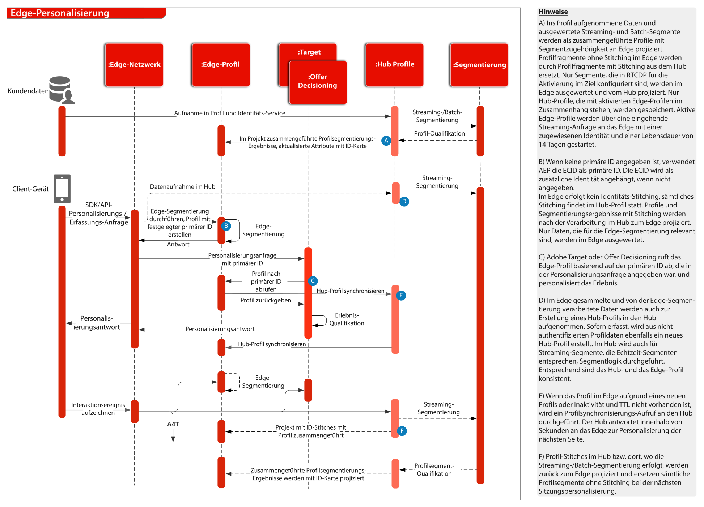

# Übersicht

Eine Übersicht und Details zum Web- und Mobile-SDK sowie zur Edge Network Server-API finden Sie im Folgenden.
* [WebSDK-Übersicht](https://experienceleague.adobe.com/docs/web-sdk.html?lang=de)
* [MobileSDK - Überblick](https://aep-sdks.gitbook.io/docs/)
* [Edge Network Server-API](https://experienceleague.adobe.com/docs/experience-platform/edge-network-server-api/overview.html)

Eine ausführliche Beschreibung der im WebSDK unterstützten Anwendungsfunktionen finden Sie in der folgenden Dokumentation.
* [Unterstützung der WebSDK-Anwendungsfunktionalität](https://github.com/orgs/adobe/projects/18/views/1)

Weitere Informationen zur Migration von anwendungsspezifischen SDKs zu Web- und Mobile-SDKs finden Sie in der folgenden Dokumentation.
* [Identitätsdienste](https://experienceleague.adobe.com/docs/experience-platform/edge/identity/overview.html)
* [Analytics](https://experienceleague.adobe.com/docs/experience-platform/edge/data-collection/adobe-analytics/analytics-overview.html)
* [Target](https://experienceleague.adobe.com/docs/experience-platform/edge/personalization/adobe-target/target-overview.html)
* [Analytics for Target](https://experienceleague.adobe.com/docs/experience-platform/edge/personalization/adobe-target/a4t/overview.html)

## Experience Platform Web/Mobile SDK oder Edge Network Server API-Bereitstellung

Das folgende Architekturdiagramm veranschaulicht die Bereitstellung und Datenerfassung mithilfe des Experience Platform Web SDK.

Sequenzdiagramm von Experience Edge, Experience Platform Services und Anwendungen

## Referenzdokumentation

* [Tutorial zur Implementierung von Adobe Experience Cloud mit Web SDK](https://experienceleague.adobe.com/docs/platform-learn/implement-web-sdk/overview.html?lang=de)
* [Tutorial zur Implementierung von Adobe Experience Cloud in Mobile Apps](https://experienceleague.adobe.com/docs/platform-learn/implement-mobile-sdk/overview.html?lang=de)