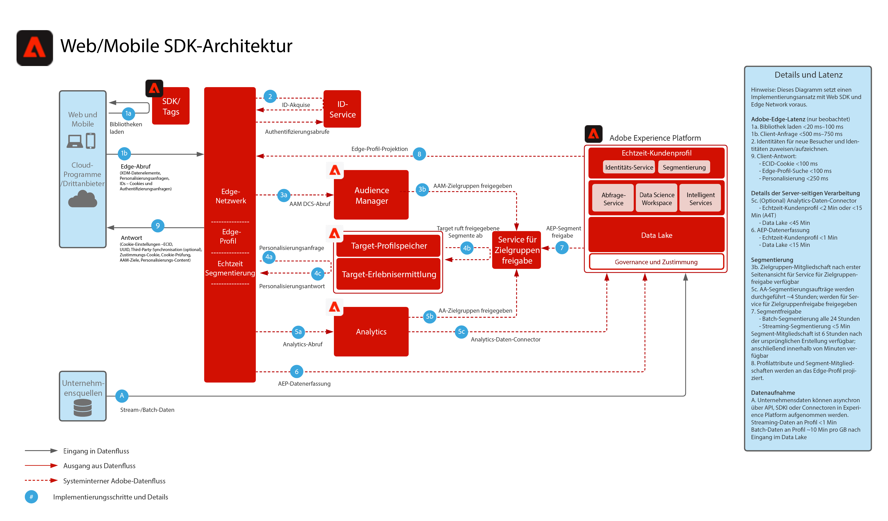

# Datenerfassung mit dem Experience Platform Web/Mobile SDK

Das folgende Architekturdiagramm veranschaulicht die Integrationspfade und die Datenerfassung mit dem Experience Platform Web SDK.

## Referenzdokumentation

* [Überblick über das Experience Platform Web/Mobile SDK](https://experienceleague.adobe.com/docs/experience-platform/edge/home.html?lang=de)
* [Tutorial zur Implementierung von Adobe Experience Cloud mit Web SDK](https://experienceleague.adobe.com/docs/blueprints-learn/architecture/data-ingestion/websdk.html?lang=de)
