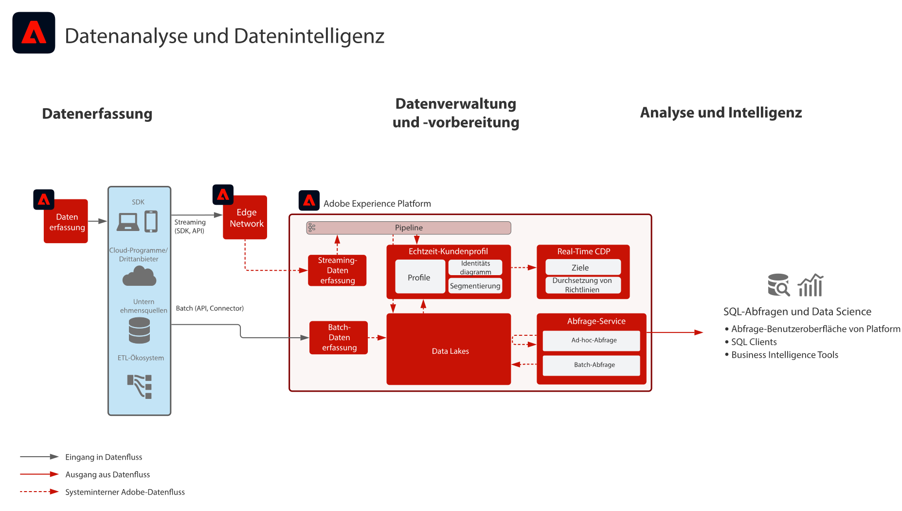

# Data Analyse and Intelligence Blueprint

Data Analyse and Intelligence umfasst die Fähigkeit innerhalb von Adobe Experience Platform, die Abfrage und Analyse der Daten, die im Datensee vorhanden sind, zu untersuchen.

Der [!UICONTROL Abfrage-Dienst] der Experience Platform ermöglicht die Ausführung von SQL-Abfragen an den Daten. [!UICONTROL Data Science ] Workspace ermöglicht die Datenerforschung, Datenwissenschaft und maschinelle Lernarbeit.

Darüber hinaus ermöglicht die Experience Platform Verbindungen mit SQL-Clients, Schnittstellen und Business Intelligence-Tools von Drittanbietern, eine direkte Verbindung zu den Daten innerhalb der Experience Platform herzustellen, auf diese zuzugreifen und sie mit dem Protokoll [!DNL PostgreSQL] Abfrage.

Bestimmte Garantien gelten für die Zeitüberschreitung der Abfrage und die Datenmenge, die im Ergebnis der Abfrage enthalten ist, wie in den Details des Entwurfs angegeben.

## Anwendungsfälle

* Interaktive Abfrage und Sammlung von Daten
* Zeilen- und Spaltenzugriff auf aufgenommene Daten zur Erkundung und Validierung
* Dashboarding und Visualisierung von Daten über Business-Intelligence-Tools

## Programme

* Adobe Experience Platform

## Architektur

## Leitlinien

* Zeitlimit von 10 Minuten für interaktive Abfragen
* Limit von 100 in der Benutzeroberfläche zurückgegebenen Datensätzen
* Limit von 50.000 über den SQL-Connector zurückgegebenen Datensätzen

## Implementierungsschritte

1. Konfigurieren Sie Datensätze und Schemas für die Datenaufnahme in den Data Lake.
1. Nehmen Sie Daten auf.
1. Vergewissern Sie sich, dass die Daten für [!UICONTROL Abfrage Service] und [!UICONTROL Data Science Workspace] für den Rohzugriff und die Abfrage verfügbar sind.
1. Verbinden Sie Business Intelligencen- und SQL-Clients mit dem [!UICONTROL Abfrage-Dienst], um Visualisierungen, Daten-Abfragen und Exploration durchzuführen.

## Verwandte Dokumentation

* [Produktbeschreibung zu Adobe Experience Platform Intelligence](https://helpx.adobe.com/de/legal/product-descriptions/adobe-experience-platform-intelligence---product-description.html)
* [Dokumentation zum Abfrage-Service](https://experienceleague.adobe.com/docs/experience-platform/query/home.html?lang=de)
