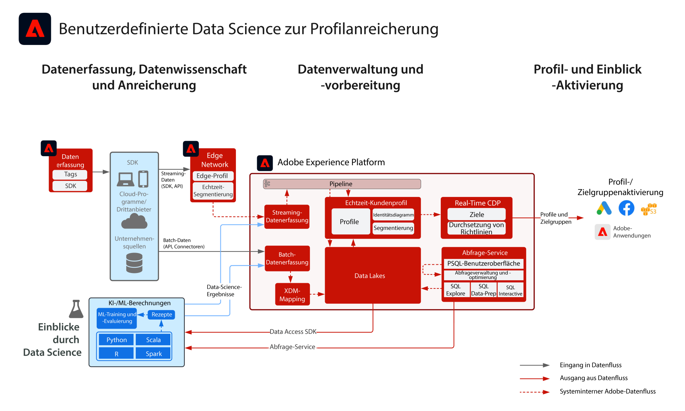

# Blueprint: Benutzerdefinierte Datenwissenschaft für Profilanreicherung

Custom Data Science for Profile Enrichment Blueprint veranschaulicht, wie Daten in Adobe Experience Platform verwendet werden können, um Modelle zu trainieren, bereitzustellen und zu bewerten, um Einblicke aus maschinellem Lernen in die Experience Platform und die Real-time Customer Data Platform aus Datenwissenschaft und maschinellen Lernwerkzeugen zu erhalten. Modellierte Einblicke können in Experience Platform integriert werden, um das Echtzeit-Kundenprofil anzureichern. Beispiele für ML-Erkenntnisse sind Lebenszeitwertbewertung, Produkt- und Kategorieaffinität, Konversions- oder Abwanderungsneigung.

## Anwendungsfälle

* Extrahieren Sie Einblicke und entdecken Sie Muster aus Kundendaten, trainieren und bewerten Sie Modelle aus diesen Daten.
* Anreichern des [!UICONTROL Echtzeit-Kundenprofils] mit modellgestützten Erkenntnissen und Attributen für detailliertere Personalisierung und Journey-Optimierung.
* Trainieren und Bewerten von Modellen, um Kundenerkenntnisse wie Kunden-Lebenszeitwert, Konversions- oder Abwanderungsneigung, Produkt- und Content-Affinität und Interaktionswerte zu ermitteln.

## Architektur

## Implementierungsschritte

1. [Erstellen Sie Schemas](https://experienceleague.adobe.com/?recommended=ExperiencePlatform-D-1-2021.1.xdm) für die zu erfassenden Daten.
1. [Erstellen Sie Datensätze](https://experienceleague.adobe.com/docs/platform-learn/tutorials/data-ingestion/create-datasets-and-ingest-data.html?lang=de) für die zu erfassenden Daten.
1. [Aufnehmen der Daten](https://experienceleague.adobe.com/?recommended=ExperiencePlatform-D-1-2020.1.dataingestion&amp;lang=de) in Experience Platform.

Damit Modellergebnisse in das Echtzeit-Kundenprofil aufgenommen werden, müssen Sie vor der Aufnahme von Daten Folgendes tun:

1. [Konfigurieren Sie die korrekten Identitäten und Identitäts-Namespaces](https://experienceleague.adobe.com/docs/platform-learn/tutorials/identities/label-ingest-and-verify-identity-data.html?lang=de) im Schema, um sicherzustellen, dass aufgenommene Daten zu einem einheitlichen Profil zusammengefügt werden können.
1. [Aktivieren Sie die Schemas und Datensätze für Profile](https://experienceleague.adobe.com/docs/platform-learn/tutorials/profiles/bring-data-into-the-real-time-customer-profile.html?lang=de).

## Überlegungen bei der Implementierung

* In den meisten Fällen sollte das Modellergebnis als Profilattribute und nicht als Erlebnisereignisse erfasst werden. Die Modellergebnisse können eine einfache Attributzeichenfolge sein. Wenn mehrere Modellergebnisse erfasst werden sollen, wird empfohlen, ein Feld vom Typ Array oder Zuordnung zu verwenden.
* Der tägliche Datensatz mit Momentaufnahmen von Profilen, der einen täglichen Export der einheitlichen Profilattributdaten darstellt, kann genutzt werden, um Modelle für Profilattributdaten zu trainieren. Die Dokumentation zu Profildatensätzen ist abrufbar. [here](https://experienceleague.adobe.com/docs/experience-platform/dashboards/query.html#profile-attribute-datasets).
* Für das Extrahieren von Daten aus Experience Platform können die folgenden Methoden verwendet werden:
   * Data Access SDK
      * Die Daten sind im Rohdatenformular
      * Profilerlebnis-Ereignisdaten bleiben im nicht einheitlichen Rohzustand.
   * RTCDP-Ziele
      * Es können nur Profilattribute und Segmentmitgliedschaften ausgegraut werden.
   * Query Service
      * Der Zugriff auf große Mengen an Rohdaten kann dazu führen, dass die Abfrage beim 10-minütigen Timeout eine Zeitüberschreitung aufweist. Es wird empfohlen, Daten schrittweise abzufragen.

## Verwandte Dokumentation

* [Produktbeschreibung zu Adobe Experience Platform Intelligence](https://helpx.adobe.com/de/legal/product-descriptions/adobe-experience-platform-intelligence---product-description.html)
* [Adobe Experience Platform Query Service](https://experienceleague.adobe.com/docs/experience-platform/query/home.html)

## Verwandte Blog-Posts

* [[!DNL Content and Commerce AI: Personalizing Your Interactions with Customers Through Content Intelligence]](https://medium.com/adobetech/content-and-commerce-ai-personalizing-your-interactions-with-customers-through-content-intelligence-dc182601deab)
* [[!DNL An Introductory Look at Exploratory Data Analysis on Adobe Experience Platform]](https://medium.com/adobetech/an-introductory-look-at-exploratory-data-analysis-on-adobe-experience-platform-1bfce7501d9a)
* [[!DNL Cutting Across Adobe Experience Products with Machine Learning to Elevated User Experience]](https://medium.com/adobetech/cutting-across-adobe-experience-products-with-machine-learning-to-elevated-user-experience-7c85000510d1)
* [[!DNL Segmentation.AI: Automated Audience-Clustering-as-a-Service in Adobe Experience Platform]](https://medium.com/adobetech/segmentation-ai-automated-audience-clustering-as-a-service-in-adobe-experience-platform-261f4099462c)