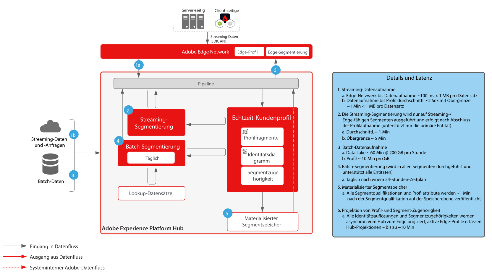
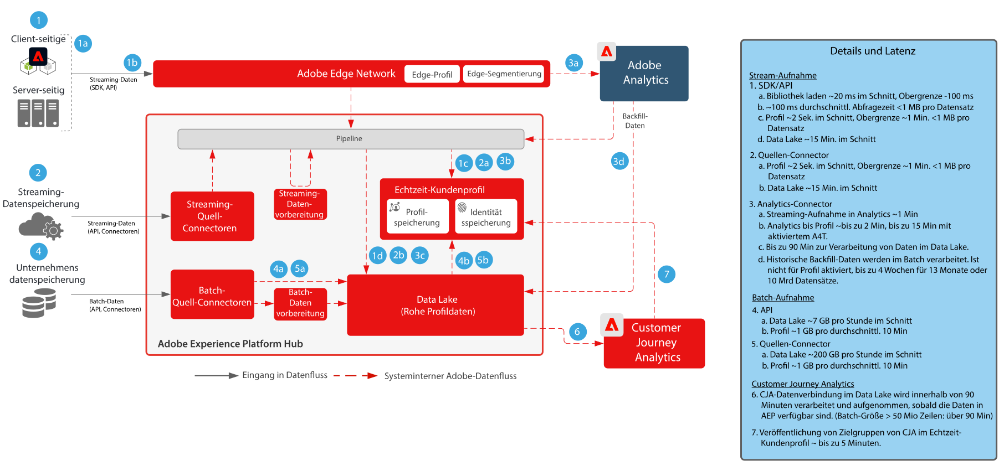

# Leitlinien

Die Leitlinien sind empfohlene Schwellenwerte bei der Daten- und Systemnutzung, die dafür sorgen, dass die Leistung optimiert wird und Fehler oder unerwartete Ergebnisse in Adobe Experience Platform und den Anwendungen vermieden werden. Die Leitlinien beschreiben Systemeinschränkungen und Leistungserwartungen, um die Einrichtung der Kundenarchitektur und die Optimierung der Leistung von Anwendungsfällen zu erleichtern. Bei den Leitlinien handelt es sich nicht um Service Level-Vereinbarungen (Service Level Agreements, SLA). Informationen zu produktspezifischen Service-Level-Vereinbarungen finden Sie in der unten stehenden Produktbeschreibung.

## Leitlinien für Adobe Experience Platform und Anwendungen

[Leitlinien für die Datenaufnahme](https://experienceleague.adobe.com/docs/experience-platform/ingestion/guardrails.html?lang=de)

[Leitlinien für die Edge Network API](https://experienceleague.adobe.com/docs/experience-platform/edge-network-server-api/guardrails.html?lang=de)

[Leitlinien zum Echtzeit-Kundenprofil](https://experienceleague.adobe.com/docs/experience-platform/profile/guardrails.html?lang=de)

[Leitlinien zu Identitäten](https://experienceleague.adobe.com/docs/experience-platform/identity/guardrails.html?lang=de)

[Leitlinien zu Query Service](https://experienceleague.adobe.com/docs/experience-platform/query/guardrails.html?lang=de)

[Leiltlinien zur Zielaktivierung](https://experienceleague.adobe.com/docs/experience-platform/destinations/guardrails.html?lang=de)

[Leitlinien zu Journey Optimizer](https://experienceleague.adobe.com/docs/journey-optimizer/using/get-started/guardrails.html?lang=de)

 

## End-to-end-Latenz  Diagramme

### Datenaufnahme

 

### Segmentierung

 

### Real-time Customer Data Platform und Adobe Target

 

### Customer Journey Analytics

 

### Journey Optimizer

 

## Produktbeschreibungen

[Experience Platform Collection Enterprise](https://helpx.adobe.com/de/legal/product-descriptions/adobe-experience-platform-collection-enterprise.html)

[Real-time Customer Data Platform](https://helpx.adobe.com/de/legal/product-descriptions/real-time-customer-data-platform.html)

[B2B-Kundendatenplattform](https://helpx.adobe.com/de/legal/product-descriptions/adobe-experience-platform-b2b.html)

[Experience Platform Activation](https://helpx.adobe.com/de/legal/product-descriptions/adobe-experience-platform0.html)

[Experience Platform Intelligence](https://helpx.adobe.com/de/legal/product-descriptions/adobe-experience-platform-intelligence---product-description.html)

[Intelligent Services](https://helpx.adobe.com/de/legal/product-descriptions/intelligent-services.html)

[Data Distiller](https://helpx.adobe.com/legal/product-descriptions/data-distiller.html)

[Customer Journey Analytics](https://helpx.adobe.com/legal/product-descriptions/customer-journey-analytics.html)

[Journey Optimizer](https://helpx.adobe.com/legal/product-descriptions/adobe-journey-optimizer.html)

[Journey Orchestration](https://helpx.adobe.com/legal/product-descriptions/journey-orchestration.html)

[Offer Decisioning](https://helpx.adobe.com/legal/product-descriptions/offer-decisioning-app-service.html)
