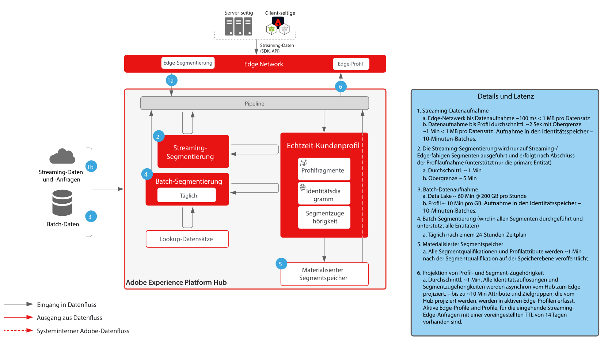
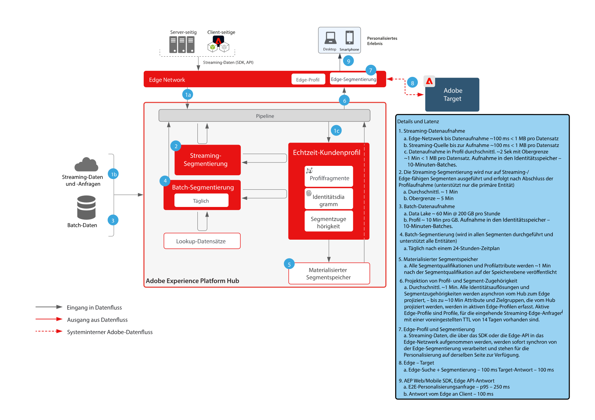
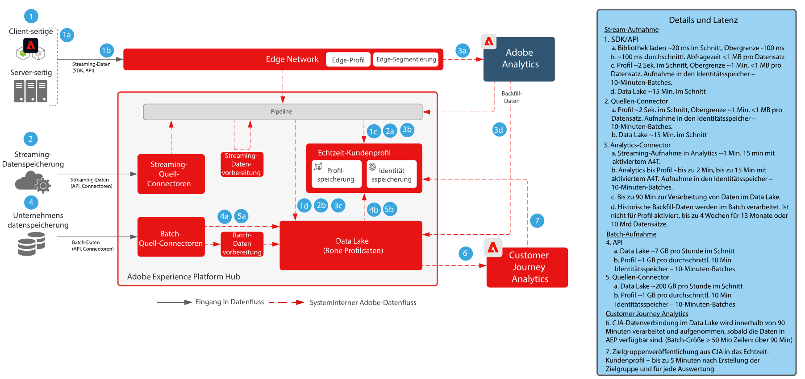
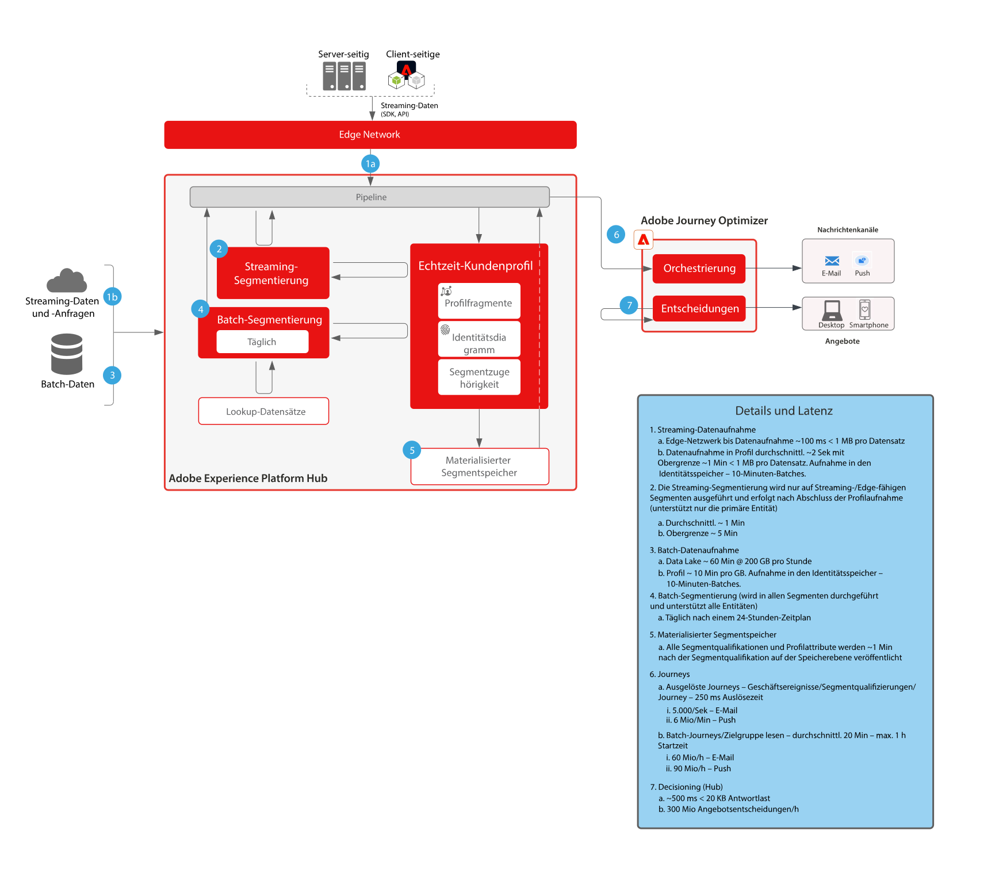

# Leitlinien

Limits sind empfohlene Schwellenwerte für die Verwendung von Daten und Systemen in Adobe Experience Platform und Anwendungen. Limits spiegeln Systemeinschränkungen und Leistungserwartungen wider, um die Kundenarchitektur und die Leistung von Anwendungsfällen zu optimieren und Fehler oder unerwartete Ergebnisse zu vermeiden. Schutzmechanismen sind nicht als Service Level Agreement vorgesehen.

Informationen zu spezifischen Service-Level-Vereinbarungen für Anwendungen und Funktionen finden Sie im Abschnitt [Beschreibung der Anwendungen und Funktionen](#application-feature-descriptions) unten auf dieser Seite.

## Referenzdokumentation zu den Leitlinien für Adobe Experience Platform und Programmen

Auf den folgenden Seiten finden Sie Informationen zu Limits für Adobe Experience Platform-Funktionen, -Dienste und -Anwendungen:

**Experience Platform-Anwendungen**

* [Übersicht über Real-Time CDP-Limits](https://experienceleague.adobe.com/docs/experience-platform/rtcdp/guardrails/overview.html)
* [Limits bei der Freigabe von Customer Journey Analytics-Zielgruppen](https://experienceleague.adobe.com/docs/analytics-platform/using/cja-components/audiences/publish.html?lang=de-DE#latency)
* [Limits bei der Customer Journey Analytics-Datenerfassung](https://experienceleague.adobe.com/docs/experience-platform/sources/connectors/adobe-applications/analytics.html?lang=de-DE#what-is-the-expected-latency-for-analytics-data-on-platform%3F)
* [Limits in Journey Optimizer](https://experienceleague.adobe.com/docs/journey-optimizer/using/get-started/guardrails.html?lang=de)

**Experience Platform-Dienste**

* [Leitlinien für die Datenaufnahme](https://experienceleague.adobe.com/docs/experience-platform/ingestion/guardrails.html?lang=de)
* [Leitlinien für die Edge Network API](https://experienceleague.adobe.com/docs/experience-platform/edge-network-server-api/guardrails.html?lang=de)
* [Leitlinien zum Echtzeit-Kundenprofil](https://experienceleague.adobe.com/docs/experience-platform/profile/guardrails.html?lang=de)
* [Leitlinien zu Identitäten](https://experienceleague.adobe.com/docs/experience-platform/identity/guardrails.html?lang=de)
* [Leitlinien zu Query Service](https://experienceleague.adobe.com/docs/experience-platform/query/guardrails.html?lang=de)
* [Leiltlinien zur Zielaktivierung](https://experienceleague.adobe.com/docs/experience-platform/destinations/guardrails.html?lang=de)

## End-to-End-Latenzdiagramme

### Datenaufnahme

 

### Segmentierung

 

### Real-time Customer Data Platform und Adobe Target

 

### Customer Journey Analytics

 

### Journey Optimizer

 

## Beschreibung der Anwendungen und Funktionen {#application-feature-descriptions}

Informationen zu funktionsspezifischen Service-Level-Vereinbarungen finden Sie in den folgenden Produktbeschreibungen:

* [Experience Platform Collection Enterprise](https://helpx.adobe.com/de/legal/product-descriptions/adobe-experience-platform-collection-enterprise.html)
* [Real-time Customer Data Platform](https://helpx.adobe.com/de/legal/product-descriptions/real-time-customer-data-platform.html)
* [B2B-Kundendatenplattform](https://helpx.adobe.com/de/legal/product-descriptions/adobe-experience-platform-b2b.html)
* [Experience Platform Activation](https://helpx.adobe.com/de/legal/product-descriptions/adobe-experience-platform0.html)
* [Experience Platform Intelligence](https://helpx.adobe.com/de/legal/product-descriptions/adobe-experience-platform-intelligence---product-description.html)
* [Intelligent Services](https://helpx.adobe.com/de/legal/product-descriptions/intelligent-services.html)
* [Data Distiller](https://helpx.adobe.com/de/legal/product-descriptions/data-distiller.html)
* [Customer Journey Analytics](https://helpx.adobe.com/de/legal/product-descriptions/customer-journey-analytics.html)
* [Journey Optimizer](https://helpx.adobe.com/de/legal/product-descriptions/adobe-journey-optimizer.html)
* [Journey Orchestration](https://helpx.adobe.com/de/legal/product-descriptions/journey-orchestration.html)
* [Offer Decisioning](https://helpx.adobe.com/de/legal/product-descriptions/offer-decisioning-app-service.html)
